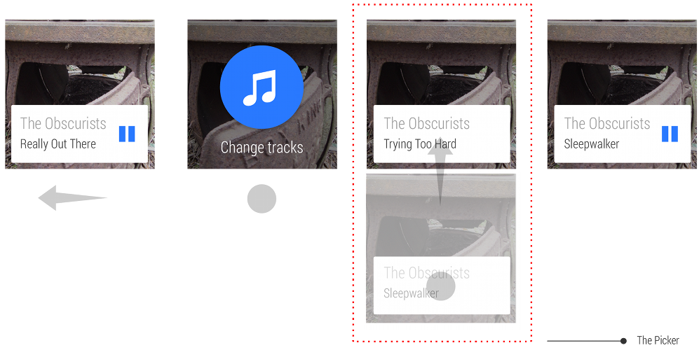
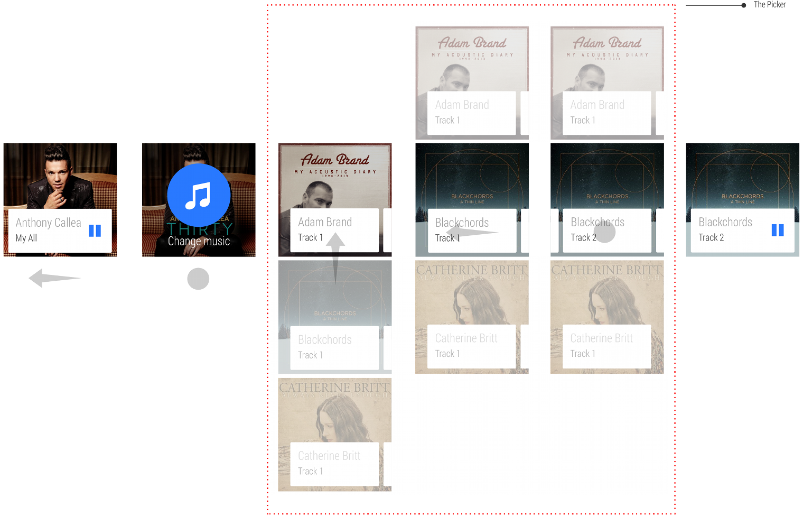
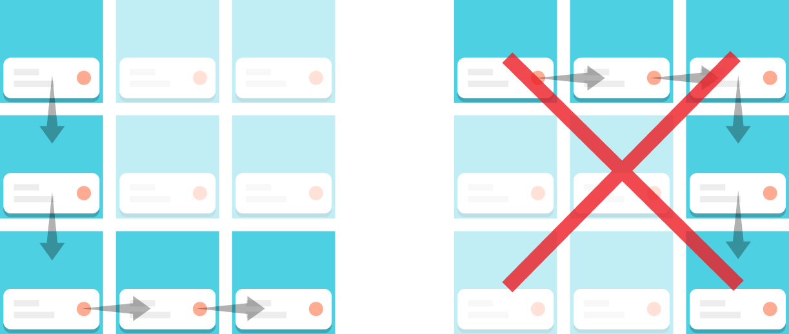

\----------------------------------------------------------------------------------------------------------------------------------------------------------

原文作者：Google

原文地址：<http://developer.android.com/design/wear/structure.html>

原文版权：[Creative Commons 2.5 Attribution
License](http://creativecommons.org/licenses/by/2.5/)

译文作者：Jianan - qinxiandiqi@foxmail.com

版本信息：本文基于2014-07-16版本翻译

译文版权：[CC BY-NC-ND 4.0](http://creativecommons.org/licenses/by-nc-
nd/4.0/)，允许复制转载，但必须保留译文作者署名及译文链接，不得演绎和用于商业用途

\----------------------------------------------------------------------------------------------------------------------------------------------------------

  

用户习惯于点击图标来启动应用程序，但是Android
Wear不一样。一个典型的Wear应用程序会在一个情境的合适时刻插入一张卡片到信息流中。这张卡片可能会包含一个用于快速交互的按钮来打开一个全屏视图（在一些情况下，卡片也可能不会提供交互按钮）：

  
以下是简单排序的构建模块。你可以使用其中的一个或者多个模块，但是我们强烈推荐不要构建这样的应用：用户在启动或者退出应用之前必须仔细考虑应该怎样响应一个指定的地点、活动、一天中某个具体的时间，或者是云端上发生的一些事情。

  
 **信息流中的上下文卡片**

  1. Bridged notifications（桥接通知）是从手持设备上推送到穿戴设备上的通知，例如新的短信通知等等，它们使用的是的标准的Android通知。在穿戴设备上这种通知只需要少量甚至根本不需要任何代码。
  2. Contextual Notifications（上下文通知）是在穿戴设备上本地生成的，并且只在相关的上下文时间点出现，比如当你跑步的时候出现一张锻炼身体的卡片。对比从手持设备上桥接过来的通知，你可以在这种类型的卡片上做的更多。

 **全屏应用**

  1. 2D Picker（二维选择器）是为了允许用户从一系列选项中做选择而设计的，比如选择艺术家和流派等等。每当有关联的时候，我们建议使用SDK中的预构建组件。
  2. 当基本的卡片后者信息流组件无法满足应用程序的时候，自定义布局也是被允许的。比如显示一张图片或者地图。

  

# 1、Bridged Notifications（桥接通知）

  

在Android Wear上，这可以通过简单的途径来获取。实际上，你的应用如果使用了通知就已经完成了这一部分。你可以使用新的notification
APIs像添加extra pages一样添加具体的穿戴特征或者支持语音回复。

[DEVELOPER DOCS Creating a
Notification](http://developer.android.com/training/wearables/notifications/creating.htmlhttp://)  

  

  

  

# 2、Contextual Notifications（上下文通知，情境通知）

  

Android Wear擅长处理这种事情：当用户需要的时候显示用户需要的信息和功能。

  
以下是它的工作原理：你的应用程序知道什么时候与用户有所关联。当对应的事件发生的时候，应用程序将会触发一个通知。可能你正在设计一个跑步应用程序在用户跑步的时候使用。或者是一个博物馆导航程序在用户参观你的博物馆时候使用。查看[设计指南](http://blog.csdn.net/qinxiandiqi/article/details/35999115)获取更多关于如何让你的应用与上下文情境相关联。

  

  
在适合的上下文情境中正确触发相应事件是非常重要的事情，也是你设计良好的用户体验所需要做的事情。

  
实现这种通知最简单的方法就是使用Android
Notifications的标准模板。当然，你也可以在卡片中整合一个Activity来实现自己的界面布局。如果你真的决定这么做，我们强烈建议你看一看风格指南以保证你使用与设备一致的风格。

  
不要忘记测试你的应用程序的所有触发点。触发的次数太多会严重骚扰用户，以至于用户可能关闭你所有的通知。

[DEVELIPER DOCS Creating Custom
Layouts](http://developer.android.com/training/wearables/apps/layouts.html)

  

# 3、2D Picker（二维选择器）

  

二位选择器设计模型（可作为GridViewPager组件）非常适用于在列表中显示选项。Google搜索的搜索结果就是采用这种模型的好例子：

  

  
这种模型可以用来显示一个单一的垂直列表，或者说是一维选择器。

  

  
它也可以作为一个二维选项矩阵，作为显示分类选项的一种方法。

  

## Actions

  

关于每一张卡片的动作响应，使用Action cards pattern（模型）

  

## Making it fast(让它运行更加流畅)

  

以下是我们一些如何让二维选择器变得更加快速的建议：

  

  * 减少卡片的数量
  * 在顶部显示最常用的卡片
  * 让卡片尽可能保持简单
  * 优化速度以超过定制

  

  
导航应该是先垂直后横向，而且不是先横向后垂直，并且限制垂直方向上的卡片不超过5张。

  

## Exiting（退出）

  

当用户做出选择之后，你应该关闭二维选择器。用户也可能通过将第一张卡片向下滑或者将最左边的卡片向右滑动来退出。

  

# 4、Breaking out of the card(with custom layouts) （使用自定义布局突破卡片限制）

  

有一些东西你没办法在卡片上显示。例如在地图上滑动一些路线或者使用摇杆控制游戏。这些情况下，快速跳转到全屏可能是一个不错的解决方案。

  
在Android Wear上一个典型的全屏应用体验大致如下：

  

  1. 你的上下文卡片插入到信息流中
  2. 用户点击卡片的动作按钮。
  3. 打开一个微型交互的全名Activity。
  4. 退出Activity并且用户回到信息流中。

  

## When to go full screen（进入全屏的时机）

  

我们强烈建议只有当你无法在一张卡片上处理你的事务时才跳转到全屏界面，并且在用户完成简单交互之后要快速退出全屏回到信息流中。这样才能让你的应用程序让用户感觉更像是系统的一部分。Android
Wear本身在语音回复或者停止可视化的时候会进入全屏。

  

## Making it distinct（让它与众不同）

  

你的全屏界面不应该与卡片信息流很类似以免误导用户。如果你真的需要一个卡片风格的UI，应该考虑使用二维选择器。

  

## Automatically exiting（自动退出）

  

很多设备没有提供返回和主界面按钮，因此如何退出是你应该考虑的事情。以下是一些自然退出的例子：

  * 如果地图要求用户标注一个地点，当用户标注后应该就退出。
  * 当一个小游戏完成之后自然退出。
  * 一个动画应用可以在激活5秒钟之后退出。

  

## Manually exiting（手动退出）

  

存在着这样的一些逻辑退出情况，比如在一些情境下用户想要马上退出。这通常都是一些长时间运行的应用程序。在这种情况下使用DismissOverlayView，你应该处理长按事件以发送退出的Intent。

