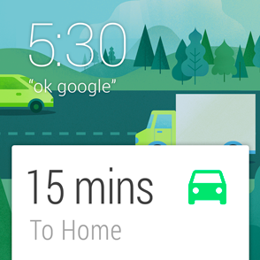
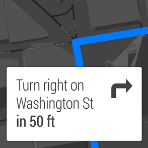
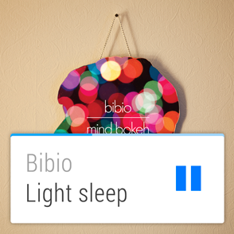

\----------------------------------------------------------------------------------------------------------------------------------------------------------

原文作者：Google

原文地址：<http://developer.android.com/design/wear/creative-
vision.html>

原文版权：[Creative Commons 2.5 Attribution
License](http://creativecommons.org/licenses/by/2.5/)

译文作者：Jianan - qinxiandiqi@foxmail.com

版本信息：本文基于2014-06-27版本翻译

译文版权：[CC BY-NC-ND 4.0](http://creativecommons.org/licenses/by-nc-
nd/4.0/)，允许复制转载，但必须保留译文作者署名及译文链接，不得演绎和用于商业用途

\----------------------------------------------------------------------------------------------------------------------------------------------------------

  

Android Wear设备只在合适的时间提供合适的信息，以将用户在现实世界于虚拟世界之间联系的更加紧密。优秀的Android Wear体验应该如下：

  

# Launched automatically（自动启动）

  
大多数人习惯于点击一个图标来启动应用程序，但是Android
Wear不一样。穿戴设备上的应用是根据用户的情境（上下文）来唤醒的，比如时间、地点、体力活动等等。当这些应用与这些情境相呼应的时候，应用程序会使用这些信息插入卡片到信息流中。这就让Android
Wear具备了及时性，相关性和具体性特点。

  

  

# Glanceable（浏览性）

  
一只传统腕表的设计是为了让你能够在几秒钟里看下时间，然后继续回到你正在做的事情中。Android
Wear的设计也是类似的。能够花更少的时间来使用你的软件，那么用户就能有更多的时间继续完成当前正在做的事情。Android Wear是快速的，及时的。

  

  

# All about suggest and deman（关于建议和需求的一切）

  
Android Wear就像一个非常机智的个人助手：它知道你的偏好，它只在有必要的时候打断你，并且它永远只在手上提供准好的答案。Android
Wear是优越的，谦卑的和响应性的。

  

  

# Zero or low interaction（零或者低交互）

  
遵循更小的外形带来的优势，Android
Wear关注于简单的交互，它只在有必要的时候要求用户输入。大部分输入都是基于触摸滑动或者语音输入，并且细粒度的手指移动操作是禁止的。Android是手势化，简单化和快速化的。

  

  

  
通过提供与世界其它部分的智能连接同时又尊重用户的关注点，Android
Wear让人感觉既个人化又全球化，简单又智能，不显眼又随时待命。遵循这些原则的应用程序在整个Android Wear体验中将会让人感觉就像在家里一样。

  
扩展Android Wear的第三方应用将在日常使用中更具针对性和帮助性。安装这些应用程序是用户通知Android Wear如何操作的一种方法。

