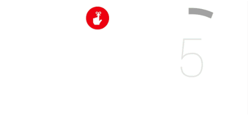

\----------------------------------------------------------------------------------------------------------------------------------------------------------

原文作者：Google

原文地址：<http://developer.android.com/design/wear/principles.html>

原文版权：[Creative Commons 2.5 Attribution
License](http://creativecommons.org/licenses/by/2.5/)

译文作者：Jianan - qinxiandiqi@foxmail.com

版本信息：本文基于2014-06-30版本翻译

译文版权：[CC BY-NC-ND 4.0](http://creativecommons.org/licenses/by-nc-
nd/4.0/)，允许复制转载，但必须保留译文作者署名及译文链接，不得演绎和用于商业用途

\----------------------------------------------------------------------------------------------------------------------------------------------------------

  

本篇设计原则提供了一些关于应该怎样规划和评估你的Android Wear应用程序设计的简单思路。

  

# Focus on not stopping the user and all else will follow（专注于不打算用户并让一切后续跟随上来）

  
手表是非常完美的设备造型，让你能够在做其它事情的时候同时使用，例如做饭、吃东西、散步、跑步，甚至是在谈话的过程中。如果你的应用程序会导致用户中止他们正在做的事情，那么这是个好机会来考虑下应该如何使用本章节的原则升级程序。

尝试一下：

计算你的Wear应用一次典型使用的耗时。如果超过了5秒，那么你就应该考虑下让你的应用程序更加集中一点。同样尝试一下你在和别人对话的过程中，你的应用怎样影响你的意识思维和眼睛焦点。

  
左边每一个操作花费的时间为5秒。

  

  

# Design for big gestures（使用大手势设计）

  
当你在手机上滑动浏览图片时，你拥有一个很大的显示区域，并且你根本不需要很精确操作。对于穿戴设备，这也是最好的交互方式。你的用户可能会在各种情况下使用你的应用程序，最近频繁使用的条目可能已经显示在桌面上。

尝试一下：

在各种日常情况下使用你的应用程序，比如走路、吃东西、与别人谈话或者订购咖啡。如果你必须走路的时候必须放慢脚步或者中断谈话来进行精确操作，那么你应该考虑如何加大你的手势范围。

  
使用更少和更大的触控目标

  

  

  

# Think about stream cards first（第一时间考虑信息流卡片）

  
穿戴设备上最好的体验是当用户需要的时候对应的内容刚好就显示在上面。你可以根据传感器或者云端上面的触发时间来指定显示你的卡片的时机。然而，在一些设备没办法预知用户正需要你的应用程序情况下，你可以依靠语音或者触摸操作来辅助。

尝试一下：

做一个列表列出所有用户可能需要你的应用程序的情况。这些情况都有什么共同点？是相同的地理位置？每一天里相同的时间？还是某些物理动作？你可能会列出一些不同的情况——这是好事情，因为这意味着你可以为这些情形指定特定的卡片。请记住，如果用户觉得这些卡片是不相关的，他们永远有机会设置你的信息流卡片为免打扰模式。

  

  

# Do one thing，really fast（每做一件事都很快）

  
尽管用户每一次使用你的应用程序可能只有几秒钟，但是他们每一天可能会使用上很多次。一长好的信息流卡片应该只携带少量的信息，并且当用户滑动的时候只提供少量的操作按钮。

尝试一下：

在你的设计中，有多少信息是需要的？是否每一个信息都是必须的，或者你能不能将部分信息分解到另一张卡片上？如果你正在设计一张卡片，不要忘记你可以在一张卡片里面包含多个页面。

  

# Design for the corner of the eye（为眼睛的余光而设计）

  
用户需要注视你的应用程序时间越长，就等于你让用户从现实世界中脱离的更严重。多考虑如何增强你的应用程序的可浏览性，让用户能够从你的应用程序中获得足够的信息并快速返回到他们正在做的事情中。

尝试以下：

当你的手表正在显示你的应用程序时，尝试注意力集中在你的手指关节上，使用你的余光来查看你的应用程序。你能否感觉到设备想在运行什么？能否分辨出它来自什么应用程序？上面的背景图片对信息的表达有没有帮助作用？它有没有使用图片或者不同的图形和颜色？

  

# Don't be a constant shoulder tapper（不要变成一个持续的振动器）

  
手表会长时间贴着用户的皮肤。基于这种亲密关系，你在手表上设置的蜂鸣次数应该要比你习惯在手机上设置的次数少。

尝试一下：

当下一次你在谈话的时候，想象一下有人搭着你的肩膀，用你的应用程序推送的消息打断你。如果推送的消息没有理由中断对话，你就不应该让这条消息中断对话。

  

  

