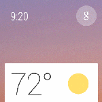

\----------------------------------------------------------------------------------------------------------------------------------------------------------

原文作者：Google

原文地址：<http://developer.android.com/design/wear/index.html>

原文版权：[Creative Commons 2.5 Attribution
License](http://creativecommons.org/licenses/by/2.5/)

译文作者：Jianan - qinxiandiqi@foxmail.com

版本信息：本文基于2014-06-27版本翻译

译文版权：[CC BY-NC-ND 4.0](http://creativecommons.org/licenses/by-nc-
nd/4.0/)，允许复制转载，但必须保留译文作者署名及译文链接，不得演绎和用于商业用途

\----------------------------------------------------------------------------------------------------------------------------------------------------------

  

# 前言

  
设计Android
Wear可穿戴设备应用程序与设计手机或者平板上的应用程序有很大的不同：各自有不同的优势和缺点、不同的适用情境、以及不同的人体工程学设计。在开始开发之前，你应该了解Android
Wear的整体视觉体验，以及它适用于哪些应用程序和如何提升用户体验。

  
由于Android Wear新的造型决定了需要使用一种新的界面。总的来说，Android Wear
UI围绕着Suggest（建议）和Demand（需求）两个核心部分提供了两种主要的界面中心。你的应用程序将会在这两个界面中担任重要角色。

  

# Suggest：The Context Stream（上下文信息流）

  
Context Stream是一个垂直的卡片列表，每一张卡片显示一个有用的或者及时的信息。非常类似于Android手机或者平板上的Google
Now，用户通过垂直滑动切换每一张卡片。在同一个时间里只有一张卡片能够显示，并且背景图片会显示另外附加的视觉化信息。你的应用程序可以创建卡片并且将卡片插入到信息流中，前提是这些卡片是有可能会被使用到的。

  
这种界面模式确保了用户不需要启动很多应用程序来检查更新。用户可以通过简单浏览Context Stream来确定哪一些对他们来说是重要的。

  
信息流中的卡片比起通知来说要更加简单。用户可以通过横向滑动卡片来查看附加的页面。横向滑动还有可能切换出一些按钮，这些按钮可以让用户对通知进行一些操作。卡片也可以通过由左边滑动到右边来从信息流中移除，直到下一次应用程序又有有用的信息需要显示为止。

  

  

# Demand：The Cue Card（提示卡）

  
当Android Wear没有在信息流中主动提供一些建议回复时，Cue Card（提示卡）允许用户直接与google对话。提示卡可以通过语音“OK
Google”或者点击Home界面的背景来打开。在提示卡上向上滑动可以打开一个预设的语音指令列表，里面每一项都可以通过点击执行。

  
从技术角度来讲，每一个预设的语音指令都会激活一个指定类型的Intent。作为一个开发者，你可以将你的应用程序与其中一些Intent匹配，以便用户可以通过这些语音指令来完成一些任务。有些时候可能会有多个应用程序同时注册一个相同的语音Intent，那么用户将会有机会选择打开哪一个应用程序。

  
如同应用程序可以在一个有规律的流操作按钮中响应点击一样，它们也可以使用相同的方式来响应语音指令：通过添加或者更新一章信息流开安，或者通过启动一个全屏应用程序。语音输入通常会使用一种命令格式，例如“remind
me to get milk”。这种情况下，在自动返回上下文信息流之前会完整播放一段简单的确认动画。

  

  

  

# Other UI Features（其它界面功能）

  
1、 **Home screen** 是设备默认的状态，包含了一下功能：

    * 背景取决于用户选择的手表界面，可以显示第一张卡片的相关内容或者一个自定义的手表界面。点击背景的任何地方或者说一句“OK Google”就可以启动语音查询。

    * 状态提示：连接状态、充电状态、飞行模式，以及一些手表界面上的未读信息统计。

    * Context Stream中排在顶部的卡片（称为偷窥卡片），它被半遮掩显示在屏幕的底部。这张卡片能够显示的面积有多大取决于当前的手表界面。

2、用户可以选择 **Watch face**
（手表界面）作为Home界面的背景显示。手表界面显示时间以及包含排在顶部的偷窥卡片。用户可以通过长按当前手表界面来选择其它手表界面。

3、一些设备当不使用的时候可能会进入低功耗的情境模式。这一般通过一些方式调节屏幕亮度。在这个状态下，偷窥卡片的内容将会自动优化后显示。用户可以通过点击屏幕，或者倾斜屏幕对着自己，或者点击任何物理键（如果设备有物理键）来退出这种模式。

4、向下滑动Home界面可以显示时间和电池信息。再往下拉可以选择静音模式，以防止中断性通知震动和点亮屏幕。

5、 **Setting screen**
（设置界面）可以通过从提示卡或者物理键（有些设备可能会提供设置键）打开。在这是界面用户可以关机或者重启设备，可以设置屏幕亮度，可以打开或者关闭飞行模式，也可以查看设备信息。

6、 **Full screen apps** （全屏应用）可以在主信息流的顶部启动，它要求一个相对更大的范围。尽管没有限制Context
Stream模式的风格，但是应用程序应该遵循与系统其它部分一样的设计风格。更多相关的信息可以参考[App
Structure](http://developer.android.com/design/wear/structure.html) 指南。

