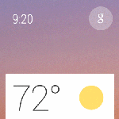

\----------------------------------------------------------------------------------------------------------------------------------------------------------

原文作者：Google

原文地址：<http://developer.android.com/wear/design/user-
interface.html#Stream>

原文版权：[Creative Commons 2.5 Attribution
License](http://creativecommons.org/licenses/by/2.5/)

译文作者：Jianan - qinxiandiqi@foxmail.com

版本信息：本文基于2014-06-15版本翻译

译文版权：[CC BY-NC-ND 4.0](http://creativecommons.org/licenses/by-nc-
nd/4.0/)，允许复制转载，但必须保留译文作者署名及译文链接，不得演绎和用于商业用途

\----------------------------------------------------------------------------------------------------------------------------------------------------------

  

# 前言

  

一种新的表现形式是值得使用一种新的UI模型的。总的来说，Android Wear
UI围绕着Suggest（建议）和Demand（需求）两个核心部分包含了两种主要的界面中心。你的应用在这两种界面中扮演着重要角色。

  

# Suggest：The Context Stream

  

Context Stream是一个垂直的卡片列表，每一张卡片显示一个有用或者及时的信息。非常类似于Android手机或者平板上的Google
Now，用户通过垂直滑动来切换每一张卡片，以更新显示对用户来说很重要但简短又全面信息。在同一个时间里只有一张卡片能够显示，并且背景图片会显示附加的视觉化信息。你的应用程序可以创建卡片，只要它们是有用的就能够插入到信息流中。

  
信息流中的卡片可以不单只是简单的信息。它们可以通过横向滑动来打开附加的页面。进一步横向滑动可能可以打开一个可点击的按钮，这个按钮允许用户对该通知进行操作。卡片也可以通过从左滑到右边来取消，从信息流中移除直到它们再一次拥有有用的信息显示为止。在模拟器中，把鼠标悬停在屏幕的顶部会点亮设备顶部的一个蓝色条，点击后可以返回到Home界面。

  

  

  

# Demand：The Cue Card

  

当Context Stream无法判断用户想要做什么的时候，cue card（提示卡）允许用户与设备对话。Cue card可以通过语音“Ok
google”或者点击Home界面上的“g”图标来打开。向上滑动提示卡片可以获得一个操作列表，列表的操作项可以点击执行。

  
操作列表中包括了针对语音操作的Android intent（意图）。即将推出的Android Wear
SDK将允许开发者将他们的应用程序与这些intent匹配，用户就可以通过语音指令来执行这些操作。可能会有多个应用程序注册了同一个语音intent，那么用户将有机会来决定选择使用哪一个应用程序。

  

  

  

