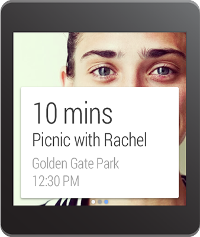

\----------------------------------------------------------------------------------------------------------------------------------------------------------

原文作者：Google

原文地址：<http://developer.android.com/wear/notifications/pages.html>

原文版权：[Creative Commons 2.5 Attribution
License](http://creativecommons.org/licenses/by/2.5/)

译文作者：Jianan - qinxiandiqi@foxmail.com

版本信息：本文基于2014-06-24版本翻译

译文版权：[CC BY-NC-ND 4.0](http://creativecommons.org/licenses/by-nc-
nd/4.0/)，允许复制转载，但必须保留译文作者署名及译文链接，不得演绎和用于商业用途

\----------------------------------------------------------------------------------------------------------------------------------------------------------

  

当你想要提供更多的信息又不想要求用户在手持设备上打开你的应用程序，你可以选择在Android
Wear设备上为你的通知添加一个多个Page（页面）。附加的页面会立刻显示在主通知卡片的右边。更多关于如何使用和设计多页面的内容，请参考[Design
Principles of Android
Wear](http://blog.csdn.net/qinxiandiqi/article/details/32331397)。

  

  
当创建一个多页面的通知，从创建主通知（第一个页面），也就是你希望显示在手机或者平板上的通知开始。然后，使用addPage()方法一次添加一个页面，或者使用addPages()一次传递一个包含过个页面的Collection集合进去。

  
例如，下面的代码添加为通知添加了第二个页面：

    
    
    // Create builder for the main notification
    NotificationCompat.Builder notificationBuilder =
            new NotificationCompat.Builder(this)
            .setSmallIcon(R.drawable.new_message)
            .setContentTitle("Page 1")
            .setContentText("Short message")
            .setContentIntent(viewPendingIntent);
    
    // Create a big text style for the second page
    BigTextStyle secondPageStyle = new NotificationCompat.BigTextStyle();
    secondPageStyle.setBigContentTitle("Page 2")
                   .bigText("A lot of text...");
    
    // Create second page notification
    Notification secondPageNotification =
            new NotificationCompat.Builder(this)
            .setStyle(secondPageStyle)
            .build();
    
    // Create main notification and add the second page
    Notification twoPageNotification =
            new WearableNotifications.Builder(notificationBuilder)
            .addPage(secondPageNotification)
            .build();

  
  

