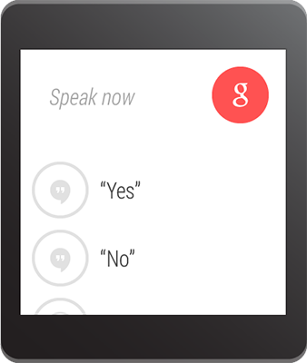

\----------------------------------------------------------------------------------------------------------------------------------------------------------

原文作者：Google

原文地址：<http://developer.android.com/wear/notifications/remote-
input.html>

原文版权：[Creative Commons 2.5 Attribution
License](http://creativecommons.org/licenses/by/2.5/)

译文作者：Jianan - qinxiandiqi@foxmail.com

版本信息：本文基于2014-06-24版本翻译

译文版权：[CC BY-NC-ND 4.0](http://creativecommons.org/licenses/by-nc-
nd/4.0/)，允许复制转载，但必须保留译文作者署名及译文链接，不得演绎和用于商业用途

\----------------------------------------------------------------------------------------------------------------------------------------------------------

  

# 前言

  

如果你的通知包括一个文字回复的操作，比如回复一封邮件，这通常需要在手持设备上启动一个Activity来处理。但是，当你的通知出现在Android
Wear设备上时，你可以允许用户直接通过语音输入来回复。你也可以提供一些预设好的文字信息给用户选择。

  
当用户使用语音或者选择一条预设的信息进行回复时，系统将会发送这个信息到你手持设备上的应用程序中。这个信息将会作为的你的通知操作所使用的Intent的extra附加数据。

  
注意：当你使用Android模拟器进行开发的时候，你必须输入文字到那些语音回复的控件中来回复。因此，你要确保AVD设置中的Hardware keyboard
present设置已经打开。

  

  

  

# Define the Remote Input（定义远程输入）

  

创建一个支持语音输入的操作，首先要使用RemoteInput.Builder的API创建一个RemoteInput对象实例。RemoteInput.Builder的构造器需要一个字符串参数，系统将这个字符串作为传递到手持设备上应用程序的Intent携带的extra中所附加的回复信息的key。

  
例如，下面的代码中创建了一个RemoteInput对象，并给语音输入提示提供一个自定义的标签：

    
    
    // Key for the string that's delivered in the action's intent
    private static final String EXTRA_VOICE_REPLY = "extra_voice_reply";
    
    String replyLabel = getResources().getString(R.string.reply_label);
    
    RemoteInput remoteInput = new RemoteInput.Builder(EXTRA_VOICE_REPLY)
            .setLabel(replyLabel)
            .build();

  

# Add Pre-defined Text Responses（添加预定义的文字回复）

  

除了允许语音回复之外，你也可以提供最多五条预定义的回复信息让用户快速选择回复。你只需要调用setChoices()方法并传递一个字符串数组。

  
例如，你可以在数组资源文件中定义一些回复：

res/values/strings.xml

    
    
    <?xml version="1.0" encoding="utf-8"?>
    <resources>
        <string-array name="reply_choices">
            <item>Yes</item>
            <item>No</item>
            <item>Maybe</item>
        </string-array>
    </resources>

然后，获取字符串数组并添加到RemoteInput对象中：

    
    
    String replyLabel = getResources().getString(R.string.reply_label);
    String[] replyChoices = getResources().getStringArray(R.array.reply_choices);
    
    RemoteInput remoteInput = new RemoteInput.Builder(EXTRA_VOICE_REPLY)
            .setLabel(replyLabel)
            .setChoices(replyChoices)
            .build();

  

  

# Receive Voice Input for the Primary Action（为主操作接收语音输入）

  

如果“Reply”是你的通知主要操作（通过setContentIntent()方法定义），那么你可以使用addRemoteInputForContentIntent()方法将RemoteInput添加到主操作中。例如：

    
    
    // Create intent for reply action
    Intent replyIntent = new Intent(this, ReplyActivity.class);
    PendingIntent replyPendingIntent =
            PendingIntent.getActivity(this, 0, replyIntent, 0);
    
    // Build the notification
    NotificationCompat.Builder replyNotificationBuilder =
            new NotificationCompat.Builder(this)
            .setSmallIcon(R.drawable.ic_new_message)
            .setContentTitle("Message from Travis")
            .setContentText("I love key lime pie!")
            .setContentIntent(replyPendingIntent);
    
    // Create the remote input
    RemoteInput remoteInput = new RemoteInput.Builder(EXTRA_VOICE_REPLY)
            .setLabel(replyLabel)
            .build();
    
    // Create wearable notification and add remote input
    Notification replyNotification =
            new WearableNotifications.Builder(replyNotificationBuilder)
            .addRemoteInputForContentIntent(remoteInput)
            .build();

通过使用addRemoteInputForContentIntent()方法添加RemoteInput对象到通知的主操作中，这个按钮通常情况下作为“Open”按钮显示，知道用户在Android
Wear设备上选中之后才会转变成“Reply”按钮并开始显示语音输入界面。

  

# Receive Voice Input for a Secondary Action（为次级操作接收语音输入）

  

如果“Reply”操作不是你的通知主操作，并且你想要将语音输入作为次级操作。你可以使用Action对象定义一个新的操作按钮，并把RemoteInput对象传递进去。

  
你应该使用Action.Builder()构造方法来实例化一个Action对象，这个构造方法需要一个图标和文字标签，还有PendingIntent对象作为参数来设置Action对象。其中，当用户选择了这个Action之后，系统将会通过这个PendingIntent来调用你的应用程序。例如：

    
    
    // Create the pending intent to fire when the user selects the action
    Intent replyIntent = new Intent(this, ReplyActivity.class);
    PendingIntent pendingReplyIntent =
            PendingIntent.getActivity(this, 0, replyIntent, 0);
    
    // Create the remote input
    RemoteInput remoteInput = new RemoteInput.Builder(EXTRA_VOICE_REPLY)
            .setLabel(replyLabel)
            .build();
    
    // Create the notification action
    Action replyAction = new Action.Builder(R.drawable.ic_message,
            "Reply", pendingIntent)
            .addRemoteInput(remoteInput)
            .build();

当你将RemoteInput对象添加到Action中之后，你需要使用addAction()将这个Action添加到WearableNotifications.Builder中。例如：

    
    
    // Create basic notification builder
    NotificationCompat.Builder replyNotificationBuilder =
            new NotificationCompat.Builder(this)
            .setContentTitle("New message");
    
    // Create the notification action and add remote input
    Action replyAction = new Action.Builder(R.drawable.ic_message,
            "Reply", pendingIntent)
            .addRemoteInput(remoteInput)
            .build();
    
    // Create wearable notification and add action
    Notification replyNotification =
            new WearableNotifications.Builder(replyNotificationBuilder)
            .addAction(replyAction)
            .build();

现在，当用户在Android
Wear设备上选择“Reply”操作之后，系统将会提供用户语音输入（如果有同预定义回复还会显示预定义回复列表）。一旦用户完成回复响应，系统将会调用附加在操作上的Intent，并添加以EXTRA_VOICE_REPLY（也就是你在RemoteInput.Builder构造器中传递进去的字符串）为key，以用户输入信息为字符串值的extra到Intent中。

  
  

