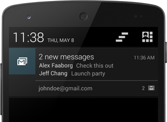

\----------------------------------------------------------------------------------------------------------------------------------------------------------

原文作者：Google

原文地址：<http://developer.android.com/wear/notifications/stacks.html>

原文版权：[Creative Commons 2.5 Attribution
License](http://creativecommons.org/licenses/by/2.5/)

译文作者：Jianan - qinxiandiqi@foxmail.com

版本信息：本文基于2014-06-24版本翻译

译文版权：[CC BY-NC-ND 4.0](http://creativecommons.org/licenses/by-nc-
nd/4.0/)，允许复制转载，但必须保留译文作者署名及译文链接，不得演绎和用于商业用途

\----------------------------------------------------------------------------------------------------------------------------------------------------------

  

# 前言

  

当在手持设备上创建通知的时候，你应该经常将一些类似的通知归并到一个单一的摘要通知中。比如，如果你的应用接收到信息后会创建通知，你不应该在手持设备上创建多条通知。当接收到多条信息的时候，你应该使用一条单一的通知并显示类似“2
new messages”这样的摘要信息。

  

  

  
但是，一个摘要通知在Android
Wear设备上就显得没那么有用，因为用户不能够在穿戴设备上详细阅读每条信息（他们必须在手持设备上打开你的应用程序来查看更多的信息）。因此，在穿戴设备上，你应该将所有通知归档到一个栈中。包含多个通知的栈将作为一张卡片显示，用户可以展开来查看每一条通知的详细信息。新的setGroup()方法让这一切成为可能，并且还能够同时在手持设备上只保持提供一条摘要通知。

  
更多关于设计通知栈的内容，请参考[Design Principles of Android
Wear](http://blog.csdn.net/qinxiandiqi/article/details/32331397)。

  

# Add Each Notification to a Group（将每一条信息分组）

  

创建一个栈，你需要为每条通知调用setGroup()方法，并指定分组的key。然后调用notfiy()方法将它发送到穿戴设备上。

    
    
    final static String GROUP_KEY_EMAILS = "group_key_emails";
    
    // Build the notification and pass this builder to WearableNotifications.Builder
    NotificationCompat.Builder builder = new NotificationCompat.Builder(mContext)
             .setContentTitle("New mail from " + sender1)
             .setContentText(subject1)
             .setSmallIcon(R.drawable.new_mail);
    
    Notification notif1 = new WearableNotifications.Builder(builder)
             .setGroup(GROUP_KEY_EMAILS)
             .build();
    
    // Issue the notification
    NotificationManagerCompat notificationManager =
            NotificationManagerCompat.from(this);
    notificationManager.notify(notificationId1, notif);

之后，当你创建其它通知的时候，只要你指定相同的分组key。那么你调用notify()方法之后，这条通知就会跟之前的通知一样出现在相同的通知栈里面，并替代成为一张新的卡片：

    
    
    builder = new NotificationCompat.Builder(mContext)
             .setContentTitle("New mail from " + sender2)
             .setContentText(subject2)
             .setSmallIcon(R.drawable.new_mail);
    
    // Use the same group as the previous notification
    Notification notif2 = new WearableNotifications.Builder(builder)
             .setGroup(GROUP_KEY_EMAILS)
             .build();
    
    notificationManager.notify(notificationId2, notif);

默认情况，通知的显示顺序由你的添加顺序决定，最近添加的通知将会出现在最顶部。你也可以为通知在栈中指定一个序号，只要你将序号作为setGroup()方法的第二个参数传递进去。

  

# Add a Summary Notification（添加一条摘要通知）

  

在手持设备上保持提供一条摘要通知是相当重要的。因此，除了将每一条通知添加到相同的栈中之外，还要添加一条摘要通知到栈中，只不过要把摘要通知的序号设置为GROUP_ORDER_SUMMARY。

  

  

  
这条摘要通知不会出现在穿戴设备上的通知栈中，但是会作为一条通知出现在手持设备上。

    
    
    Bitmap largeIcon = BitmapFactory.decodeResource(getResources(),
            R.drawable.ic_large_icon);
    
    builder = new NotificationCompat.Builder(this)
            .setSmallIcon(R.drawable.ic_small_icon)
            .setLargeIcon(largeIcon);
    
    // Use the same group key and pass this builder to InboxStyle notification
    WearableNotifications.Builder wearableBuilder = new WearableNotifications
            .Builder(builder)
            .setGroup(GROUP_KEY_EMAILS,
                    WearableNotifications.GROUP_ORDER_SUMMARY);
    
    // Build the final notification to show on the handset
    Notification summaryNotification = new NotificationCompat.InboxStyle(
            wearableBuilder.getCompatBuilder())
            .addLine("Alex Faaborg   Check this out")
            .addLine("Jeff Chang   Launch Party")
            .setBigContentTitle("2 new messages")
            .setSummaryText("johndoe@gmail.com")
            .build();
    
    notificationManager.notify(notificationId3, summaryNotification);

这条通知使用了NotificationCompat.InboxStyle，它提供了一种为邮件或者信息类应用程序创建通知的简单方法。你可以采用这种风格，而其它的通知使用NotificationCompat来定义，当然你也可以完全不是用这种风格来定义摘要通知。

  
提示：定义类似截图中的文字风格，可以参考[Styling with HTML
markup](http://developer.android.com/guide/topics/resources/string-
resource.html#StylingWithHTML)和[Styling with
Spannables](http://developer.android.com/guide/topics/resources/string-
resource.html#StylingWithSpannables).

