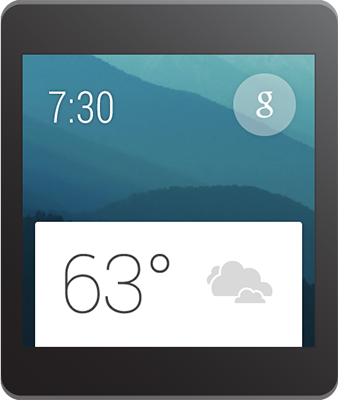
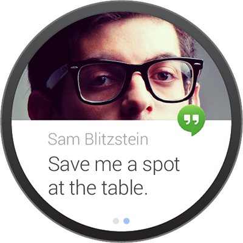
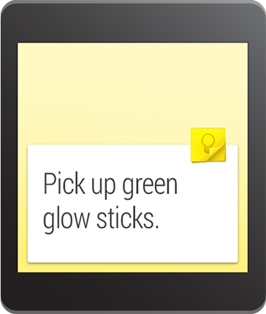
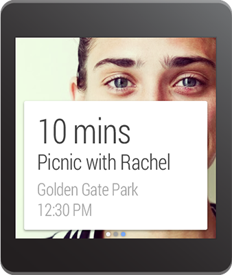

\----------------------------------------------------------------------------------------------------------------------------------------------------------

原文作者：Google

原文地址：[http://developer.android.com/wear/design/index.html](http://developer.android.com/wear/design/index.htmlhttp://developer.android.com/wear/design/index.html)

原文版权：[Creative Commons 2.5 Attribution
License](http://creativecommons.org/licenses/by/2.5/)

译文作者：Jianan - qinxiandiqi@foxmail.com

版本信息：本文基于2014-06-19版本翻译

译文版权：[CC BY-NC-ND 4.0](http://creativecommons.org/licenses/by-nc-
nd/4.0/)，允许复制转载，但必须保留译文作者署名及译文链接，不得演绎和用于商业用途

\----------------------------------------------------------------------------------------------------------------------------------------------------------

  

# 前言

  

Android可穿戴设备只在对的时间提供对的信息，让你处在现实世界中也能连接到虚拟世界。

  
本章你将学习如何Android Wear平台上设计良好的用户体验。Android
Wear的设计与手机或者平板上的设计有很大的不同，因此我们将从阐述你的信息内容是如何连接到Android
Wear的整体视图上来开始。为了更好的了解Android Wear上的用户体验，你应该先阅读[UI
Overview](http://blog.csdn.net/qinxiandiqi/article/details/30990357)。

  

## 1.1 Android Wear体验如下：

  

  *  **Contextually aware and smart（上下文关联和智能）** 。这些设备将计算机交互提到到一个新层次。相对于请求焦点并让用户输入的交互模式，Android可穿戴设备能够意识它们自己的情境和状态，然后在正确的时间显示有用的信息。及时，相关，具体。
  *  **Glanceable（可浏览）** 。可穿戴设备的使用是全天性的，尽管有时设备在我们的视线范围之外。有效的应用程序会在最大有效承载范围内，全天性提供以最简单的方式并优化信息片段。简短，重点，及时。
  *  **Zero/low interaction（零/低交互）** 。忠于更小的外形所带来的优势，Android Wear专注于更简单的交互，它只在必要的时候要求用户输入。大部分输入都是基于触摸滑动和语音，并且复杂的输入操作是应该要避免的。手势，简单，快速。
  *  **Helpful（有用的）** 。Android Wear就像一个强大的个人助理：它了解你这个人和你的喜好，它只在有必要的时候打断你，它总是能够随时为你提供一个现成的答案。高效，友好，敏感。

  
  
  

在尊重理解用户的兴趣情况下，通过提供智能的连接到世界各地，Android Wear即能私人化也能全球性，简单又智能，不显眼又能随时待命。在整个Android
Wear的体验中，遵循这些规则的通知就像感觉在家一样。

  

# Notification UI Patterns（通知的UI图案）

  

Android通知在主要信息流中作为卡片显示，并构成了Android Wear的核心体验。Android通知设计指南中的大部分原则也应用到了Android
Wear上。能否遵从用户的兴趣和清楚什么是不必要的干扰将会体现在用户对你的应用程序的感受上。

  
将你的通知上不必要的信息忽略掉。要设计成不需要详细阅读信息，通知看一眼就能明白。要使用单词或者短语，不要使用句子。要的是显示，不是阐述：在可能的情况下尽量使用图标，字形和可视化效果来传达你的信息。

  
在一些情况下，尤其是信息类应用，卡片可能会包含一个动态内容，并且没办法一次填满一个屏幕。在这种情况下，内容将会被自动拆分以填满卡片，用户可以通过点击来扩展查看，因此你应该提供完整的信息。

  
通知的优先级应该要反应出通知的迫切性，对时间敏感的通知应该赋予高优先级。活跃的通知，也就是那些能引起设备震动的通知，应该是那种迫切需要得到用户的关注和响应的通知（例如，一个基于时间的信息提示，一条来自朋友的信息）。不是很紧急的通知（例如，一张中转时间卡片，每日计步器的计数，社会网络更新）应该静默添加到卡片信息流中。

  

  

  

## 2.1 Actions（操作）

  

Action的出现出现取决于你的通知，它允许用户来操作你的通知。最多能够允许三个Action。最常用的Action应该放在首位，所以它是一个在你的通知内容之外的简单滑动。

  
Action包括一个图标和标题。图标必须是PNG文件，使用白色透明背景，32×32dp（其中内边距为8dp）尺寸，与[Iconography](http://developer.android.com/design/style/iconography.html#action-
bar)设计指南中的action bar图标规则很类似。标题应该是一个动词而且要简短，并且一行不够显示时会自动被截断。

  
Action是可选的。很多有用的通知都不需要包含Action。

  
更多关于开发action按钮的细节，请参考[Creating Notifications for  Android
Wear](http://blog.csdn.net/qinxiandiqi/article/details/32698407)。

  

  

  

## 2.2 Images（图片）

  

Image出现在信息流中卡片的背后，它提供了背景和附加的浏览。你的Image应该支持通知中的核心信息；例如，一个关于体育队伍的卡片应该包含这个队伍的颜色和logo，一条通讯录中的信息应该显示对应联系人的头像。

  
记住卡片将会覆盖Image的底部。Image的大小应该适应手机上通知的外形，尺寸为64*64dp。横向滑动的时候Image背景会滑动，因此横向导向的Image更适合包含多个page和action的通知。

  
添加大图片，可以使用通知的setLargeIcon()，参考[Creating Notifications for Android
Wear](http://blog.csdn.net/qinxiandiqi/article/details/32698407)。

  

  

## 2.3 Application Icons

  

你的应用程序启动图标将会自动显示在卡片上，用来标识你的通知。不要使用通知标题或者背景图片来标识或者区分你的应用。相反的，应该允许你的图标来标识它本身，并专注于提供一个清晰的简洁的信息在卡片和图片上。你可以使用setHintHideIcon()方法来选择不显示这个图标。

  

  

## 2.4 Pages（页面）

  

Page是一些附加的卡片，出现在信息流中主卡片的右边。如果你的信息比一个简短片段还要长，不要牺牲可浏览性来将所有信息都打包进你的主通知中。相反的，使用多个page来提供附加内容。

  

  
Page会立刻出现在主通知卡片的右边。它们通常被用来提供附加的细节或者主卡片内容的附加视图。例如：

  * 一张当前的天气卡片可能会提供一个附加的page来显示未来三天的天气预报。
  * 一张下一班火车发车信息卡可能会提供一个附加page来显示后续的发车时间。
  * 一张日常计步器卡片可能会提供一个附加page显示同一个测量中的卡路里和距离。

Page没有限制可以添加的最多数量。但是，提供Action的通知不应该显示超过三个page以保证操作依然容易使用。

  
Page是可选择的，很多有用的通知可能不需要包含page。

  
更多page的开发细节，请参考[Adding Pages to a
Notification](http://blog.csdn.net/qinxiandiqi/article/details/34093201)。

  

## 2.5 Notification Stacks（通知栈）

  

Stack可能用于将同一个应用程序的多个通知收集到一个卡片栈中。相对于page用于提供一个通知的附加细节，Stack被用来收集多个同一级别的通知。一个Stack可以通过用户访问Stack中每一个卡片来展开。

  
Stack是一种可以添加多个有用的通知而不用破坏用户的数据流的方法。如果你的应用可能在同一时间里会产生多个通知，可以考虑将它们添加到一个Stack中。

  
Stack中每一个通知都可以包含关联于这个通知的多个独立page和多个独立Action。用户可以在展开Stack中通知之后访问这些action。

  
更多关于开发Stack的细节，请参考[Stacking
Notifications](http://blog.csdn.net/qinxiandiqi/article/details/34100821)。

  

  

  

## 2.6 Voice Replies(语音回复）

  

语音回复主要用于消息类型应用程序，提供了一种通过口述简短消息的免提方式。大多情况下，你可以提供最多五个建议答复或者“固定回答”。这些“固定回答”可以被用户点击，以便于在某些不适合语言的情况提供一种快速发送简单回复的方法。

  
你应该在你提供的选择中尝试覆盖简单和中性的答复。在语音回复界面中，较长的语音回复可能会被自动截断。

  
更多关于使用语音回复的开发细节，请查看[Receiving Voice Input from a
Notification](http://blog.csdn.net/qinxiandiqi/article/details/34091973).

  

