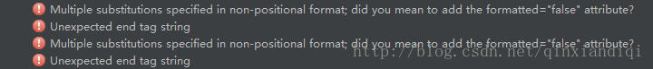

> 原文作者：Jianan - qinxiandiqi@foxmail.com  
原文地址：[http://blog.csdn.net/qinxiandiqi/article/details/53783402](http://blog.csdn.net/qinxiandiqi/article/details/53783402)  
版本信息：2016-12-21  
版权声明：本文采用[CC BY-NC-ND 4.0](http://creativecommons.org/licenses/by-nc-nd/4.0/)共享协议。允许复制和转载，但必须在文首显眼位置保留原文作者、原文链接、版本信息、版权声明等信息。不允许演绎和用于商业用途。

在Android的string.xml文件中，如果定义的字符串资源包含两个或两个以上的格式化占位符，比如：  
``` xml
<string name="version_format">v%d - %s</string>
```  
那么你在编译的时候可能会遇到以下的错误：  

  

出现这个错误的原因在于aapt在编译时对字符串资源中的格式化占位符进行比较严格的校验，解决方案有两种：  

*  使用完整的格式化占位符形式：**%[index]$[type]**，其中index表示该占位符在字符串所有占位符的序号，type表示该占位符的数据类型，比如上面的例子改成：
``` xml
<string name="version_format">v%1$d - %2$s</string>
```  

* 在string.xml中添加**formatted**属性为false表明对应的字符串资源为非格式化字符串，比如上面的例子改成：  
``` xml
<string name="version_format" formatted="false">v%d - %s</string>
```  

建议使用第一种完整格式化占位符形式的方法解决这个问题。