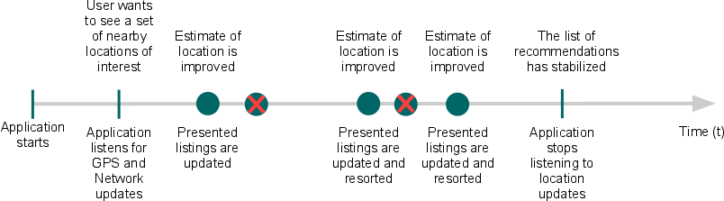

> 原文作者：Google
原文地址：[https://developer.android.com/guide/topics/location/strategies.html](https://developer.android.com/guide/topics/location/strategies.html)  
原文版权：[Creative Commons 2.5 Attribution License](http://creativecommons.org/licenses/by/2.5/)  
译文作者：Jianan - qinxiandiqi@foxmail.com  
版本信息：本文基于2016-06-17版本翻译  
译文版权：[CC BY-NC-ND 4.0](http://creativecommons.org/licenses/by-nc-nd/4.0/)，允许复制转载，但必须保留译文作者署名及译文链接，不得演绎和用于商业用途

<br>
# 前言
---

> **Note:** 本文中的策略适用于Android平台上**android.location**包中的定位API。不同于Google Location Services API，Google Location Services API是Google Play Services中的一部分，能够提供更强大更高级别的框架来自动处理定位数据源、用户移动和定位精度问题，还能够根据你提供的能源消耗参数调整定位的刷新方式。通过使用Google Location Services API，在大多数情况下，你都能够获得更好的电池性能，同时，还能得到更好的定位精度。更多关于这部分定位服务API的内容，请参考[Google Location Services for Android](https://developer.android.com/google/play-services/location.html)。

获取用户的地理位置信息能够让你的应用程序显得更加智能，借此能够分发更合适的信息给用户。为android开发地理位置相关的应用程序，你可以利用GPS或者android的网络定位数据源来获取用户的地理位置。尽管GPS的定位更加精准，但它只适用于户外，并且还会更快的消耗电量，它也不能按用户所期待的及时返回地理位置信息。android的网络定位数据源是通过使用手机信号塔和WiFi信号来获取用户的地理位置信息，不管是在室内还是室外都能够以统一的方式提供地理位置信息，网络定位的响应也会更快，消耗的电量也更好。在你的应用程序中获取用户的地理位置，你可以同时使用GPS或者网络定位，也可以只使用其中一种。

<br>
# 获取用户地理位置信息带来的挑战
---

从移动设备上获取用户的地理位置信息是很复杂的。有多种原因能够导致地理位置信息的获取（不管使用的是哪一种数据源）发生错误或者精度不准。一些用户地理位置信息获取可能导致的数据源错误如下：

*  多种定位数据源  
   GPS、手机信号塔ID和WiFi，每一种数据源都包含了一种用户地理位置定位的规则。选择和信任哪一种数据源的数据是一个权衡定位精度、定位速度，以及电量消耗的问题。
* 用户位置移动
  由于用户的位置在不停变化，你必须每隔一段时间重新更新用户的地理位置信息来应对用户位置不停变化问题。
* 不同的精度
  不同定位数据源的地理位置信息精度是不同的。10秒钟前从一个定位数据源获取的地理位置信息精度可能比另外一个甚至是同一个定位数据源刚刚获取的地理位置信息还要准确。

上面的这些问题让获取一个可靠的用户地理位置信息变得很困难。本文档提供一些解决方案来帮助你面对这些挑战，获取相对可靠的地理位置信息。同时，也提供一些建议，帮助你在应用程序中为用户提供一个精确的响应及时的定位体验。

<br>
# 请求定位更新
---

在解决上面提到的一些定位错误问题之前，这里要先介绍如何在android设备上获取定位数据。  

在android上获取用户的地理位置信息是通过回调来实现的。你通过调用**LocationManager**类（Location Manager）的**requestLocationUpdates()** 方法，传递一个**LocationListener**监听器来向系统表明你需要接收地理位置数据刷新信息。你的**LocationListener** 必须实现一些回调方法。这些方法在用户的地理位置信息有变化，或者地理位置服务状态有变化时，Location Manager就会回调它们。  

例如，下面的代码片段定义了一个LocationListener并且请求定位更新：
```java
// 获取系统的LocationManager服务
LocationManager locationManager = (LocationManager) this.getSystemService(Context.LOCATION_SERVICE);

// 定义一个LocationListener来响应定位更新
LocationListener locationListener = new LocationListener() {
    public void onLocationChanged(Location location) {
      // 当地理位置信息有变化的时候回调
      makeUseOfNewLocation(location);
    }

    public void onStatusChanged(String provider, int status, Bundle extras) {}

    public void onProviderEnabled(String provider) {}

    public void onProviderDisabled(String provider) {}
  };

// 向Location Manager注册LocationListener监听定位更新
locationManager.requestLocationUpdates(LocationManager.NETWORK_PROVIDER, 0, 0, locationListener);
```

**requestLocationUpdates()** 方法中第一个参数指明使用的定位数据源类型（这个例子中，使用的依据手机信号塔和WiFi信号来定位的网络数据源）。你可以通过第二和第三个参数来控制你的监听器接收定位数据信息的频率——第二个参数指定两次数据更新通知之间的最小时间间隔，第三个参数指定触发下一次定位数据更新通知的最小距离——两个参数都设置为0则表示要尽可能快的更新。最后一个参数就是你的LocationListener监听器啦，它的回调方法会在有定位更新的时候得到回调。  

请求根据GPS数据源来更新定位信息，只需要将第一个参数NETWORK_PROVIDER替换为GPS_PROVIDER就可以了。你也可以同时请求GPS和网络定位数据源更新定位信息，但你需要调用requestLocationUpdates()方法两次，一次使用NETWORK_PROVIDER，一次使用GPS_PROVIDER。  

<br>
# 向用户申请权限
---

为了能够从NETWORK_PROVIDER或者GPS_PROVIDER定位数据源接收到定位更新数据，你必须在android的manifest文件中分别声明ACCESS_COARSE_LOCATION和ACCESS_FINE_LOCATION权限。例如：
```xml
<manifest ... >
    <uses-permission android:name="android.permission.ACCESS_FINE_LOCATION" />
    ...
</manifest>
```

如果没有这些权限，你的应用程序在运行过程中请求定位更新将会失败。  

> 注意：如果你同时使用NETWORK_PROVIDER和GPS_PROVIDER定位数据源，那么你只需要申请ACCESS_FINE_LOCATION权限，因为它已经包含了这两个数据源需要的权限（ACCESS_COARSE_LOCATION只包含了NETWORK_PROVIDER数据源所需要的权限）。

<br>
# 定义最佳的性能模型
---

基于定位的应用程序现在很常见，但由于稍差的定位精度、用户不停移动、获取定位信息的方法多种多样、以及需要减少电量消耗，导致获取用户定位信息变得很复杂。为了解决获取精确的定位信息与节省电量消耗之间的矛盾，你必须确定一个统一的模型来指定你的应用程序如何获取用户的定位信息。这个模型应该包含什么时候你应该启动或者停止定位更新监听，以及什么时候可以使用缓存的定位数据。  

## 获取用户定位信息的步骤
---

下面是获取用户定位信息的典型流程：  
1. 启动应用程序
2. 稍等一段时间后，启动对目标定位数据源更新的监听器
3. 过滤新的，但是精度不准确的定位信息，以保持当前的地理位置测量数据是最佳的。
4. 停止监听定位信息的更新
5. 获取最后最佳的定位测量数据

下面图1通过一条时间线形象地展示了一个应用程序在监听地理位置信息更新的过程中每一个阶段发生的事件。


图1：一条代表应用程序监听定位刷新的时间线

上面的模型中，在地理位置信息更新和接收的阶段，你会接收到多次地理位置信息，你需要根据你添加的地理位置服务进行判断过滤。

## 确定什么时候启动地理位置更新监听
---

你可能想要在应用程序一启动的时候就开启地理位置信息更新监听，也有可能当用户触发了相关功能模块的时候才进行启动监听。但要知道，长时间进行定位监听来修复当前地理位置信息会消耗掉大量电量，而如果监听时间过短又可能导致定位不够精确。  
正如上面章节所描述的，你可以通过调用**requestLocationUpdates()** 方法来启动定位更新监听：

```java
String locationProvider = LocationManager.NETWORK_PROVIDER;
// Or, use GPS location data:
// String locationProvider = LocationManager.GPS_PROVIDER;

locationManager.requestLocationUpdates(locationProvider, 0, 0, locationListener);
```


## 获取最后快速调整修复的定位信息
---

你的定位监听器第一次获取到修复的定位信息所花费的时间常常要让用户等很久。直到你的定位监听器获取到更多精确的地理位置信息时，你才能调用**getLastKnownLocation(String)** 方法来获取缓存的地理位置信息：

```java
String locationProvider = LocationManager.NETWORK_PROVIDER;
// Or use LocationManager.GPS_PROVIDER

Location lastKnownLocation = locationManager.getLastKnownLocation(locationProvider);
```

# 确定何时停止定位更新监听
---

决定什么时候不再需要新的地位位置修正信息取决于你的应用程序逻辑，它可能很简单，也可能很复杂。当获取的地理位置信息到使用这个地址位置信息的时间间隔越短，这个定位信息的测量精确度就越高。要始终注意监听定位更新的时间越长，消耗的电量就更多。因此，一旦给你获得你所需要的定位信息之后，你就应该马上调用**removeUpdates(PendingIntent)** 方法停止监听定位更新。

```java
// Remove the listener you previously added
locationManager.removeUpdates(locationListener);
```

## 维护一个当前最精确的定位信息
---

你可能认为最近获取的定位修正信息就是最准确的，然而，由于地理位置修正值变化的精度问题，最近获取的修正定位信息不一定就是最精确的。你应该在应用程序中添加基于几个标准来选择定位信息修正值的逻辑。这些标准同样也会由于应用程序的用户和实际测量值的不同而变化。  

下面有几个你可以用来检验定位修正值精确度的步骤：

* 检查定位修正值是否明显比上次的测量值要新很多。
* 检查定位信息的精度要求是否比上次的测量值要好还是差。
* 检查新的定位测量值是哪个定位数据源提供的，你是否信任这个定位数据源。

综合上面所描述的逻辑，类似的处理代码如下：
```java
private static final int TWO_MINUTES = 1000 * 60 * 2;

/** 判断是一个新的定位测量值是否比当前的定位修正值更好
  * @param location  需要评估的新定位测量值
  * @param currentBestLocation  当前的定位修正值，也就是你想要用来跟新定位测量值比较的定位数据
  */
protected boolean isBetterLocation(Location location, Location currentBestLocation) {
    if (currentBestLocation == null) {
        // 如果当前没有定位修正值，那么新的定位测量值肯定是更好的
        return true;
    }

    // 检查新的定位测量值是更新的数据还是更旧的数据
    long timeDelta = location.getTime() - currentBestLocation.getTime();
    boolean isSignificantlyNewer = timeDelta > TWO_MINUTES;
    boolean isSignificantlyOlder = timeDelta < -TWO_MINUTES;
    boolean isNewer = timeDelta > 0;

    // 如果新的定位测量值晚于当前的定位修正值两分钟，那么使用新的定位测量值，因为用户可能已经移动了
    if (isSignificantlyNewer) {
        return true;
    // 如果新的定位测量值早于当前定位修正值两分钟，那么新的定位测量值应该是过时的
    } else if (isSignificantlyOlder) {
        return false;
    }

    // 检查新的定位测量值精度是否更加精确
    int accuracyDelta = (int) (location.getAccuracy() - currentBestLocation.getAccuracy());
    boolean isLessAccurate = accuracyDelta > 0;
    boolean isMoreAccurate = accuracyDelta < 0;
    boolean isSignificantlyLessAccurate = accuracyDelta > 200;

    // 检查两个定位测量值是否来源于同一个定位数据源
    boolean isFromSameProvider = isSameProvider(location.getProvider(),
            currentBestLocation.getProvider());

    // 组合定位的及时性和准确度来评估定位的质量
    if (isMoreAccurate) {
        return true;
    } else if (isNewer && !isLessAccurate) {
        return true;
    } else if (isNewer && !isSignificantlyLessAccurate && isFromSameProvider) {
        return true;
    }
    return false;
}

/** 检查两个定位数据源是否是同一个数据源 */
private boolean isSameProvider(String provider1, String provider2) {
    if (provider1 == null) {
      return provider2 == null;
    }
    return provider1.equals(provider2);
}
```

## 调整模式以节省电量和数据交换
---

当你测试你的应用程序的时候，你可能会发现你为了提供更好的定位和更好的性能而设计的定位模式可能需要一些调整。为了更好的在两者之间取得平衡，下面提到的一些东西你可能需要进行调整。  

### 减少监听时间

更少的监听定位刷新时间意味着与GPS和网络定位服务更少的交互操作，因此，也就延长了电池的使用时间。而且，这种策略也允许从少数定位信息中挑选最佳的测量值。

### 为定位数据源设定更低的刷新频率

在监听定位刷新期间，降低新更新信息出现的频率同样可以提升电池的效率，但需要考虑精度损耗的成本。刷新频率值需要根据你的应用程序用途来权衡。你可以通过增加**requestLocationUpdates()** 的参数来指定刷新间隔时间和最小的距离变化条件。

### 限制多个定位数据源的使用

取决于你的应用程序使用场景以及要求的精确度等级，你可能只需要选择网络定位数据源或者GPS定位数据源就够了，不用两种数据源同时使用。在可预见能够接受的精度范围内置选择与一种定位数据源交互能够降低电量的消耗。

<br>
# 常见的应用程序案例
---

有很多种原因你需要获取用户的地理位置信息。下面是一组你可以使用用户的地理位置信息来丰富你的应用程序的场景。每一种场景都描述了为获取好的定位信息并且在节省电量消耗的情况下，应该什么时候启动或者停止监听定位刷新的做法。

## 用地理位置信息标记用户创建的内容
---

你可能想要创建一个应用程序，使用地理位置信息标志用户创建的内容。例如用户可能想要分享他所在地的风俗，发表对一家餐厅的评论，或者记录一些能通过他们当前地理位置信息来增强的内容。图2形象的描述了这个过程中与定位服务的交互模型：


图2：一条包含用户定位获取，以及消耗掉当前获取的地理位置后停止定位监听的时间线

这条时间线基于前面如何在代码中获取用户定位信息的模型（图一）。为了更好的定位精确度，你可能需要在用户开始创建内容甚至是应用程序启动的时候就开始监听定位信息的刷新，然后在内容发表或者保存之后挺尸定位刷新的监听。你可能需要考虑创建一个内容的典型任务需要花费多长的时间，然后判断这个时间间隔是否足够高效采集一个定位测量值。

## 帮助用户决定应该走去哪里
---

你可能想要创建一个应用程序来尝试给用户提供一系列关于去哪里的选项。例如，你要查询提供一个附近餐厅、商店和公寓的列表，并且这个建议列表会根据用户的地理位置变化而变化。

为了适应这个流程，你可以选择：

* 当获取的更新更准确的定位测量值时，刷新建议列表
* 当建议列表排序相对稳定的时候停止监听定位刷新

图3形象的表述了这个模型：



图3：一条每一次用户定位刷新都要动态更新一系列数据的时间线

<br>
# 提供假的定位数据
---

当你在开发应用程序，你当然需要测试你的获取用户地理位置信息模型是否足够满足要求。使用一台android设备很容易进行这种测试。然而，即使你没有一台真机设备，你同样可以在android模拟器中通过假定位数据来测试你的定位模块功能。下面有三种向你的应用程序发送假定位数据的方法：使用android studio，DDMS，或者在模拟器控制台上使用“geo”命令。

> 注意：提供假定位信息是以GPS定位信息的方式注入的，因此你必须从GPS定位数据源获取定位刷新数据才能使假定位信息正常使用。

## 使用Android Studio
---

选择Tool > Andorid > AVD Manager.在android虚拟机管理器窗口中选择你的AVD，并且通过点击操作列表中的绿色播放按钮启动这个模拟器。

之后，选择Tool > Android > Android Device Monitor.在Android Device Monitor窗口中选择Emulator Control（模拟器控制）标签页，然后在Location Controls里面输入GPS坐标作为用户的经纬度坐标，或者使用GPX文件指定路线规划，或者使用KML文件标识多个地点。

## 使用DDMS
---

使用DDMS工具，你可以通过几种不同的方式模拟位置：

* 手动发送个人经纬度坐标到设备上
* 使用一个GPX文件来描述一条回放的路线
* 使用一个KML文件来描述用于测量回放的个体标识地点

更多关于使用DDMS模拟地理位置的内容，请参考[使用DDMS](https://developer.android.com/tools/debugging/ddms.html).

## 在模拟器控制台上使用“geo”命令
---

从终端命令行上发送假地理位置数据：

1. 在android模拟器中启动你的应用程序，同时打开你的SDK中**/tools**目录下的terminal/console。
2. 连接模拟器的控制台：
    ```
        telnet localhost <console-port>
    ```
3. 发送地理位置数据：
    * geo fix命令发送一个修正的地理位置。  
      这个命令接受一对十进制的经纬度参数，还有一个可选的以米为单位的海拔高度参数。例如
      ```
          geo fix -121.45356 46.51119 4392
      ```
    * geo nmea命令发送一个NMEA 0183句子
      这个命令接受一个单一的'$GPGGA'(稳定数据)类型或者'$GPRMC'(过渡数据)类型的句子。例如：
      ```
          geo nmea $GPRMC,081836,A,3751.65,S,14507.36,E,000.0,360.0,130998,011.3,E*62
      ```

更多关于如何连接到模拟器控制台的内容，请参考[使用模拟机控制台](https://developer.android.com/tools/devices/emulator.html#console)。
