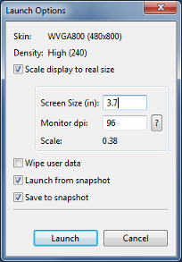

> 原文作者：Google  
原文地址：[http://developer.android.com/guide/practices/screens_support.html](http://developer.android.com/guide/practices/screens_support.html)  
原文版权：[Creative Commons 2.5 Attribution License](http://creativecommons.org/licenses/by/2.5/)  
译文作者：Jianan - qinxiandiqi@foxmail.com  
版本信息：本文基于2015-10-20版本翻译  
译文版权：[CC BY-NC-ND 4.0](http://creativecommons.org/licenses/by-nc-nd/4.0/)，允许复制转载，但必须保留译文作者署名及译文链接，不得演绎和用于商业用途

<br>
# **前言**
---
运行Android系统设备的屏幕尺寸和密度千变万化。然而对于应用程序来说，Android系统为所有设备提供了一个统一的开发环境，并且由系统处理了大部分应用程序界面与实际屏幕的适配工作。同时，系统也提供了相应的API允许你在特定的屏幕尺寸或屏幕密度上为你的应用程序UI做特定的调整，以便在不同配置的屏幕上优化你的UI。例如，你可能需要在平板和手机上显示不一样的UI效果。

尽管系统能够自动将你的应用程序UI通过缩放或重置大小来适配不同的屏幕，但你仍然需要为你的应用程序适配不同尺寸和密度的屏幕做一点优化工作。这样，你才能够最大程度优化不同设备上的用户体验，让你的用户相信你的应用就是为他们的设备设计的，而不是通过简单的UI拉伸来填充他们的设备屏幕。

通过本文介绍的方法，你能够创建一个显示正确的应用程序，并且签名打包出一个在其所有支持的设备屏幕上都能获得优越用户体验的apk文件。

> **注意：** 本文所有内容都假定你的应用程序只支持Android 1.6（API Level 4）或者更高的Android版本。如果你的应用程序需要支持Android 1.5或者更低的版本，请先阅读[Strategies for Android 1.5](http://developer.android.com/guide/practices/screens-support-1.5.html).
>
> 另外，要知道从Android 3.2开始引入了很多新的API，这些API能够让你为不同屏幕尺寸更好的调整应用程序所使用的layout资源。如果你开发的应用需要针对平板进行优化，这些新特性就更加重要。更多的细节可以参考下面**Declaring Table Layouts for Android 3.2**章节。

<br>
# **屏幕支持概览（Overview of Screens Support）**
---
本章节为Android支持多样屏幕的概述。包括对本文档或API中涉及的术语及概念进行介绍说明，对Android系统所支持的屏幕配置属性的总结，以及API和底层屏幕兼容特性的概述。

## **2.1 术语及概念（Terms and concepts）**

### **2.1.1 Screen size（屏幕尺寸）**

实际的物理尺寸，根据屏幕的对角线来测量。  

为了简单起见，Android将全部屏幕尺寸归类成4种通用尺寸：`small`、`normal`、`large`、`extra-large`。

### **2.1.2 Screen density（屏幕密度）**

指的是屏幕上一个物理单位区域中的像素数量，通常使用`dpi`（每英寸多少点）为单位。例如，相对于“normal”或者“high”密度的屏幕，在相同物理区域上“low”密度的屏幕拥有的像素要更少。

为了简单起见，Android将全部屏幕密度归类成6中通用密度：`low`、`medium`、`high`、`extra-hight`、`extra-extra-high`、`extra-extra-extra-high`。

### **2.1.3 Orientation（屏幕方向）**

屏幕的方向是从用户的视觉角度来说的。屏幕方向不是landscape（横向）就是portrait（竖向），分别意味着屏幕的宽高比更宽或者更高。注意不单要做不同屏幕的适配，还要做同一个屏幕不同方向情况下的适配，因为如果用户在应用程序运行的过程中旋转设备可能会引起屏幕方向的改变。

### **2.1.4 Resolution（分辨率）**

表示一块屏幕上总的物理像素数量。当支持多样屏幕适配的时候，应用程序不直接使用分辨率，应用程序应当使用上文所说的系统通用尺寸和通用密度类别，只需关心屏幕尺寸和密度就可以了。

### **2.1.5 Density-independent pixel（dp，密度无关的像素）**

一种虚拟的像素单位。当你在UI的layout资源中定义layout的尺寸或位置的时候，你应当使用这种虚拟像素单位。

1个单位的虚拟像素等于160dpi屏幕上的一个物理像素点，这也是系统将“medium”屏幕密度作为基准密度的原因。在运行的时候，如果有需要，系统会基于实际屏幕的密度对dp单位进行缩放。dp单位和实际屏幕px像素单位的转换很简单：`px = dp * (dpi/160)`。例如，在240dpi的屏幕上，1dp等于1.5px。当你定义应用程序UI的时候，你应当使用dp来保证你的UI能够正确显示在不同的屏幕上。

## **2.2 屏幕支持的范围（Range of screens supported）**

从Android 1.6（API Level 4）开始，Android提供了多种屏幕尺寸和密度的支持，以对应不同的设备屏幕配置。你可以使用系统提供的这些功能针对每一种屏幕配置优化你的应用程序界面，确保你的应用程序能够在每一种屏幕上提供最好的用户体验，而不单单只是基本正常显示。

为了简化你为不同屏幕适配用户界面的工作，Android将实际的屏幕尺寸和密度归类为如下：

* 4种通用的尺寸：**small**，**normal**，**large**，**xlarge**

> **注意：** 从Android 3.2（API Level 13）开始，这些尺寸分类已经被弃用，以便于基于可用屏幕宽度来管理屏幕尺寸这种新技术的实现。如果你是为Android 3.2或更高版本的系统开发，请参考下面 **Declaring Tablet Layouts for Android 3.2** 章节获取更多信息。

* 6种通用密度：
  * ldpi(low) ~ 120dpi
  * mdpi(medium) ~ 160dpi
  * hdpi(high) ~ 240dpi
  * xhdpi(extra-hight) ~ 320dpi
  * xxhdpi(extra-extra-high) ~ 480dpi
  * xxxhdpi(extra-extra-extra-high) ~ 640dpi

这些通用尺寸和通用密度全部都是以normal尺寸和mdpi密度作为基准来调整的。之所以使用这个基准是因为这是第一部Android设备T-Mobile G1的屏幕配置，也就是HVGA屏幕（直到Android 1.6之前，这都是Android唯一支持的屏幕配置）。

每一套通用尺寸和通用密度都会覆盖一定范围的真实屏幕尺寸和密度。例如，两台设备都要求使用normal尺寸，但实际上手动测量两台设备屏幕的真实尺寸和纵横比会稍稍不同。同样的，两个设备都要求使用hdpi密度，但实际上两台设备的像素密度稍稍不同。Android系统会将这些差异抽象化，因此你可以直接提供通用尺寸或者通用密度的UI，让系统在有需要的时候自动进行校准。下图粗略的展示了不同的尺寸和密度与通用尺寸和通用密度的对应关系：

  

**图1** 真实尺寸与密度和通用尺寸通用密度对应的大致范围（注意图中数字是不太准确的）

当你为不同的屏幕尺寸设计UI的时候，你会发现每一种都有最小的空间值限制。因此，系统对上面提到的每一种通用屏幕尺寸都定义了相关联的最小解析度。最小的尺寸为1dp，dp是你定义layout的时候应该使用的单位，使用这个单位才能让系统处理UI因屏幕密度不同引起的变化。

* xlarge屏幕最小解析度为960dp*720dp
* large屏幕最小解析度为640dp*480dp
* normal屏幕最小解析度为470dp*320dp
* small屏幕最小解析度为426dp*320dp

> **注意：** 这些最小屏幕解析度在Android 3.0之前的版本上并没有明确定义，因此，你可能会发现一些设备的屏幕尺寸在normal和large之间被错误归类了。另外，这些解析度也基于屏幕的物理解析度，所以每台设备都各不相同——例如一部1024*720的平板使用了系统栏后留给应用程序的可用空间会更少，因为部分空间被系统栏占用了。

为不同的屏幕尺寸和屏幕密度优化你的应用程序UI，你可以为一些通用尺寸和通用密度提供[替换的资源](http://developer.android.com/guide/topics/resources/providing-resources.html#AlternativeResources)。通常情况下，你应该为不同尺寸的屏幕提供可替换的layout资源，以及为不同密度的屏幕提供可替换的图片资源。在运行的时候，系统会将当前设备的屏幕与通用尺寸或通用密度进行对比，自动为你的应用程序选择合适的资源。

你不需要为每一种通用屏幕尺寸和通用屏幕密度的组合都提供一套可替换的资源。系统提供了强大的兼容功能，能够将你的应用程序渲染到不同设备屏幕上并处理大部分的问题。但前提是你在实现你的UI时已经使用了相关的技术，这样才能使系统优雅的调整UI大小（详细请查看下面**独立密度**章节）。

> **注意：** 一台设备的通用屏幕尺寸和通用屏幕密度的特性之间是相互独立的。例如，一块WVGA的high密度屏幕将会使用normal屏幕尺寸，因为它的物理尺寸与T-Mobile G1一样（第一部Android设备，也是屏幕配置分类的基准）。另一方面，一块WVGA的medium密度屏幕将会使用large屏幕尺寸。尽管它们的解析度是相同的（总像素相同），但是这块WVGA medium密度的屏幕密度比较低，这意味着它的像素点物理尺寸更大，因此才会使整块屏幕比基准屏幕（normal尺寸的屏幕）更大。

## **2.3 独立的密度（Density independence）**

当你的应用程序实现“密度独立”时，即使是在不同密度的屏幕上，你的UI元素也将保留同样的物理尺寸（从用户的角度来看）。

保持密度独立是一件重要的事情，因为如果没有保持密度独立，一个UI元素（例如一个按钮）将会在低密度屏幕上显示的很大，而在高密度屏幕上显示的很小。像这样密度相关的尺寸如果一改变，就会导致你的应用程序产生布局或者可用性的问题。图2和图3分别显示了一个应用程序如果没有保持密度独立和保持密度独立的显示效果。  

  

**图2** 没有支持不同屏幕密度的应用程序示例，分别是low、medium和high密度的屏幕效果。  

  

**图3** 很好支持不同屏幕密度的应用程序示例（也就是密度独立），分别是low、medium和high密度的屏幕效果。

Android系统通过两种方式来帮助你的应用程序实现密度独立：

* 系统根据当前屏幕的实际密度自动缩放dp单位到合适的大小
* 在需要的情况下，系统根据当前屏幕的实际密度自动缩放图片资源到合适的尺寸

在图2中，TextView和ImageView的尺寸通过像素（px单位）来指定，因此这些View的物理尺寸在low密度屏幕上显示会变得很大，在high密度屏幕上显示的很小。这是因为尽管它们的屏幕实际物理尺寸大小一样，但是high密度的屏幕上每英寸拥有的像素点更多（反过来也就是同样数量的像素点在high密度屏幕上能够填充的范围更少）。由于密度无关像素的基准是medium密度的屏幕，所以在上面两张图片中medium密度的屏幕显示效果是一样的。对于low密度和high密度的屏幕，系统会自动分别为dp值的实际尺寸缩小或放大到合适尺寸。

大多数情况下，确保你的应用程序与密度无关，你只需要简单的将所有layout中的尺寸值使用dp单位或者“wrap_content”属性值声明。这样系统也才能够根据当前屏幕的密度选择合适的缩放因子将图片资源缩放到合适的尺寸。

然而，从上面的截图中，你可能已经发现图片的缩放会导致图片模糊或者产生齿距。为了避免这种情况，你需要为不同的密度提供可替换的图片资源。例如，你应该为high密度的屏幕提供高分辨率的图片，系统会在high密度屏幕上使用高分辨率的图片来缩放，而不是直接使用medium密度的图片。下面的章节会详细说明如何为不同配置的屏幕提供可替换掉的资源。

<br>
# **如何支持多样屏幕（How to Support Multiple Screens）**
---
Android支持多样屏幕的基础是它能够根据当前屏幕配置适当渲染应用程序布局和图片的能力。系统正确处理了每一块屏幕上的UI渲染工作，这些操作是通过缩放layout来适配屏幕尺寸/密度，或者缩放图片来适配屏幕密度。为了更好的处理不同屏幕配置之间的差异，你还应该做以下工作：

* **在manifest中明确声明你的应用程序所支持的屏幕尺寸**  
通过声明你的应用程序所支持的屏幕尺寸，你可以确保只有符合屏幕配置条件的设备才能下载你的应用程序。声明所支持的不同屏幕尺寸也会影响系统如何在更大的屏幕上绘制你的应用程序——无论你的应用程序是否运行在[屏幕兼容模式](http://developer.android.com/guide/practices/screen-compat-mode.html)下。  
声明你的应用程序所支持的屏幕尺寸，你需要在manifest文件中声明[&lt;supports-screens>](http://developer.android.com/guide/topics/manifest/supports-screens-element.html)标签。

* **为不同的屏幕尺寸提供不同的layout**  
默认情况下，Android会调整应用程序的layout大小来适配当前设备屏幕。在大多数情况下，这么做没什么问题。然而，在有些情况下，你的UI可能看起来没那么好，需要针对不同屏幕尺寸做一定的调整。例如，在大屏幕上面，你可能想要调整一些元素的位置和尺寸来利用大屏幕多出来的屏幕空间，或者在小屏幕上你可能需要调整下尺寸才能让全部元素都能正确显示在屏幕上。  
提供特定尺寸资源，你可以使用的配置修饰符有`small`、`noraml`、`large`、`xlarge`。例如，为extra-large屏幕提供的layout资源应该放在`layout-xlarge/`资源文件夹下。  
从Android 3.2（API level 13）开始，上面所说的尺寸类别已经被弃用，你应该使用`sw<N>dp`配置修饰符作为替代品来定义你的layout资源要求的最小可用宽度。例如，如果你的多窗口平板布局要求最少600dp的屏幕宽度，你就应该使用`layout-sw600dp/`资源文件夹。更多关于这种声明layout资源的新技术，请参考下面**Declaring Table Layouts for Android 3.2**章节。

* **为不同的屏幕密度提供不同的图片资源**  
默认情况下，Android会自动缩放你的bitmap图片（`.png`，`.jpg`，和`.gif`文件）和Nine-Patch图片（`.9.png`文件），这样它们才能在每一台设备上渲染出合适的物理尺寸。例如，如果你的应用程序只为基准密度，也就是medium屏幕密度（mdpi）提供了图片资源，那么系统将会在high密度屏幕上放大这些图片，在low密度屏幕上缩小这些图片。这些缩放可会到引起图片显示问题。为了确保你的图片看起来显示效果最好，你应该为不同密度的屏幕提供不同分辨率的图片进行替换。  
提供特定密度的资源，你可以使用的`配置修饰符`（下面章节详细介绍）有`ldpi`（low）、`mdpi`（medium）、`hdpi`（high）、`xhdpi`（extra-high）、`xxhdpi`（extra-extra-high）、`xxxhdpi`（extra-extra-extra-high）。例如，想要为high屏幕密度提供的图片应该放在`drawable-hdpi/`资源文件夹下。

> **注意：** `mipmap-xxxhdpi`修饰符只有在需要为xxdpi屏幕密度的设备提供比通常更大的启动图标时才必须使用的。你不需要为所有图片都提供xxxdpi规格的版本。

有些设备会将启动图标放大多达25%。例如，如果你的最高启动图标密度已经是extra-extra-hight密度，缩放程序将会使启动图标的显示效果变得模糊。因此，你应该在`mipmap-xxxhdpi`资源文件夹中提供更高密度的启动图标，系统会直接使用这个图标，而不是去放大低密度版本的图片。

参考[提供xxx-high密度启动图标](http://developer.android.com/design/style/iconography.html#xxxhdpi-launcher)章节获取更多详细信息。除了启动图标，你不应该为其它UI元素提供xxxhdpi类型的图片。

> **注意：** 将你的启动图标放在`res/mipmap-[density]`资源文件夹下，而不是`res/drawable-[density]`资源文件夹。因为，不管你的应用程序实际安装的设备屏幕分辨率是多少，Android系统都会保留这类密度修饰符的资源文件夹，例如mipmap-xxxhdpi。这样启动器才能够选择你的应用程序最佳分辨率的图标显示在home上面。更多关于mipmap文件夹的信息，请参考[Managing Projects Overview](http://developer.android.com/tools/projects/index.html#mipmap)

所有的这些尺寸和密度的配置修饰符一一对应上面**屏幕支持的范围（Range of screens supported）** 章节所提到的通用尺寸和通用密度。

> **注意：** 如果你不熟悉这些配置修饰符，以及系统如何使用它们来适配替换资源，请参考[Providing Alternative Resources](http://developer.android.com/guide/topics/resources/providing-resources.html#AlternativeResources)。

在运行的过程中，系统通过以下几个步骤来确保UI在当前屏幕上能有最好的显示效果：

1. **系统使用适当的可替换资源**  
根据当前屏幕的尺寸和密度，系统将使用应用程序提供的对应尺寸和密度修饰符资源文件夹中的资源。例如，一台high密度的设备要使用应用程序的一张图片资源，系统将会在应用程序的全部资源文件夹中挑选最匹配当前设备配置的资源文件夹。取决于可用的替代资源，使用`hdpi`修饰符的资源文件夹（例如`drawable-hdpi`）可能是最佳的匹配，系统就会使用这个文件夹中的图片资源。

2. **如果没有找到匹配的可用资源，系统将会使用默认的资源加以放大或缩小来适配当前屏幕尺寸和密度**  
所谓的默认资源文件夹就是那些不带任何配置修饰符的资源文件夹。例如，`drawable/`资源文件夹中的资源就是默认的图片资源。系统会假设默认的资源是根据屏幕尺寸和密度的基准来设计的，也就是normal尺寸和medium密度。因此，系统将会为高密度的屏幕放大默认图片，为低密度屏幕缩小默认图片。  
然而，当系统查找对应当前屏幕的密度修饰符资源但又找不到匹配的资源时，系统不一定就会使用默认的资源。系统也有可能会使用其它密度修饰符的资源来作替代，以便放大缩小后能够取得最好的效果。例如，当系统寻找low密度的资源但是又找不到的时候，系统会优先用high密度的资源进行缩小，因为相对于使用0.75缩放因子将medium密度资源缩小成low密度资源，系统使用0.5的缩放因子将high密度资源缩小成low密度的资源会更加容易和节省开销。

更多关于Android系统如何选取带配置修饰符的可替代资源来适应设备配置信息，请参考[How Android Finds the Best-matching Resource](http://developer.android.com/guide/topics/resources/providing-resources.html#BestMatch)。

## **3.1 使用配置修饰符（Using configuration qualifiers）**

Android支持一系列配置修饰符，通过这些修饰符，你可以控制系统如何基于当前设备屏幕的特性选择对应的替代资源。所谓的配置修饰符就是一串字符串，用于附加到你的Android项目资源文件夹后面，以指明该资源文件夹所针对的配置。

配置修饰符的使用方式：

1. 在你的项目`res/`文件夹下创建一个新的文件夹，并以`<resources_name>-<qualifiter>`格式命名
  * `<resources_name>`指的是标准的资源名称（例如`drawable`或者`layout`）。
  * `<qualifier>`指的是下面表1中的配置修饰符，用于指明文件夹中的资源对应的屏幕配置（例如`hdpi`或`xlarge`）

2. 将适当的配置资源放到对应的资源文件夹中。这些资源的名称必须与默认的资源文件一模一样。

例如，`xlarge`是针对extra-large屏幕的配置修饰符。当你将这个修饰符添加到资源文件夹后面时（例如`layout-xlarge`），它向系统指明这些资源应该用于extra-large屏幕的设备。

**表1** 允许你为不同屏幕配置指定资源的配置修饰符  

<table width="auto">
  <tr>
    <td width="12%"><b>屏幕特性</b></td>
    <td><b>修饰符</b></td>
    <td><b>描述</b></td>
  </tr>
  <tr>
    <td rowSpan="4">尺寸</td>
    <td><b>small</b></td>
    <td>针对<i>small</i>通用屏幕尺寸的资源</td>
  </tr>
  <tr>
    <td><b>normal</b></td>
    <td>针对<i>normal</i>通用屏幕尺寸的资源（也是所用尺寸的基准尺寸）</td>
  </tr>
  <tr>
    <td><b>large</b></td>
    <td>针对<i>large</i>通用屏幕尺寸的资源</td>
  </tr>
  <tr>
    <td><b>xlarge</b></td>
    <td>针对<i>extra-large</i>通用屏幕尺寸的资源</td>
  </tr>
  <tr>
    <td rowSpan="8">密度</td>
    <td><b>ldpi</b></td>
    <td>针对low通用屏幕密度（<i>ldpi</i>）的资源（大约120dpi）</td>
  </tr>
  <tr>
    <td><b>mdpi</b></td>
    <td>针对medium通用屏幕密度（<i>mdpi</i>）的资源（大约160dpi，也是通用屏幕密度的基准）</td>
  </tr>
  <tr>
    <td><b>hdpi</b></td>
    <td>针对high通用屏幕密度（<i>hdpi</i>）的资源（大约240dpi）</td>
  </tr>
  <tr>
    <td><b>xhdpi</b></td>
    <td>针对extra-high通用屏幕密度（<i>xhdpi</i>）的资源（大约320dpi）</td>
  </tr>
  <tr>
    <td><b>xxhdpi</b></td>
    <td>针对extra-extra-high通用屏幕密度（<i>xxhdpi</i>）的资源（大约480dpi）</td>
  </tr>
  <tr>
    <td><b>xxxhdpi</b></td>
    <td>针对extra-extra-extra-high通用屏幕密度的资源（大约640dpi）。只用于存放启动图标，详情请参考上面章节。</td>
  </tr>
  <tr>
    <td><b>nodpi</b></td>
    <td>针对所有屏幕密度的资源。这些资源与密度无关，无论当前屏幕密度是多少，系统都不会放大缩小这些资源。</td>
  </tr>
  <tr>
    <td><b>tvdpi</b></td>
    <td>针对介于mdpi和hdpi之间屏幕密度的资源，大约是213dpi。这不是一个主要密度类型，它主要是为电视机屏幕而设置。大多数app都不需要这种类型，提供的mdpi和hdpi资源已经能够满足大部分app的需求，并且在需要的时候系统也会自动对这些资源进行缩放到合适的大小。如果你需要提供tvdpi类型的资源，你需要使用1.33倍mdpi的缩放因子来设置tvdpi资源的大小。例如，一张针对mdpi屏幕的100x100px图片，对应tvdpi屏幕的尺寸是133x133px。</td>
  </tr>
  <tr>
    <td rowSpan="2">方向</td>
    <td><b>land</b></td>
    <td>针对横向屏幕的资源（宽宽高比）</td>
  </tr>
  <tr>
    <td><b>port</b></td>
    <td>针对竖向屏幕的资源（高宽高比）</td>
  </tr>
  <tr>
    <td rowSpan="2">长宽比</td>
    <td><b>long</b></td>
    <td>针对屏幕的竖屏或宽屏长宽比（分别对应竖向或者横向方向）比基准屏幕配置更大的屏幕资源</td>
  </tr>
  <tr>
    <td><b>notlong</b></td>
    <td>针对屏幕的竖屏或者宽屏长宽比比基准屏幕配置更小的屏幕资源</td>
  </tr>
</table>
<br>
> **注意：** 如果你的应用程序是为Android 3.2或者更高的系统版本开发的，那么你需要查看下面*Declaring Table Layouts for Android 3.2*章节，在定义layout资源的时候使用新的配置修饰符来声明所适配的屏幕尺寸（替换表一中的尺寸修饰符）

更多关于这些修饰符如何匹配当前屏幕实际尺寸和密度的内容，请参考前面*屏幕支持范围（Range of Screens Support）* 章节。

例如，下面的应用程序的资源目录为不同的屏幕尺寸提供了不同的layout资源，为不同的屏幕密度提供了不同的图片，并使用`mipmap/`资源文件夹提供启动图标：

    res/layout/my_layout.xml              // layout for normal screen size ("default")  
    res/layout-large/my_layout.xml        // layout for large screen size
    res/layout-xlarge/my_layout.xml       // layout for extra-large screen size
    res/layout-xlarge-land/my_layout.xml  // layout for extra-large in landscape orientation

    res/drawable-mdpi/graphic.png         // bitmap for medium-density
    res/drawable-hdpi/graphic.png         // bitmap for high-density
    res/drawable-xhdpi/graphic.png        // bitmap for extra-high-density
    res/drawable-xxhdpi/graphic.png       // bitmap for extra-extra-high-density

    res/mipmap-mdpi/my_icon.png         // launcher icon for medium-density
    res/mipmap-hdpi/my_icon.png         // launcher icon for high-density
    res/mipmap-xhdpi/my_icon.png        // launcher icon for extra-high-density
    res/mipmap-xxhdpi/my_icon.png       // launcher icon for extra-extra-high-density
    res/mipmap-xxxhdpi/my_icon.png      // launcher icon for extra-extra-extra-high-density

更多关于如何使用可替代资源，以及完整的配置修饰符列表（不单只是屏幕配置修饰符），请参考[Providing Alternative Resource](http://developer.android.com/guide/topics/resources/providing-resources.html#AlternativeResources).

要注意，系统在运行的时候会选择哪一种资源作为“最合适”的资源是根据一定的逻辑规则来决定的。也就是，无论在哪种屏幕下，你所使用的修饰符都不一定要跟当前屏幕配置完全匹配，以便系统能够自己选择。具体来讲，当基于尺寸修饰符选择资源的时候，如果没有更匹配的资源，系统会选择为比当前屏幕更小的屏幕所提供的资源（例如，在需要的时候large尺寸的屏幕可能会使用normal尺寸的资源）。另外，如果唯一能够使用的资源是为比当前设备屏幕更大的屏幕所提供的，那么系统将不会使用这些资源，并且应用程序会崩溃（例如，所有的layout资源都添加了`xlarge`修饰符，但是当前设备屏幕是normal尺寸屏幕）。更多关于系统选择资源的信息，请参考[How Android Finds the Best-matching Resource](http://developer.android.com/guide/topics/resources/providing-resources.html#BestMatch).

> **小贴士：** 如果你有一些图片资源希望系统永远不进行缩放（可能你想要在程序运行时由自己来控制和调整），那么你应该把这些资源放到`nodpi`配置修饰符的资源文件夹中。在这个配置修饰符文件夹中的资源是密度无关的资源，系统永远不会对它们进行缩放。

## **3.2 设计可替代的布局和图片资源（Designing alternative layouts and drawables）**

需要提供哪些可替代资源是根据你的应用程序需求来决定的。通常情况下，你需要使用尺寸和方向类的修饰符来提供可替代的layout资源，以及使用密度类的修饰符提供可替代的图片资源。

下面章节将分别总结为什么你要使用尺寸类或密度类修饰符提供可替代的layout资源或者图片资源。

### **3.2.1 可替代布局资源（Alternative layouts）**

通常情况下，只要你在不同配置的屏幕上测试你的应用程序，你就能知道是否需要为不同的屏幕尺寸提供可替换的layout资源了。例如：

* 当你在small屏幕上测试的时候，你可能会发现你的layout不能很好的填充在屏幕上。例如，在small屏幕上，屏幕的宽度内不能填满多个按钮。这种情况下，你需要为small屏幕提供可替代的layout资源来调整按钮的尺寸和位置。

* 当你在extra-large屏幕上测试的时候，你可能会发现你的layout不能高效利用大屏幕的优势，并且整个布局都被拉伸来填满屏幕。这种情况下，你需要为extra-large屏幕提供可替代的layout资源，重新提供为大屏幕（例如平板）优化的UI。  
尽管你的应用程序不为大屏幕提供可替代layout资源也能够正常运行，但对用户来说，提供可替代资源能让用户感觉这个应用程序就是为了他的设备所设计的。如果UI都被拉伸了，用户对应用程序的用户体验可能很反感。

* 另外，当测试横向屏幕与竖向屏幕时，你可能会发现竖向屏幕底部的UI元素在横向屏幕上显示在屏幕右边。

总结，你应该确认你的应用程序布局是存在以下几点：

* 需要适配小屏幕（这样用户才能正常使用你的应用程序）
* 是否有对大屏幕进行优化以充分利用大屏幕带来的额外空间
* 是否有对横向和竖向屏幕进行优化

如果你的UI所使用的图片即使在被系统缩放layout之后也要填充整个view（例如按钮的背景图片），那么你应该使用[Nine-Patch](http://developer.android.com/guide/topics/graphics/2d-graphics.html#nine-patch)图片文件。Nine-Patch（点九图）文件实际上就是在png图片文件的基础上指定了两个维度上的可拉伸区域。当系统拉伸使用点九图的的view时，所使用的点九图也会被拉伸，只不过拉伸的只是点九图上指定的可拉伸区域。因此，如果使用点九图的话就不需要为不同的屏幕尺寸提供不同的图片，因为点九图能够自动调整到任何尺寸。然而，你还是要为不同的屏幕密度提供可替代的点九图资源。

### **3.2.2 可替代图片资源（Alternative drawables）**

几乎每一个应用程序都需要为不同的屏幕密度提供可替代的图片资源，因为每一个应用程序都有一个启动图标，至少要保证这个启动图标在每一块屏幕上都有良好的显示效果。同样，如果你的应用程序中还有其它的图片（例如菜单图标或者其它图形），你都应该为不同的屏幕密度给每一张图片都提供可替换的版本。

> **注意：** 你只需要为图片文件（`.png`，`.jpg`或`.git`）和Nine-Patch文件提供密度相关的资源。如果你使用XML文件来定义图形、颜色或者其它[drawable resources](http://developer.android.com/guide/topics/resources/drawable-resource.html)，那么你只需要在默认的图片文件夹（`drawable/`）中保留一份代码就可以了。

要为不同的屏幕密度创建可替代的图片资源，你应该遵循六种通用屏幕密度图片的缩放比例**3:4:6:8:12:16**。例如，如果你有一张为medium屏幕密度设计的图片尺寸是48x48像素，那么其它尺寸应该为：

* 36x36（0.75x），low屏幕密度
* 48x48（1.0x 基准），medium屏幕密度
* 72x72（1.5x），high屏幕密度
* 96x96（2.0x），extra-high屏幕密度
* 180x180（3.0x），extra-extra-high屏幕密度
* 192x192（4.0x），extra-extra-extra-high屏幕密度（只需要启动图标，参考上面章节）

**图4** 每一种屏幕密度之间图片的尺寸关系  


更多关于设计图标的信息，请参考[Icon Design Guidelines](http://developer.android.com/guide/practices/ui_guidelines/icon_design.html)。里面包含了各种图片资源的尺寸信息，包括启动图标、菜单图标，状态栏图标、标签图标等等。

<br>
# **为Android 3.2声明平板布局（Declaring Tablet Layouts for Android 3.2）**
---
自从第一代运行Android 3.0系统的平板开始，为平板定义layout的重要方法就是把平板layout放到带`xlarge`配置修饰符的资源文件夹中（例如`res/layout-xlarge`）。为了兼容其它类型的平板以及屏幕尺寸（特别是7英寸的平板），Android 3.2开始引入新的方法来为更碎片化的屏幕尺寸指定资源。相对于尝试将你的layout适配到通用的尺寸（例如large或者xlarge），新的技术是基于你的layout需要的空间大小（例如宽度要600dp）来调整。

这么设计的原因是当使用通用尺寸为7英寸平板做适配时，事情会变得非常棘手，因为7英寸平板在通用尺寸归类技术上与5英寸手机都划分为同一组（large类型）。尽管这种设备从尺寸上来看非常相近，但是对应用程序的UI占用的空间大小来说是显著不同的，同样用户交互习惯也不同。因此，7英寸和5英寸屏幕不应该使用相同的layout资源。为了实现为这两种不同的屏幕尺寸提供不同的layout资源，Android现在允许你根据应用程序layout实际需要的尺寸来声明layout资源的类型，并且要使用dp单位。

例如，你在为平板设备特别设计好layout资源之后，应该在小于600dp宽度的屏幕上检查这些layout是否能使用。因为使用这些平板layout资源的条件就是屏幕的最小尺寸是否满足你声明的尺寸。因此，现在你可以为你的应用程序UI指定一些只有在可用宽度最少为600dp时才能使用的layout资源。

你应该在指定一个宽度的同时，以这个宽度作为最小尺寸来进行设计。否则，你需要在完成layout资源后测试你的layout能够支持的最小宽度。

> **注意：** 所有使用新API指定的数值都是密度无关的值（dp），所以你的layout尺寸也应该使用dp单位来定义，因为你应该关心的只是系统计算屏幕密度后得出来的可用屏幕空间总值（强烈反对使用物理像素单位）。更多关于密度无关像素的内容，请参考上面**术语与概念（Terms and concepts）** 章节。

## **4.1 使用新的尺寸修饰符（Using new size qualifiers）**

表2总结了能够根据屏幕可用空间大小来指定资源的配置修饰符。相比较于传统的通用屏幕尺寸类型（small、normal、large、xlarge），新的修饰符能基于你的应用程序支持的屏幕尺寸给你提供更多的控制。

> **注意：** 你使用这些修饰符指定的尺寸不是实际上的屏幕尺寸。实际上，这些尺寸是你的Activity窗口可用宽度或者高度的dp值。Android系统可能会占用一些屏幕空间来显示系统UI（例如屏幕底部的系统栏或者顶部的状态栏），因此一些屏幕可能无法使用你的layout资源。也就是说，你声明的尺寸应该是你的Activity需要的尺寸——系统会统计系统UI占用的空间后决定给你的layout提供多大的空间。另外也要注意**Action Bar**也是你的应用程序组成部分，尽管你的layout资源没有声明它，但是它同样要占用你的layout可用空间的一部分，你在设计的时候也要把这部分给计算进去。

**表2** 新的屏幕尺寸配置修饰符（Android 3.2引入）

|屏幕配置|修饰符|说明|
|:-----|:-----|:------|
|最小宽度  （smallestWidth）| **sw&lt;N>dp**<br>例如：sw600dp、sw720dp|屏幕的基本尺寸，由屏幕可用区域的最短尺寸所决定。准确的说，设备的最小宽度就是屏幕最短的可用高度和宽度（你也可以认为是屏幕有可能呈现的最短宽度）。你可以使用这个修饰符来确保无论当前屏幕的方向如何，你的应用程序UI最少可用的宽度都有**&lt;N>** dp。<br>例如，你的应用程序无论任何时候都要求屏幕宽度最少要600dp，那么你就可以使用这个修饰符创建一个layout资源并放到**res/layout-sw600dp/**的资源文件夹中。系统只会在当前屏幕可用最小尺寸为600dp时才会使用这个资源，并且不管这个600dp是用户认为的高度还是宽度。最小宽度是一个固定的屏幕尺寸，是屏幕的一个属性。**无论当前屏幕的方向如何，设备的最小宽度都是不会变的。**<br>设备的最小宽度要考虑到屏幕的装饰空间和系统UI。例如，如果设备屏幕有一些持久性的UI沿着最小宽度的轴心占据一定的空间，那么系统声明的最小宽度值将会比实际屏幕的尺寸小，因为被占据的这部分屏幕空间你的UI永远无法使用。<br>这是相对于传统通用尺寸修饰符（small、normal、large、xlarge）的替代方案，它允许你根据你的UI实际需要的可用尺寸定义离散的数值。使用最小宽度来定义通用尺寸是非常有用的，因为宽度通常是设计一个layout的关键因素。一个UI通常可以上下滑动，但是却在横向空间上无法扩展。可用宽度同时也是决定是否在手机上显示单窗口layout或者平板上显示多窗口layout的关键因素。因此，你应该更加关注每一种设备上可能的最小宽度值是多少。|
|可用屏幕宽度  （Available screen width）|**w&lt;N>dp**<br>例如：w720dp、w1024dp|通过**&lt;N>**值指定该资源文件夹中资源最小可用宽度的dp值。当屏幕在横向和竖向之间切换的时候，系统相应的宽度值会改变，以实时更新你的UI当前可用的实际宽度。<br>这通常对判断是否使用多窗口layout非常有用，因为尽管是在平板设备上，你通常也不希望竖向多窗口布局与横向的相同。因此，你可以使用这个修饰符来声明layout所需要的最小宽度，而不是同时使用屏幕尺寸和方向的修饰符来联合声明。|
|可用屏幕高度  （Available screen high）|**h&lt;N>dp**<br>例如：h720dp、h1024dp|通过**&lt;N>**值指定该资源文件夹中资源最小可用高度的dp值。当屏幕在横向和竖向之间切换的时候，系统相应的高度值会改变，以实时更新你的UI当前可用的实际高度。<br>与使用**w&lt;N>dp**来定义layout所需宽度一样，使用**h&lt;N>dp**来定义你的layout所需要的高度也是非常有用的，它可以避免使用屏幕尺寸和方向两种修饰符来进行组合定义。然而，大多数app不需要这个修饰符。因为UI在需要的时候一般都能够上下滑动，在可用高度的控制上本身就比较灵活，不像可用宽度无法扩展。 |
<br>
尽管看起来使用这些修饰符要比使用通用屏幕尺寸类修饰符更复杂，但是一旦你确定了你的UI需求，使用这些修饰符实际上要简单得多。当你在设计UI的时候，你所关心的最主要问题应该是你的应用程序在手机风格的UI和平板风格的UI（使用多窗口）之间切换时，你所能使用的实际尺寸。这个UI风格切换的关键点取决于你特定的设计——可能你的平板layout需要720dp的宽度，也有可能600dp或者480dp就够了，还有可能是介于两者之间的某个值。使用表二中的修饰符，你就能精确的控制你的layout切换临界值。

更多关于这些尺寸配置修饰符的资料，请参考[Providing Resource](http://developer.android.com/guide/topics/resources/providing-resources.html#SmallestScreenWidthQualifier)文档。

## **4.2 配置实例（Configuration examples）**

为了帮助你针对不同类型的设备进行设计，下面是一些典型屏幕宽度的数值：

* 320dp：一种典型的手机屏幕（240x320 ldpi、320x480 mdpi、480x800 hdpi等等）
* 480dp：像是平板设备的过渡线（480x800 mdpi）
* 600dp：一种7英寸平板（600x1024 mdpi）
* 720dp：一种10英寸平板（720x1028 mdpi、800x1280 mdpi等等）

使用表2中的尺寸修饰符，你的应用程序可以根据你想要的宽度（或高度）来设定准确的数值去促使手机和平板分别使用不同的layout资源。例如，如果600dp是你的平板layout能够支持的最小可用宽度值，你就可以提供下面两套layout资源：

    res/layout/main_activity.xml           # 手机使用
    res/layout-sw600dp/main_activity.xml   # 平板使用

在这个例子中，只有当前屏幕空间的最小可用宽度值为600dp时，你的平板layout才能够被使用。

如果你还想进一步自定义你的UI，例如分别为7英寸和10英寸平板设计不同的layout，那么你可以再补充额外的最小宽度值layout：

    res/layout/main_activity.xml           # 手机使用 (小于600dp的可用宽度)
    res/layout-sw600dp/main_activity.xml   # 7英寸平板使用(600dp或者更大的屏幕宽度)
    res/layout-sw720dp/main_activity.xml   # 10英寸平板使用(720dp或者更大的屏幕宽度)

注意上面两个例子中的资源所使用的最小宽度修饰符**sw&lt;N>dp**，它所指的是不管当前设备的方向怎样，屏幕宽高两条边中的最小宽度。因此，使用**sw&lt;N>dp**从总体上忽略了屏幕的方向并为你的layout指定屏幕的可用尺寸是一种比较方便的方法。

然而，在一些情况下，分辨当前可用宽度或者高度对你的UI非常重要。例如，如果你有一个内置两个窗口的layout要显示两个边靠边的fragment，你可能就需要根据当前屏幕的宽度是否大于等于600dp，以及是否横向还是竖向才能决定是否使用这个layout。这种情况下，你的资源文件应该类似下面：

    res/layout/main_activity.xml         # 手机使用(可用宽度小于600dp)
    res/layout-w600dp/main_activity.xml  # 多窗口 (任何可用宽度大于等于600dp的屏幕)

注意第二套资源使用的可用宽度修饰符是**w&lt;N>dp**。使用这种方法，有些设备由于屏幕方向的改变导致两种layout都会使用到（例如屏幕在一个方向上可用宽度至少有600dp，而在另一个方向可用宽度小于600dp）。

如果可用高度才是你需要关注的点的话，你同样也可以与上面一样使用**h&lt;N>dp**修饰符。甚至，你还可以联合**w&lt;N>dp**和**h&lt;N>dp**两种修饰符一块使用，如果你真的需要的话。。。

## **4.3 声明支持的屏幕尺寸（Declaring screen size support）**

一旦你为不同的屏幕尺寸实现了对应的layout后，在你的manifest文件中声明你的应用程序所支持的屏幕也是同样重要的。

相对于新的屏幕配置修饰符，Android 3.2也为manifest的**&lt;support-screens>** 元素引入了新的属性。

* `android:requiresSmallesWidthDp`  
声明支持的最小屏幕宽度。最小宽度指的是屏幕空间（dp单位）上最短的边能够给你的应用程序最小的可用宽度，换句话说就是在屏幕两条边上最短的可用边。因此，为了能让设备兼容你的应用程序，设备的最小宽度应该等于或者大于声明的这个值。（通常声明的这个“最小宽度”值指的是你的layout所支持的值，并且不管当前屏幕是什么方向。）  
例如，如果你的应用程序只支持最小可用宽度为600dp的平板设备：  
```xml
<manifest ... >
    <supports-screens android:requiresSmallestWidthDp="600" />
    ...
</manifest>
```  
然而，如果你的应用程序支持Android所支持的所有屏幕（比如小到426dpx320dp），那么你可以不用声明这个属性，因为你的应用程序支持的最小宽度已经覆盖了可能遇到的最小设备了。  
> **慎重：** Android系统并不会注意这个属性，因此在运行的过程中这个属性并不会对应用程序的行为产生任何影响。它的作用是在像Google Paly这样的服务中过滤你的应用程序。不过，Google Play当前并不支持这个属性过滤（在Android 3.2版本上）。因此如果你的应用程序不支持小屏幕，你还需要继续使用其它关于尺寸的属性。

* `android:compatibleWidthLimitDp`  
这个属性允许你通过指定你的应用程序所支持的最大的“最小宽度”值来启用屏幕兼容模式作为一个可选的功能。如果设备屏幕的最小边可用宽度值大于你声明的值，用户依然能够安装你的应用程序，不过会在屏幕兼容模式下运行。默认情况下，屏幕兼容模式是关闭的，你的layout通常会被拉伸来填充屏幕。不过在系统栏会有一个按钮允许用户开启或者关闭屏幕兼容模式。  
> **注意：** 如果你的layout能够在大屏幕上正确的调整大小，那么你不需要使用这个属性。我们建议你避免使用这个属性，你应该遵从本文档提到的其它方法来确保你的layout尺寸能够适配大屏幕。

* `android:largestWidthLimitDp`  
这个属性允许你通过指定你的应用程序支持的最大的“最小宽度”值来强制启用屏幕兼容模式。如果设备可用屏幕的最小边大于你声明的值，你的应用程序将会在屏幕兼容模式下运行，并且没有任何途径关闭兼容模式。  
> **注意：** 如果你的应用程序layout能够在大屏幕上正确调整大小，那么你不需要使用这个属性。我们建议你避免使用这个属性，你应该遵从本文档提到的其它方法来确保你的layout尺寸能够适配大屏幕。

> **慎重：** 当为Android 3.2或者更高版本系统开发应用程序时，你不应该使用旧的屏幕尺寸属性与上面列出的属性组合使用。同时组合使用新的属性和旧的尺寸属性可能会导致无法预料到到结果。

更多关于这些属性的信息，请参考上面列出的相关链接。

<br>
# **最佳实践（Best Practices）**
---
支持多样屏幕的目的是为了创建能够正常运行，并且在Android支持的通用屏幕设备上都能显示良好的应用程序。本文前面的章节阐述了Android如何适配你的应用程序到不同的屏幕配置上，以及你可以怎样为应用程序在不同的屏幕配置上定制不同的效果。本章节主要提供一些额外的小贴士，以及关于确保你的应用程序在不同屏幕配置上都能良好缩放这种技术的概要。

下面是确保你的应用程序能够在不同屏幕上良好显示的快速检查列表：

1. 在XML layout文件中指定尺寸时要使用`wrap_content`、`fill_parent`或者`dp`单位。

2. 不要在你的应用程序代码中使用固定的像素值。

3. 不要使用`AbsoluteLayout`（已经被废弃）

4. 为不同的屏幕密度提供可替代的图片资源。

下面的章节提供更多的细节。

## **5.1 为layout的尺寸使用wrap_content、fill_content或者dp单位**

当在XML layout文件中定义view的`android:layout_width`和`android:layout_height`时，使用`wrap_content`、`fill_parent`或者`dp`单位来确保view在当前设备屏幕上能够分配到一个合适的尺寸。

例如，一个view定义了`layout_width="100dp"`，那么它在medium密度屏幕上将有100像素宽，而在high密度的屏幕上系统会将它放大到150像素宽，这样view就在屏幕上占据大约相等物理尺寸。

同样的，你应该使用`sp`（独立尺度像素）单位来定义字体的尺寸。`sp`的缩放因子由用户设定，系统会像处理`dp`一样缩放这些尺寸。

## **5.2 不要在应用程序的代码中写死像素值**

出于性能原因以及为了保持代码的简单性，Android系统使用像素作为尺寸和坐标值的标准单位。这意味着一个view的尺寸在代码中都是用像素单位来表示，并且基于当前屏幕密度而变化。例如，如果`myView.getWidth()`返回值为10，这表示在当前屏幕上myView宽度为10像素，但是在更高密度的屏幕上，这个返回值可能为15像素。如果你在应用程序的代码中使用像素值来定义图片的尺寸，这会导致图片无法根据当前屏幕密度进行预缩放处理，你可能需要在自己的代码中自行缩放这些像素值来适配未经缩放的原图。

如果你的应用程序需要在运行时操作图片或者处理像素值，请参考下面**Additional Density Consideration**章节。

## **5.3 不要使用AbsoluteLayout**

不像其它的layout控件，`AbsoluteLayout`强制使用固定的值来给子view布局，这样就导致在不同屏幕上很容易出现布局问题。因此，`AbsoluteLayout`在Android 1.5（API Level 3）就给废弃了。

你应该替换使用`RelativeLayout`，它能够根据相对位置给子view布局。例如，你可以指定一个按钮应该显示在一个TextView的右边。

## **5.4 使用尺寸和密度相关的资源**

尽管系统会根据当前屏幕配置自动缩放你的layout和图片资源，但你可能需要调整UI在不同屏幕上的尺寸，以及为不同的屏幕密度提供对应的图片资源。这其实是重申上面章节讲的内容。

如果你需要控制你的应用程序在各个屏幕上的显示效果，你需要在特定资源文件夹中调整你的layout和图片资源。例如，考虑到一个图标需要在medium和high屏幕密度上显示，你可以简单的创建两个不同尺寸的图标（例如medium密度为100x100尺寸，high密度为150x150尺寸），然后分别将这个两个图标放到特定修饰符的资源文件夹中：  

    res/drawable-mdpi/icon.png   //for medium-density screens
    res/drawable-hdpi/icon.png   //for high-density screens

> **注意：** 如果一个资源文件夹的名字没有定义密度修饰符，那么系统会认为这个资源文件夹中的资源是为medium这个密度基准而设计的，并且在需要的情况下会为其它密度缩放这些资源。

更多关于有效配置修饰符的内容，请参考上面**使用配置修饰符（Using configuration qualifiers）**章节。

<br>
# **其它密度注意事项（Additional Density Considerations)**
---
本章节将阐述更多关于Android如何在不同屏幕密度上缩放图片资源，以及如何更进一步控制图片在不同密度屏幕上的绘制。本章节的内容对于大部分应用程序来说不是那么重要，除非你的应用程序在不同屏幕密度上运行遇到问题，或者你的应用程序需要操作图形。

为了更好的理解在运行过程中是如何操作图形来支持多种密度屏幕，你应该先理解系统用于确保正确缩放图片的途径：

1. **预缩放资源（例如图片资源）**  
基于当前屏幕的密度，系统使用你的应用程序提供的指定尺寸或密度修饰符的资源直接显示。如果提供的资源与当前屏幕密度不符合，系统将会加载默认的资源并放大或缩小这些资源来适配当前的屏幕密度。系统会假设默认的资源（就是那些保存在没有添加任何配置修饰符资源文件夹中的资源）是为屏幕密度的基准（mdpi）而设计的，除非系统加载的资源是从其它密度修饰符资源文件中加载的。所谓的预缩放就是系统将图片大小调整到适合当前屏幕尺寸时做的处理。  如果你需要获取预缩放资源的尺寸，系统返回的将是缩放之后的资源尺寸。例如，一张为mdpi屏幕设计的图片为50x50像素，它将会在hdpi屏幕上放大到75x75像素（如果没有对应的hdpi资源替换的话），并且系统返回的尺寸也将是放大后的这个值。  
在一些情况下，你可能不希望Android系统进行预缩放资源处理。避免预缩放处理最简单的方法就是把资源放到`nodpi`配置修饰符的资源文件夹下。例如：  
res/drawable-nodpi/icon.png  
当系统从这个文件夹中获取icon.png资源时，系统会不根据当前设备密度对这张图片进行缩放。

2. **自动缩放像素尺寸和位置**  
应用程序可以通过在manifest文件中设置`android:anyDensity`属性为false，或者在程序代码中把一张图片的`Bitmap`对象的`inScaled`属性设置为false来禁用预缩放处理。在这种情况下，系统将会在绘制过程中自动缩放绝对像素位置和像素尺寸。系统通过这么处理来保证使用像素定义的屏幕元素与在基准屏幕密度（mdpi）上显示的物理尺寸保持大致相同。系统所做的这些缩放处理对于应用程序来说是透明，应用程序获取到的也是缩放后的尺寸，而不是实际的物理像素尺寸。  
例如，假设一台设备是WVGA high密度的屏幕，它的分辨率为480x800并且与传统的HVGA屏幕的大小一样，现在它运行一个禁用预缩放处理的程序。在这种情况下，当应用程序请求屏幕尺寸时，系统将会“欺骗”应用程序，返回320x533尺寸（近似mdpi的屏幕密度）。之后，当应用程序执行绘画操作时，例如废除一个位于(10,10)到(100,100)的矩形，系统将会适当转换这个位置的值，实际上废除的区域为(15,15)到(150,150)。如果你的应用程序需要直接操作图片的缩放，这个误差可能会导致意想不到的结果，不过这是尽可能考虑应用程序的性能后得出的一个合理的方案。如果你遇到这种情况，请参考下面**将dp单位转换为像素单位（Converting dp units to pixel units）** 。  
通常情况下，**你不应该禁用预缩放处理**。支持多样屏幕的最好方法是遵从上面**如何支持多屏幕（How to Support Multiple Screens)** 章节提及的基本技术。

如果你的应用程序需要操作图片或者需要通过其它方式在屏幕上直接与像素进行交互，那你可能需要采取额外的步骤来支持不同的屏幕密度。例如，如果你需要根据手指在屏幕上划过的像素点来识别触摸手势并进行响应，你就需要采用适当的密度无关像素值来取代实际像素值。

## **6.1 缩放运行过程中创建的Bitmap对象（Scaling Bitmap objects created at runtime）**

如果你的应用程序在内存中创建一张图片（一个Bitmap对象），默认情况下系统会假设这张图片是为medium这个基准屏幕密度而设计的，并且在渲染的时候会自动缩放。当Bitmap没有指定密度属性时，系统会添加“自动缩放”属性给Bitmap。如果你没有正确计算当前设备的屏幕密度并且为Bitmap对象指定相应的密度属性，自动缩放会跟你没有提供可替换资源的处理方法一样缩放这些Bitmap图片。

为了控制运行过程中创建的Bitmap对象是否缩放，你可以通过Bitmap的`setDensity()`为其指定密度类型，该方法可选参数值为`DisplayMetrics`类中定义的常量，例如`DENSITY_HIGH`或者`DENSITY_LOW`。

如果你是通过`BitmapFactory`从文件或者数据流这些数据源创建了`Bitmap`对象，那么你可以当做这个Bitmap对象已经存在一样，使用`BitmapFactory.Options`来设置bipmap对象的属性，系统通过这些属性来决定如何对它进行缩放。例如，你可以设置`inDensity`属性来设置bitmap对象对应的屏幕密度，以及`inScaled`属性来设置bitmap是否要通过缩放来适配当前设备屏幕密度。

如果你设置`inScaled`属性为false，那么你就禁用了系统可能会对bitmap进行的预缩放处理，系统在每次绘制的时候才对bitmap自动缩放处理。使用自动缩放来取代预处理会消耗更多的CPU，不过可以节省内存。

  

**图5：** 对比预缩放和自动缩放的bitmap

图5显示了在high密度屏幕上分别加载low（120）、medium（160）、high（240）密度的bitmap时，预处理缩放和自动缩放机制的区别。可以看出其中的差异是很小的，因为所有的bitmap都被缩放到适配当前屏幕密度的大小，尽管被缩放的bitmap由于预缩放处理还是绘制时自动缩放处理而有小小的显示差异。

> **注意：** 在Android 3.0或更高的系统版本中，由于改进了图形框架，预缩放或者自动缩放的bitmap显示效果将看不出区别。

## **6.2 将dp单位转换为像素单位（Converting dp units to pixel units）**

在一些情况，你需要使用dp单位表达尺寸后再转换为对应的像素单位。试想一下一个应用程序识别一个滑动或者划动手势的要求是手指至少移动16像素。在基准屏幕上要识别出这个手势，用户至少要滑动**16 pixels/160dpi**，相当于一英寸的十分之一（2.5mm）。如果是在high密度的设备屏幕上，用户至少要滑动**16 pixels/240dpi**，相当于一英寸的十五分之一（1.7mm）。这个距离必须足够短，这样用户才能感觉这个应用程序很灵敏。

为了解决这个问题，手势的触发距离必须在代码中用dp表示，并转换为对应的实际像素尺寸。例如：

```java
// 用dp单位表示的手势触发距离
private static final float GESTURE_THRESHOLD_DP = 16.0f;

// 获取屏幕密度
final float scale = getResources().getDisplayMetrics().density;
// 基于屏幕密度将dp尺寸转换为px尺寸
mGestureThreshold = (int) (GESTURE_THRESHOLD_DP * scale + 0.5f);

// 使用mGestureThreshold作为手势距离判定尺寸...

```

其中`DisplayMetrics.density`属性是根据当前屏幕密度得出的缩放因子，你必须使用这个因子转换dp单位和像素单位。在medium密度的屏幕上，`DisplayMetrics.density`等于1.0；在high密度的屏幕上等于1.5；在extra-high密度的屏幕上等于2.0；在low密度的屏幕上等于0.75。你必须使用这个因子的数值乘以dp单位值得出在当前屏幕上对应的实际像素尺寸（额外增加`0.5f`是为了在强制转换为整数时得到较大的整数值）。更多信息，请参考`DisplayMetrics`类。

另外，与其随意为这类事件定义一个触发值，你应该使用`ViewConfiguration`类中的可用方法获取预缩放的配置值。

## **6.3 使用预缩放配置值（Using pre-scaled configuration values)**

你可以使用`ViewConfiguration`类来获取Android系统使用的距离值、速度值、时间值等等。例如，系统框架识别滑动操作的像素距离值可以使用`getScaledTouchSlop()`方法获取：

```java
private static final int GESTURE_THRESHOLD_DP = ViewConfiguration.get(myContext).getScaledTouchSlop();
```

使用`ViewConfiguration`类中以**getScaled**开头的方法返回的像素值，不管当前是什么屏幕密度，都保证能正确显示。

<br>
# **如何在多种多样的屏幕上测试你的应用程序（How to Test Your Application on Multiple Screens）**
---
在发布你的应用程序之前，你应该在所有支持的屏幕尺寸和屏幕密度上进行完整测试。Android SDK中包含了很多你可以使用的仿真模拟器，这些模拟器模拟出了通用屏幕配置的尺寸和密度，而你的应用程序很可能就会在这种环境中运行。你同样可以修改仿真模拟器的默认尺寸、密度和分辨率，以模拟出一些特别屏幕的属性。使用仿真模拟器和额外的自定义配置就能测试一些可能的屏幕配置，因此你没有必要为了测试你的应用程序而去购买每一种设备。

配置应用程序多样屏幕支持性测试环境，你需要创建一系列AVD（Android虚拟机），可以使用默认的仿真模拟器或者创建符合你的应用程序能够支持的屏幕尺寸密度的屏幕配置。为此，你可以使用AVD管理器来创建这些AVD，并通过图形界面启动它们。

  

**图6：** 为测试屏幕支持个的系列AVD

启动Android SDK管理器，在window平台下你可以执行Android SDK文件夹下的`SDK Manager.exe`文件，在其它平台上可以执行`<sdk>/tools/`目录下的`android`可执行文件。图6展示了选中一个AVD的AVD管理器，用于测试各种各样的屏幕配置。

表3展示了Android SDK提供的各种各样仿真模拟器，你可以使用这些模拟器来模拟一些常见的屏幕配置。

**表3：** Android SDK提供的仿真器及各种屏幕配置（粗体显示）,还有其它一些典型分辨率。

||Low密度(120),ldpi|Medium密度(160),mdpi|High密度(240),hdpi|Extra-high密度(320),xhdpi|
|:----|:----|:----|:----|:----|
|Small屏幕|**QVGA(240x320)**||480x640||
|Normal屏幕|**WQVGA400(240x400)<br>WQVGA432(240x432)**|**HVGA(320x480)**|**WVGA800(480x800)<br>WVGA854(480x854)**<br>600x1024|640x960|
|Large屏幕|**WVGA800(480x800)[1]<br>WVGA854(480x854)[1]**|**WVGA800(480x800)[2]<br>WVGA854(480x854)[2]**|||
|Extra-Large屏幕|1024x600|**WXGA(1280x800)[3]**<br>1024x768<br>1280x768|1536x1152<br>1920x1152<br>1920x1200|2048x1536<br>2560x1536<br>2560x1600|
**[1]** 模拟这个配置，在创建AVD的时候要自定义120的密度，并且选择WVGA800或者WVGA854的皮肤  
**[2]** 模拟这个配置，在创建AVD的时候要自定义160的密度，并且选择WVGA800或者WVGA854的皮肤  
**[3]** Android 3.0平台上才支持这个皮肤  

更多关于创建和使用AVD测试应用程序的内容情况请参考[Managing AVDs with AVD Manager](http://developer.android.com/tools/devices/managing-avds.html)。

查看所有支持的屏幕配置激活设备比例，请参考[Screen Sizes and Densities](http://developer.android.com/about/dashboards/index.html)。

我们同样建议你将模拟器的物理尺寸配置成与真实设备尺寸相近后再测试你的应用程序。这样更容易将模拟结果与各个尺寸和密度比较。为此，你需要知道你的计算机显示器大致的dpi密度（例如，一个30英寸的戴尔显示器密度大概96dpi）。当你从AVD管理器中启动AVD的时候，你可以在启动选项中指定模拟器的屏幕尺寸和显示器的dpi，如图7：

  

**图7** 从AVD管理器中启动AVD时，你可以设置的尺寸和密度选项

如果你想要在内建模拟器皮肤支持的分辨率或密度之外的屏幕上测试你的应用程序，你可以通过自定义分辨率和密度来创建一个AVD。当使用AVD管理器创建AVD的时候不要选择内建的皮肤，自己指定分辨率。

如果你使用命令行启动你的AVD，你可以通过`-scale`选项为模拟器指定缩放因子，例如：

    emulator -avd <avd_name> -scale 96dpi

为了精简模拟器的尺寸，你也可以为`-scale`选项传递一个0.1到3之间的数值，它代表期望的缩放因子。

更多关于从命令行创建AVD模拟器的内容，请参考[Managing AVDs from the Command Line](http://developer.android.com/tools/devices/managing-avds-cmdline.html)。
