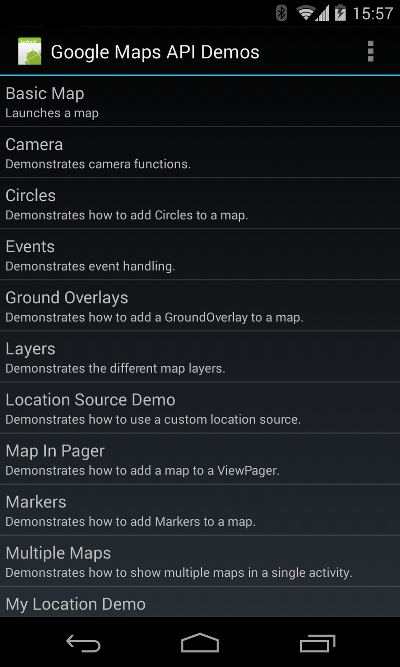

\----------------------------------------------------------------------------------------------------------------------------------------------------------

原文作者：Google

原文地址：<https://developers.google.com/maps/documentation/android-api/intro>

原文版权：[Creative Commons 3.0 Attribution
License](http://creativecommons.org/licenses/by/3.0/)

译文作者：Jianan - qinxiandiqi@foxmail.com

版本信息：本文基于2014-06-12版本翻译

译文版权：[CC BY-NC-ND 4.0](http://creativecommons.org/licenses/by-nc-
nd/4.0/)，允许复制转载，但必须保留译文作者署名及译文链接，不得演绎和用于商业用途

\----------------------------------------------------------------------------------------------------------------------------------------------------------

  

# 前言

  

通过使用Google Maps Android API，你可以添加依赖于Google Maps数据源的地图到你自己的应用上。Google Maps
API会自动执行连接Google
Maps服务器，下载地图数据，显示地图，并且响应地图手势等过程。你也可以通过API去添加地图标识，多边形以及添加地图上的覆盖层来修改地图界面以展现特殊的地图需求。这些对象提供了指定地点附加信息，并且允许用于与地图进行互动。Google
Maps API允许你添加以下图标到地图上：

  * 地图上指定地点的标识图标（Markers）

  * 一系列的线段（Polylines）

  * 闭合的线段（Polylines）

  * 地面上指定地点的图片（Ground Overlays）

  * 基础地图标题上显示的图片（Title Overlays）

  

# 1\. Audience（适用人群）

  

本文档适用于熟悉面向对象开发概念以及Android开发的开发人员。同样的你也需要从用户的角度熟悉Google Map的使用方法。

本文档的目的是帮助你快速学习Google Maps Android API并且使用它来开发应用程序。你也可能希望去参考具体类和方法的帮助文档。

  

## 1.1 Google Maps Mobile SDK for Business

  

Google Maps Mobile SDK for Business为Google Maps SDK for IOS和Google Maps
Android API 提供了更加强大的功能。如果你使用了商业版的Google Maps Mobile SDK，请额外参考Google Maps API
for Business documentation以获取更多的信息。

  

# 2\. Attribution Requirements（权责声明）

  

如果你在你的应用程序中使用Google Maps Android API，你必须将Google Paly
Services的权责声明作为你应用程序中法律生命的一部分。推荐把法律声明作为一个独立的菜单，或者是添加到“About”菜单中。

获取权责声明内容的方法可以通过调用GooglePlayServicesUtil.getOpenSourceSoftwareLicenseInfo方法获得。

  

# 3\. Accessibility（无障碍使用）

  

Google Maps Android API v2为无障碍使用提供了内建的支持。本章节对包含了使用这些API的应用程序会自动启用的无障碍功能的高度概括。

当用户打开了他们移动设备上的对讲无障碍功能，在屏幕上的每一次单点滑动都会将焦点从一个UI元素移动到下一个元素上（另一个替代单点滑动的方法是通过手指拖拽UI元素）。当一个UI元素获得焦点，对讲辅助功能将会读出UI元素的名字。如果用户双击屏幕的任何地方，焦点动作时间将会执行。

更多在你的应用程序上增强无障碍辅助功能的方法，请参考Android accessibility
documentation。特别的，给地图添加一个声明描述是一个很好的实践。指定声明的文本，可能调用view的setContentDescription()方法。

  

# 4\. Sample Code（示例代码）

  

这个Demo app依赖于Google Play services SDK，你可以跟使用示例代码一样使用和查看。

  

以下说明假设你的使用的是Eclipse的ADT插件：

首先你需要按照以下步骤添加Google Play services作为一个android库：

  1. 选择File > Import > Android > Existing Android Code Into Workspace，然后选择Next.
  2. 选择Browse,选择 <android-sdk-folder>/extras/google/google_play_services/libproject/google-play-services_lib,然后点击Open.
  3. 选择Copy project into workspace，然后点击Finish。
  4. 标记Google Play services作为库: 右键google-play-services_lib项目菜单,选择Properties > Android.然后勾选Is Library选项。

  

导入示例项目：

  1. 选择File > New > Other > Android Sample Project，然后点击Next。
  2. 选择最新版本的Android SDK然后点击Next。
  3. 滑动到示例项目列表的底部，选择Maps[Google Play Services]，点击Finish。

  

配置依赖关系并运行demo项目：

  1. 将Google Play services library链接为demo app的依赖库：右键打开Map项目的菜单，然后选择Properties > Android.检查library列表中是否已经将google-play-services_lib项目作为外部依赖库。如果没有，请根据[Referencing a Library Project](http://blog.csdn.net/qinxiandiqi/article/details/30033357)的步骤添加依赖库。
  2. 添加你自己的Google Maps Android API Key。Demo app 的包名为com.example.mapdemo。Demo App已经包含了一个API Key在它的manifest文件中，你需要将其替换为你自己的API Key。
  3. 如果你还没有完成以上步骤，请将你的手机设备设置为开发者模式，然后再连接你的电脑。
  4. 选择Mapsxiangmu，然后选择Run > Run 去运行demo app。

成功运行后你将会看到一个可在你的手机设备上运行的demo列表：

  

  

