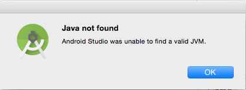
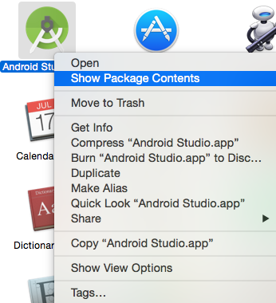
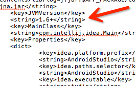

  

Android Studio正式版已经发布一段时间了，使用Mac版的Android Studio可能与遇到Java not found：Android
Studio was unable to find a valid JVM问题。

  

  

解决这个问题：

首先要确定mac系统上有没有安装jdk，并查看自己的jdk版本，可以在终端上输入命令 java
-version查看。如果没有安装jdk请先安装jdk，安装方法就不多说了，可以去Oracle官网上下载安装。

接下来确定自己的jdk版本，如果jdk的版本不是1.6版本就有可能出现以上问题，无法启动Android Studio。原因在于Android
Studio的配置文件中默认要求的是1.6版本的JVM，所以可以简单的修改下Android Studio的配置文件。方法如下：

1.找到你的Android Studio.app文件位置，一般都是在Applications文件夹下面。  

2.选择Android Studio.app文件，打开右键菜单，选择Show Package Contents打开Android
Studio.app（其实Mac系统下的app文件就是一个特殊的文件夹）。

3.进入Contents文件夹，找到Info.plist配置文件。

4.可以打开Info.plist配置文件，找到其中的<key>JVMVersion<key>标签，可以看到这个标签下面为<string>1.6<string>，默认使用JVM1.6版本，现在最新的JDK已经是1.8了。把1.6改成你所安装的jdk版本号然后保存修改就可以解决这个问题，或者简单的改成1.6+就可以兼容1.6以上的jdk版本。

  

  

