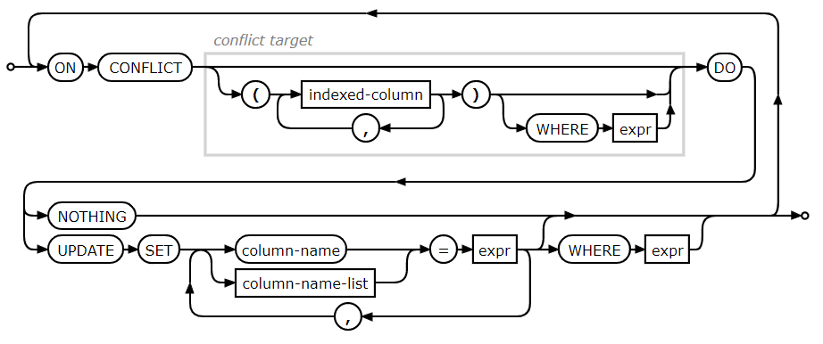

## 业务场景
在业务开发中可能会遇到这种场景：在SQLite数据库中有张表有多个字段，现在想要插入一条新记录，这条新记录只提供了表中部分字段的数据。要求如果表中没有这条记录就直接插入，如果表中已经有相同主键的记录就更新这条记录，新记录没有提供数据的字段要保持不变。  

## 怎么处理？使用INSERT OR REPLACE
看着很简单是吧？但要怎么做呢？  
为了让业务场景更具象一点，我们举个例子：假设我们现在有个IM聊天会话列表的数据表tb_conversations，表中包含会话id（主键）、会话名name、未读消息数unread（默认值为0）、是否置顶is_sticky（默认值为0，0代表否，1代表是），共4个字段。  
先来创建这张表：
```sql
CREATE TABLE tb_conversations (
    id        INTEGER PRIMARY KEY,
    name      TEXT,
    unread    INTEGER DEFAULT 0,
    is_sticky INTEGER DEFAULT 0
);
```
现在我们跟老王有个会话，会话id是1，name是老王。我们想把老王这个会话置顶，SQL语句怎么写？用**UPDATE**吗？不，因为不知道表中有没有老王这条记录，如果当前表中老王这条记录不在的话，UPDATE不会起作用。聪明的你应该想到了，用INSERT OR REPLACE：
```sql
INSERT OR REPLACE INTO tb_conversations(id, name, is_sticky) VALUES(1, "老王", 1);
```
因为当前表中没有老王这条记录，所以执行的结果是直接插入记录。由于sql语句中没有提供unread字段，所以插入的时候自动赋值为默认值0：  
  

这个时候，老王发了一条消息过来，消息未读数变成1，表要怎么更新？同样的，因为不知道表中是否已经有老王这条记录（在实际业务中，你在不先查表得情况下，其实很难肯定在每次操作数据库的时候，表中是否已经有对应记录），所以还是INSERT OR REPLACE：
```sql
INSERT OR REPLACE INTO tb_conversations(id, name, unread) VALUES(1, "老王", 1);
```
看看结果：  
  

可以看到unread字段已经替换成1。诶，等等，is_sticky字段怎么变成0了？明明第一次插入记录的时候已经把会话置顶了，is_sitkcy是1了才对呀！这是因为当前表中已经有老王这条记录了，所以这次INSERT OR REPLACE的执行效果是REPLACE。**REPLACE在替换的时候，对于没有提供数据的字段会直接使用这个字段的默认值。** is_sticky字段的默认值是0，所以REPLACE之后就变成0了。  
这可不是我们想要的效果，总不能我们把老王的会话置顶后，老王一发消息过来，置顶就被取消了吧。我们需要在更新记录的时候，未提供数据的字段保持不变。这也是开题业务场景里提到的，只插入或更新部分字段的问题。我们需要对INSERT OR REPLACE进行改进。

## 改进INSERT OR REPLACE
既然REPLACE的效果会把未提供数据的字段替换为默认值，那么只要在替换的时候，让这些未提供数据的字段不采用默认值，而是采用当前表中该记录的值不就好了。怎么使用当前表中的记录值呢？可以使用SQL子语句来处理：
```sql
INSERT OR REPLACE INTO tb_conversations (id, name, unread, is_sticky)
    VALUES (
        1,
        "老王",
        1,
        (SELECT is_sticky FROM tb_conversations WHERE id = 1)
    );
```  
先把表数据恢复到置顶老王会话之后的状态，这时收到老王新消息，未读数变为1，执行上面sql：
  
可以看到unread字段已经变成1，并且is_sticky字段的值也保留下来了。  

**这就完了吗？**  
上面执行的是INSERT OR REPLACE的REPLACE效果，但如果执行的是INSERT效果会怎样呢？  
我们先删掉老王这条记录：  
```sql
DELETE FROM tb_conversations WHERE id = 1;
```
再执行上面这条带SQL子语句的SQL，看看结果：  
  
奇怪的事情又发生了，在不存在老王记录的情况下，INSERT效果的is_sticky字段居然变成NULL，而不是默认值。为什么呢？其实也很合理，因为在不存在老王记录的情况下，SELECT查询子语句的执行结果就是NULL。既然指定了is_sticky字段值为NULL，那它就是NULL，很合理吧。  
怎么办呢？再改进一下，让SELECT查询子语句在查不到记录的情况下返回指定值：  
```sql
INSERT OR REPLACE INTO tb_conversations (id, name, unread, is_sticky)
    VALUES (
        1,
        "老王",
        1,
        COALESCE((SELECT is_sticky FROM tb_conversations WHERE id = 1), 0)
    );
```  

用COALESCE(expression_1, expression_2, ..., expression_n)函数包装一下SELECT子语句。COALESCE函数的作用是在所有的参数中，按顺序从左到右检查，返回第一个不为NULL的值，如果全部参数都是NULL则返回NULL。这样，当SELECT子语句为NULL的时候，就返回指定值（上面的语句指定为0）。现在先删除老王的记录，再执行这个语句：  
  

可以看到，这样无论是INSERT还是REPLACE效果都符合我们的要求了。  

还有更好的办法吗？每个缺失字段都要写这么长的子语句好繁琐。有的，用UPSERT语法。

## UPSERT语法处理插入冲突

先来张SQLite官网的语法图：  


更详细的语法可以查看官网的文档：[https://www.sqlite.org/draft/lang_upsert.html](https://www.sqlite.org/draft/lang_upsert.html)  

还是上面的例子来举例UPSERT语法怎么用，老王发来一条消息更新会话就这么写： 
```sql
INSERT INTO tb_conversations(id, name, unread) 
    VALUES(1, "老王", 1) 
    ON CONFLICT(id) DO UPDATE SET 
        name=excluded.name,
        unread=excluded.unread;
```
解释下这段sql的结果。可以分成两部分来看，第一部分是常规的INSERT插入语句，直接写要插入的数据就行了。第二部分是重点，也就是ON CONFILCT之后这部分。ON CONFILCT(id)表示插入数据的时候，如果表中已经有相同的id记录造成冲突，就执行后面DO UPDATE SET这部分。后面DO UPDATE SET这部分表示发生冲突后，我只要更新冲突记录的name和unread字段。注意到类似unread=excluded.unread这句中的excluded前缀，excluded前缀表示取这次插入新记录的值，excluded.unread意思就是取这次新插入的unread值1。相对的，如果没有excluded前缀或者是vocabulary前缀就表示取表中冲突记录的值，比如unread=unread或者unread=vocabulary.unread。  
上面这段UPSERT语法的语句，它的执行效果与前面包含查询子语句的INSERT OR REPLACE语句结果一致。UPSERT语法看起来相对就简洁多了，可操作性也更强。但有没有什么缺点呢？  
很遗憾，UPSERT语法是SQLite 3.24.0版本才开始支持的，旧版本不支持。所以在使用UPSERT语法之前，你需要先考虑你的业务运行环境。比如Android开发者需要考虑app的运行的系统版本： 

|Android API|QLite Version|
|---| ---|
|API 31	|3.32|
|API 30	|3.28|
|API 28	|3.22|
|API 27	|3.19|
|API 26	|3.18|
|API 24	|3.9|
|API 21	|3.8|
|API 11	|3.7|
|API 8	|3.6|
|API 3	|3.5|
|API 1	|3.4|

可以看到从Android 11版本开始的SQLite才支持UPSERT语法，如果你的app需要支持Android 11一下系统版本，那还是老老实实去写INSERT OR REPLACE吧。