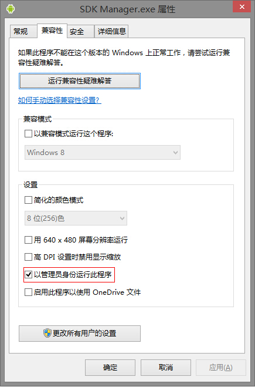

  

关于升级到Win8.1之后，发现Android SDK中的工具一打开就闪退的问题。

网上能搜到的说法大都是因为find_java.bat批处理获取不到正确的jdk路径导致的问题，解决方法是修改android.bat这个批处理文件，但是在我的机子上这种方法一直没有成功过。

在我的电脑上导致这个问题的原因是由于权限问题，所以解决方案是右键点击“Android SDK
Manager.exe"等SDK工具的菜单，选择”以管理员身份运行“即可以正常打开。如果嫌每次都要打开右键菜单麻烦的话，可以直接修改exe文件的属性。右键菜单>属性>兼容性>勾选以管理员身份运行，如下图：

点击确定即可正常双击打开程序。  

