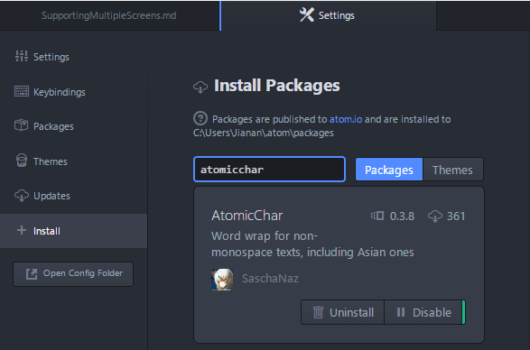

&emsp;&emsp;Atom是Github开发的一个开源编辑器，类似于SublimeText，功能很强大，界面很漂亮，详情可查看官网[atom.io](https://atom.io/)。
&emsp;&emsp;如题，Atom默认会根据窗口宽度对文本进行自动软换行处理（如果没有的话，可以在File->Settings下将Soft Wrap选项的勾打上），然而在处理中文文本的时候自动换行会失效。这是Atom的一个bug，github的issues上已经有人解决了这个问题，只是还没有添加到项目中去。目前可以通过添加AtomicChar这个插件来解决这个问题，方法如下：

1. 打开File->Settings->Install
2. 搜索框中输入atomicchar，点击Install安装，如图

3. 重启Atom，中文自动换行解决。