> 原文作者：deors  
原文地址：[https://deors.wordpress.com/2011/10/08/annotation-processors/](https://deors.wordpress.com/2011/10/08/annotation-processors/)  
译文作者：Jianan - qinxiandiqi@foxmail.com  
版本信息：本文基于2015-10-16版本进行翻译  
版权声明：本文经原文作者许可进行翻译，保留所有权利，未经允许不得复制和转载

<br>
本文是我的“关于Java语言使用注解处理器生成代码”系列第二部分。在第一部分中（请阅读[这里](http://blog.csdn.net/qinxiandiqi/article/details/48999291))，我们介绍了什么是Java语言的注解，以及它们的几种常用方式。

现在，在这第二部分中，我们将介绍注解处理器。包括如何创建注解处理器，以及如何运行它们。

<br>
# **序** 
---
毫无疑问，注解是非常优秀的。你可以通过注解来设置任何类型的元数据和配置，并且注解有非常容易定义的语法，以及多种不同的类型可以使用。

直到目前为止，我们所看到的是注解相比于Javadoc有很多优点，但是还不足够证明它们集成到Java语言的程度。因此，是否有可能与注解进行交互并从注解中获得更多的功能？答案是肯定的：

* 在运行过程中，使用RUNTIME生命周期类型的注解能够通过反射来访问。通过Class的getAnnotation()和getAnnotations()方法就能完成这件奇妙的事情[1]。

* 在编译过程中，注解处理器，一种特殊的类，能够处理从编译的代码中找到的每一个注解。

<br>
# **注解处理器的API**
---
在Java 5首次引入注解的时候，注解处理器的API还没有成熟，也没有标准化。处理注解需要一个名为apt（也就是Annotation Processor Tool，注解处理器工具）的独立的工具，以及包含在com.sum.mirror包中的Mirror API。apt需要使用Mirror API来自定义处理器。

从Java 6开始，注解处理器通过JSR 269[2]已经标准化并被纳入到标准库中，apt工具也被无缝集成到Java编译工具javac里面。

尽管我们只讨论Java 6新注解处理器API的细节，但是你同样可以在[这里](http://download.oracle.com/javase/1.5.0/docs/guide/apt/)或者[这里](http://download.oracle.com/javase/1.5.0/docs/guide/apt/mirror/overview-summary.html)找到Java 5文档中关于apt以及Mirror API的相关信息，并在[这篇文章](http://www.javalobby.org/java/forums/t17876.html)中找到适当的例子。

注解处理器不是简单地实现javax.annotaion.processing.Processor接口并完成其中定义的方法。因此，为方便我们实现自定义处理器，Java提供了一个已经实现通用功能的虚拟类javax.annotation.processing.AbstractProcessor。

自定义的注解处理器可能会用到下面三个注解来配置自己：

* javax.annotation.processing.SupportedAnnotationTypes：用于给注解处理器注册能够处理的注解类型。可用值为支持的注解类型完整名称——使用通配符也是允许的。

* javax.annotation.processing.SupportedSourceVersion：用来声明注解处理器所支持的源代码版本。

* javax.annotation.processing.SupportOption：用来注册可能从命令行传递过来的自定义选项（参数）。

最后，我们要实现自己的process()方法。

<br>
# **编写我们的第一个注解处理器**
---
接下来让我们开始编写我们的第一个注解处理器。遵循上面章节描述的常规步骤，我们将创建一个注解处理器类，它能够处理[第一部分](http://blog.csdn.net/qinxiandiqi/article/details/48999291)章节中示例代码的Complexity注解：
```java
package sdc.assets.annotations.processors;

import …

@SupportedAnnotationTypes("sdc.assets.annotations.Complexity")
@SupportedSourceVersion(SourceVersion.RELEASE_6)
public class ComplexityProcessor extends AbstractProcessor {

    public ComplexityProcessor() {
        super();
    }

    @Override
    public boolean process(Set<? extends TypeElement> annotations,
                           RoundEnvironment roundEnv) {
        return true;
    }
}
```

上面这个注解处理器类注册了它所支持的注解类型为sdc.assets.annotations.Complexity，虽然这个注解处理器被调用的时候什么事都没干。这样，每次Java编译器（编译）生成class时，如果有发现使用了Complexity注解就会执行这个注解处理器，这个注解处理器必须能够在classpath中找到（稍后我们会了解这方面的更多细节）。

为了能够与被注解的类进行交互，process()方法提供两个参数：

* 一个java.lang.model.TypeElement对象的Set集合：处理注解的过程要经过一个或者多个回合才能完成。每个回合中注解处理器都会被调用，并且接收到一个以在当前回合中已经处理过的注解类型的Type为元素的Set集合。

* 一个javax.annotation.processing.RoundEnvironment对象：通过这个对象可以访问到当前或者之前的回合中处理的Element元素（译注：可以被注解类型注解的元素，如类、方法、参数等等），只有被注解处理器注册的注解类型注解过的元素才会被处理。

除了上面两个参数之外，还有一个ProcessingEnvironment类型的实例对象processingEvn可以使用。通过这个对象可以访问日志或者其它一些工具；其中一些会在稍后讨论。

通过RoundEnvironment对象以及被注解元素的反射方法，我们就可以写一个简单的注解处理器实现类。这个注解处理器的处理方法只是打印出所有能找得到的，被Complexity注解的元素：

```java
for (Element elem : roundEnv.getElementsAnnotatedWith(Complexity.class)) {
    Complexity complexity = elem.getAnnotation(Complexity.class);
    String message = "annotation found in " + elem.getSimpleName()
                   + " with complexity " + complexity.value();
    processingEnv.getMessager().printMessage(Diagnostic.Kind.NOTE, message);
}
return true; // no further processing of this annotation type
```

<br>
# **打包并注册注解处理器**
---
完成我们的注解处理器的最后一个步骤是打包并注册。这样Java编译器或者其它工具才能够找到这个注解处理器。

注册处理器最简单的方法就是利用标准的Java服务机制：
* 将你的注解处理器打包进一个Jar包。
* 在这个Jar包中要包含一个文件夹**META-INF/services**。
* 在这个文件夹中要包含一个名为javax.annotation.processing.Processor的文件。
* 在这个文件里面将Jar包中所有注解处理器的完整类名写进去，每个类名一行。

Java编译器或者其它工具将会在所有声明的classpath路径下查找这个文件，并用于注册处理器。

在我们的示例中，项目文件夹结构以及文件的内容如下：  

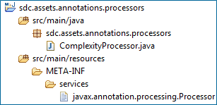

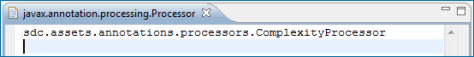

完成打包后，我们就开始可以使用它了。

<br>
# **通过javac运行处理器**
---
假设你有一个Java项目需要使用到一些自定义的注解，并且还有一些可用的注解处理器。在Java 5版本下，编译和处理注解是两个不同的步骤（并且也由两个不同的工具完成），不过从Java 6开始这两个任务都被集成到Java编译工具javac中了。

如果你将注解处理器添加到javac的classpath下，并且使用上面提到的服务机制进行注册了，那么它们将会被javac调用执行。

在我们的的示例中，下面的命令将会编译并处理使用了Complexity注解的Java源文件（译注：-cp是javac用于指定classpath的可用选项，下面命令中将包含自定义注解和注解处理器的两个jar包添加到classpath下）：

```
>javac -cp sdc.assets.annotations-1.0-SNAPSHOT.jar;
     sdc.assets.annotations.processors-1.0-SNAPSHOT.jar
     SimpleAnnotationsTest.java
```

其中用于测试的Java类内容如下：

```java
package sdc.startupassets.annotations.base.client;

import ...

@Complexity(ComplexityLevel.VERY_SIMPLE)
public class SimpleAnnotationsTest {

    public SimpleAnnotationsTest() {
        super();
    }

    @Complexity() // this annotation type applies also to methods
                  // the default value 'ComplexityLevel.MEDIUM' is assumed
    public void theMethod() {
        System.out.println("consoleut");
    }
}
```

当我们执行完javac命令后，输出的结果如下：  

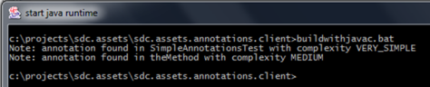

尽管使用默认的javac参数配置通常都没有什么问题，不过在某些情况下还有一些选项可以帮助我们运行注解处理器：

* -Akey[=value]：用于传递一个选项给处理器。只有在注解处理器上通过SupportedOptions注解注册过的选项才能传递进去。
* -proc:{none|only}：默认情况下，javac会运行注解处理器并编译全部源文件。如果使用了proc:none选项，那么所有的注解处理过程都不会被执行——这在编译注解处理器本身的时候很有用。如果使用了proc:only选项，则只有注解处理过程会被执行——在运行类似质量检查工具或者标准检查器这样功能的注解处理器内部验证时很有用。
* -processorpath path：用于指定注解处理器及相关依赖的位置。这是个可选项，如果没有设定，编译器会去默认的classpath路径下搜索。这在项目依赖和注解处理器依赖（运行过程中不需要的部分）之间保持明确的分离时非常有用。
* -s dir：用于指定生成代码的保存位置。尽管对应源代码包层级结构的子目录在需要的时候会被自动创建，但是指定的这个父目录必须要在运行javac命令之前就已经存在。
* -processor class1[,class2,class3...]：指定需要执行的注解处理器的完整类名。如果指定这个选项，上面提到的基于服务机制来搜索注解处理器过程就会被忽略。这对于在classpath下有多个注册的注解处理器但只想执行其中几个的情况非常有用。

<br>
# **通过Eclipse运行处理器**
---
Eclipse或者其它主流IDE都能支持注解处理器并且将它们整合到常规的构建过程中。

在Eclipse下，当你打开Java项目的properties对话框后，你可以在Java Compiler分组中找到Annotation Processing选项。  

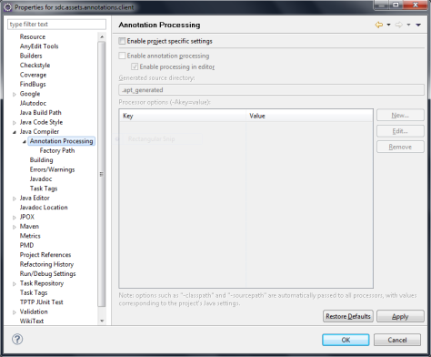

在Annotation Processing选项标签页中，勾选Annotation Processing选项（默认不勾选）。处理器选项参数可以通过这个标签页中的表单（在编译的时候）传递过去。

同样，在Factory Path选项页中选择需要执行的注解处理器：  

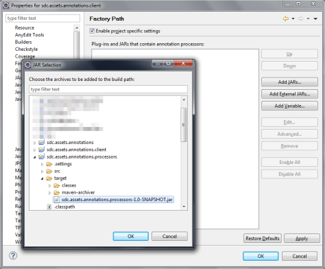

一旦完成配置，每次编译这个项目的时候，注册的注解处理器都会被执行。

<br>
# **通过Maven运行处理器**
---
注解处理器同样可以被集成到Apache Maven构建工具中执行。

（在Maven中），我们能够访问到的自动化（处理）层级允许我们将所有的任务类型无缝集成到构建过程中。在一个项目的周期里面，标准验证和代码生成不再需要一个单独的进程。另外，它同样允许与持续集成引擎无缝集成。

尽管还有其它集成注解处理器到Mavan构建中的方法，但是我们建议使用这里讨论的方法。这种方法基于相同的Mojo（Maven plug-in，译注：Mojo表示一个处理过程的具体实现，通常由maven的Plugin提供这个具体过程），它能够管理编译的任务。实际上，由于（实际）使用了Java编译工具，这种方法能够产生我们熟知的标准做法。

与Maven集成需要同时将我们的注解和注解处理器以Maven artifact的形式引入。

我们建议将注解和注解处理器保存到不同的artifact中，因为在一些客户项目中可能不需要这些注解处理器，这样才能减少项目的依赖数量。

在这个方法中，我们将会创建三个不同的项目，每个项目对应一个Maven artifact：

* 关于注解的artifact。它只包含了自定义的注解类型。
* 关于注解处理器的artifact。它包含了注解处理器。取决于这些处理器在完成它们的处理任务时需要使用的自定义注解，而添加上包含对应注解的artifact依赖。编译插件需要配置上proc:none选项，这样在编译这个artifact的时候，注解处理过程才不会被执行。
* 客户项目。它包含了具体的业务代码，需要依赖前面的两个artifact。

下面是包含注解的artifact项目文件夹结构以及POM内容：

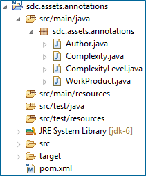

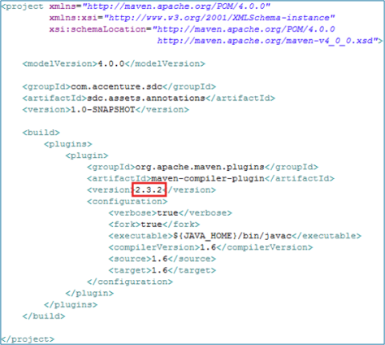

注意构建上面这个artifact的maven编译插件版本号。

下面是包含注解处理器的artifact项目文件夹结构和POM内容：  

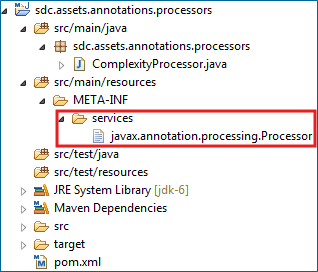

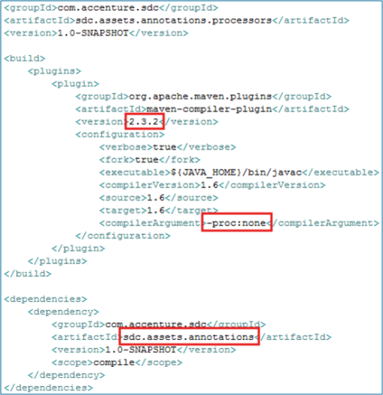

注意打包处理器过程中需要的services文件夹、Maven编译插件的版本、用于在编译这个artifact过程中阻止运行处理器的选项proc:none，以及包含注解类型的artifact的依赖。

最后，下面是客户项目的文件夹结构和POM内容：

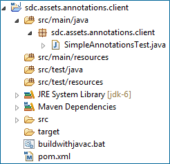

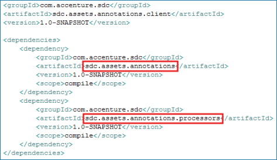

注意这里需要依赖包含自定义注解的artifact以及包含注解处理器的artifact。

完成之后，每次执行maven构建工具的compile目标，注解处理器都会按照预设的执行。

---
本系列将会在第三部分中继续讲解：生成源代码。请阅读[这里](http://blog.csdn.net/qinxiandiqi/article/details/49387559)。

[1]：从[这里](http://download.oracle.com/javase/6/docs/api/java/lang/Class.html)查看Class接口文档获取更多内容  
[2]：JSR269，动态注解处理器API，可以在[这里](http://jcp.org/en/jsr/detail?id=269)在线查看。

<br>
> **译附：**   
译者根据本文整理并修改的maven demo项目：  
Github地址：[https://github.com/qinxiandiqi/AnnotationProcessorDemo](https://github.com/qinxiandiqi/AnnotationProcessorDemo)  
Tag标签：**part2**（执行*git checkout part2*命令检出）
