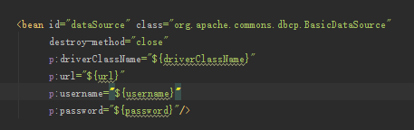

在Spring项目的配置文件中引用properties属性文件中的属性，运行时无法识别properties属性文件中的属性引用，但properties属性文件和属性明明已经存在，例如：  

  



要在Spring中使用外部properties属性文件，需要在Spring配置文件中添加bean后处理器**PropertyPlaceholderConfigurer**，并指明外部properties属性文件的路径：  

```xml
<bean class="org.springframework.beans.factory.config.PropertyPlaceholderConfigurer">
	<property name="locations" value="properties路径"/>
</bean>
```

如果有多个properties属性文件，可以使用下面方式：

```xml
<bean class="org.springframework.beans.factory.config.PropertyPlaceholderConfigurer">
    <property name="locations">
        <list>
            <value>properties路径</value>
            <value>properties路径</value>
            ...
        </list>
    </property>
</bean>
```


