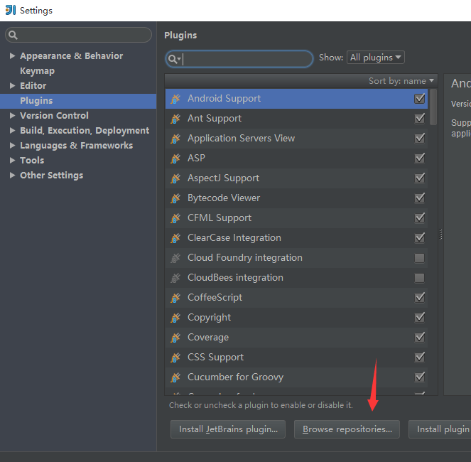
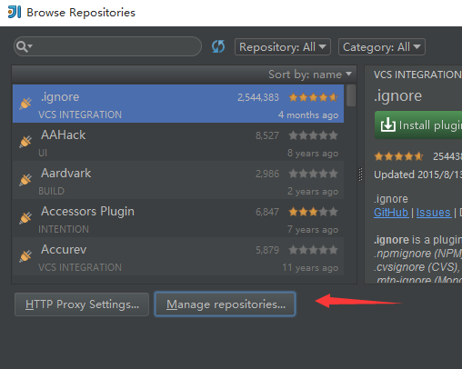
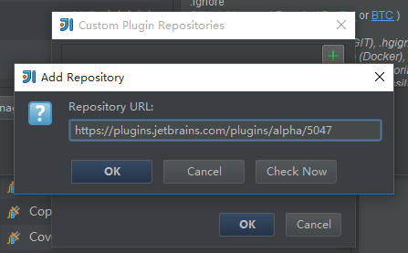
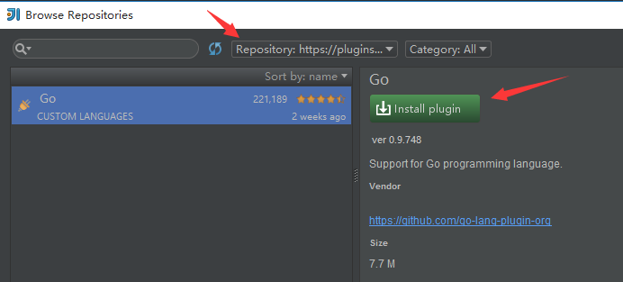
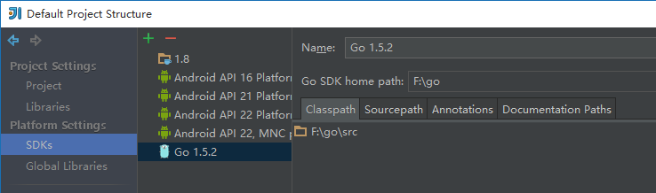

> 原文作者：Jianan - qinxiandiqi@foxmail.com  
原文地址：[http://blog.csdn.net/qinxiandiqi/article/details/50319953](http://blog.csdn.net/qinxiandiqi/article/details/50319953)  
版本信息：2015-12-15  
版权声明：本文采用[CC BY-NC-ND 4.0](http://creativecommons.org/licenses/by-nc-nd/4.0/)共享协议。允许复制和转载，但必须在文首显眼位置保留原文作者、原文链接、版本信息、版权声明等信息。不允许演绎和用于商业用途。

支持golang开发的IDE现在已经很多了，如果要讨论出哪一个IDE才是最好的golang IDE，这绝对可以让一群程序猿撕逼上百楼，这里就不讨论了。选择什么样的IDE，主要就是个人喜好的问题而已。我习惯了Android Studio和Intellij IDEA的UI风格，所以这里只讨论IDEA的golang插件配置，别的IDE就不讨论了，因为我很懒。

IDEA的golang插件是开源的，项目托管在[github](https://github.com/go-lang-plugin-org/go-lang-idea-plugin)上面。如果你技术很屌的话，可以参与到这个插件的开发中，留个大名，比去某风景区的石头上刻某某某到此一游屌多了。

在IDEA上安装golang插件需要手动添加golang插件的仓库，目前golang插件有两个仓库：  
1. Alpha：[https://plugins.jetbrains.com/plugins/alpha/5047](https://plugins.jetbrains.com/plugins/alpha/5047)
2. Nightly：[https://plugins.jetbrains.com/plugins/nightly/5047](https://plugins.jetbrains.com/plugins/nightly/5047)  

两个仓库的在于Alpha仓库的golang插件每个星期更新一次版本，而Nightly仓库的golang插件版本每天更新一次版本。根据自己更新频率的需要添加合适的仓库到自己的IDEA里面，添加方法如下：

* Setting菜单里面选择Plugin，点击**Browse repositories**：  

* Browse repositories窗口中选择**Manage repositories**：  

* 出现Custom Plugin Repositories窗口，点击“+”按钮，输入golang插件仓库地址后点确定：  

* 回到Browse Repositories窗口，顶部选择刚添加的golang插件仓库，过滤出golang插件，选择并点击**Install plugin**按钮安装插件：  

* 安装golang插件后重启IDEA。安装成功够进入File->Other Settings->Default Project Structure...，选择SDKs选项，添加golang的sdk和指定sdk路径：  

* golang插件配置完毕，创建新项目的时候可以看到go项目和golang的sdk。
