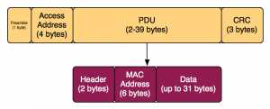
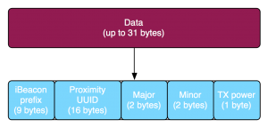

  

\-----------------------------------------------------------------------------------------------------------------------

原文作者：Adam Warski

原文地址：<http://www.warski.org/blog/2014/01/how-ibeacons-work/>  

译文作者：Jianan - qinxiandiqi@foxmail.com

版本信息：本文基于2014-09-02版本进行翻译

版权声明：本文经原作者许可进行翻译，保留所有权利，未经许可不得复制和转载。

\-----------------------------------------------------------------------------------------------------------------------

  

iBeacon是最近非常火的话题。这种技术能够实现室内定位，让你的手机能够知道是否处于一个Beacon的范围内。使用这种技术能够产生很多应用程序：比如帮助你在停车场中找到你的汽车，或者在零售店中根据所处位置提供优惠券或者其它一些位置相关的服务。还有很多我们现在无法想象得到的应用程序。

  
现在有很多种关于iBeacon是什么，以及我们可以如何使用它们的解释。然而从技术角度上来说，它们是如何工作的？底层的技术使用的使用Bluetooth
LE，因此。。。

  

# What is Bluetooth LE？（什么是Bluetooth LE，简写BLE）

  
Bluetooth Low
Energy（BLE）是2010年发布的蓝牙4.0技术规范的一部分。它起源于2006年Nokia的Wibree技术，但最终被整合进了蓝牙。这是一组与传统蓝牙不同的协议，并且使用的设备上也不会向后兼容。因此，现在市面上你可以看到三种类型的设备：

1.Bluetooth设备：只支持传统蓝牙的设备。

2.Bluetooth Smart Ready设备：同时支持传统蓝牙和LE模式的设备。

3.Bluetooth Smart设备：只支持LE模式的设备。

  
最新的手机（iPhone 4s+, SG3+)、笔记本、平板电脑等，基本上都已经支持蓝牙4.0，也就是Bluetooth Smart
Ready设备。Beacon，从另一方面来说，这种设备只支持low energy protocols（LE低功耗协议），属于上面说所的“Bluetooth
Smart”设备，这也是它们靠一颗纽扣电池就能运行很长时间的原因。老式设备，比如外设、汽车系统、旧手机等通常只支持传统蓝牙协议。

  
BLE最重要的特点当然在于它的低能耗。举个例子，一些beacon设备靠一颗微型电池就能够持续发送一个信号两年左右（这种电池一般是不可拆卸的，你可能需要在beacon停止工作之后替换一个新的beacon）。传统蓝牙和LE蓝牙使用的都是相同的波段（2.4GHz-2.4835GHz）。BLE协议的传输速率比较低，因此除了用于发现设备和做一些简单通信之外，不太适合用于传输大量的数据流。在协议条款上，LE和传统蓝牙的信号都能够覆盖到100米的范围。

  

# How does BLE communication work？（BLE设备如何通信）

  
BLE的通信包括两个主要部分：advertising（广告）和connecting（连接）。

  
广告（Advertising）是一种单向的发送机制。想要被搜索到的设备可以以20毫秒到10秒钟的时间间隔发送一段数据包。使用的时间间隔越短，电池消耗的越快，但设备被发现的速度也就会快。数据包长度最多47个字节，由以下部分组成：

 **  
     1 byte preamble（1字节做报头）**

 **     4 byte access address（4字节做地址）**

 **     39 bytes advertising channel PDU（39个字节用于PDU数据包）**

 **     3 bytes CRC（3个字节用于CRC数据校验）**

  

  
对于广告通信信道，地址部分永远都是`0x8E89BED6`。对于其它数据信道，地址部分由不同的连接决定。

  
返回的PDU数据也拥有自己的数据报头（2个字节：声明有效载荷数据的长度和类型——设备是否支持连接等等）和当前有效载荷数据（最多37个字节）。

  
最终，有效载荷数据中的头6个字节是设备的MAC地址，所以实际信息数据最高可占31个字节。

  
BLE设备可以运行在单一的不可连接的广告模式中（在这种模式下所有的信息都包含在广告数据包中），然而设备也是允许运行在可被连接的模式下（通常情况下都是这种模式）。

  
当设备被发现之后，一个连接就会被建立起来。之后就可以读取BLE设备提供的Service，以及每个Service的characteristic（属性，类似于GATT
Profile实例）。每一个characteristic都会提供一些值，这些值可以被读取或者修改。例如，一个小型温控器可以开放一个service用于获取当前的温度或者湿度读数（相当于是service的characteristic），同时也可以开放其它的service和characteristic用于设置期望的温度。这里因为beacon不使用连接模式，我将会跳过这些细节。如果你想要了解更多关于连接BLE设备的内容，可以参考[Apple's
Core Bluetooth
guide](https://developer.apple.com/library/ios/documentation/NetworkingInternetWeb/Conceptual/CoreBluetooth_concepts/AboutCoreBluetooth/Introduction.html#//apple_ref/doc/uid/TP40013257-CH1-SW1)，尽管你可能不是一个IOS开发者。更多相关技术性的文章，可以参考[Introduction
to BLE](http://www.eetimes.com/document.asp?doc_id=1278927)，[Making the most
out of BLE Advertising
mode](http://www.eetimes.com/document.asp?doc_id=1280724)。

  

# How do beacons use BLE？（beacon设备如何使用BLE）

  
Beacon设备只使用了广告通信信道。正如beacon（信标、灯塔）的字面意思，这种设备以一定的时间间隔发送数据包，并且发送的数据被可以被像手机这样的设备获取。也就是说，iBeacon只是BLE广告模式的一种简单的使用，并在此基础上提供了对IOS的一些附加支持。

  
如果你试着拦截一段iBeacon广告数据包，例如下面从Estimote beacon截获的数据包：

  

    
    
    02 01 06 1A FF 4C 00 02 15 B9 40 7F 30 F5 F8 46 6E AF F9 25 55 6B 57 FE 6D 00 49 00 0A C5

  
（截获以上数据，如果你使用的Mac设备，你可以参考[additional XCode
download](http://stackoverflow.com/questions/5863088/bluetooth-sniffer-
preferably-mac-
osx)为XCode添加蓝牙扫描和数据包打印工具。如果是Window设备，请参考[这里](http://processors.wiki.ti.com/index.php/BLE_sniffer_guide#Advertisement_packets)）

  
以上的数据已经将广告数据包的报头、修正地址、广告PDU数据包的报头和其中的MAC地址部分都移除掉了，也就是说这部分数据只包含了实际信息数据——一共30个字节，符合实际信息数据最多31个字节的限制。

  
那么一个iBeacon设备的BLE广告数据是如何组成的？以下是Apple修正的数据格式，整理如下（也可以参考[这里](http://stackoverflow.com/questions/18906988/what-
is-the-ibeacon-bluetooth-profile)）：

  

    
    
    02 01 06 1A FF 4C 00 02 15: iBeacon prefix (fixed)
    B9 40 7F 30 F5 F8 46 6E AF F9 25 55 6B 57 FE 6D: proximity UUID (here: Estimote’s fixed UUID)
    00 49: major
    00 0A: minor
    C5: 2’s complement of measured TX power

  
  

  
根据这些原理，如果你想要实验beacon的功能，你不必需要一个真正的beacon设备。如果你有最新的手机（例如iPhone4S+，SG3+）或者配备蓝牙4的笔记本（例如Retina
MacBook），你可以将这些设备转换成iBeacon发送设备和接收设备。以iPhone为例，你可以在AppStore上下载“Locate
iB”应用。对于MacOS，可以参考[这里](http://stackoverflow.com/questions/19410398/turn-
macbook-into-
ibeacon)。当然你可以可以使用[树莓派](http://developer.radiusnetworks.com/2013/10/09/how-to-
make-an-ibeacon-out-of-a-raspberry-pi.html)。

  

# Breaking down the iBeacon format（解析iBeacon的数据格式）

  
除了修正的iBeacon前缀数据（02 01 ... 15），其它各部分数据各代表什么？

  
 **Proximity UUID** （上面例子中的B9 ...
6D部分）：这是将你所有的beacon与其他人的beacon设备区别开的id！例如，目前在商店里某个区域分布着多个beacon形成一条“链带”，用于为顾客提供特定的服务，那么归属于同一条“链带”的beacon将分配到相同的proximity
UUID。为这条“链带”设计的专用应用程序将会在后台使用这个UUID扫描到这条“链带”中的beacon设备。

  
 **major**
编号（2个字节，上面例子中为0x0049，也就是73）：用于将相关的beacon标识为一组。例如，一个商店中的所有beacon将会分配到相同的major编号。通过这种方式，应用程序就能够知道顾客位于哪一家商店。

  
 **minor**
标号（也是2个字节，上面例子中为0x000A，也就是10）：用于标识特定的beacon设备。例如一个商店中的每一个beacon设备都拥有唯一的minor编号，这样你才能够知道顾客位于商店中的哪个位置。

  

# Measuring distance（测量距离）

  
最后一个值， **TX power**
，用于确定你和beacon之间距离有多近。根据这个值不但可以获得粗略的信息（比如靠近/远离/不在范围内等），也可以获取精确到米的距离（当然你也可以转换为以步为单位的距离）。那么如何实现？

  
 **TX power** （上面例子中为0xC5=197，根据2的补码测得256-197=-59dBm）是距离设备1米测得的信号强度值（RSSI-
Received Signal Strength
Indication，接收到的信号强弱指标）。假如接收到的信号强度减弱了，那么我们可能在远离。只要知道1米距离的RSSI，以及当前的RSSI（我们可以从接收到的信号中一块获取到这些信息），那么计算出当前的距离是可能的。IOS已经实现了个这个功能，对于其它平台需要自己手动编码计算，可以参考[这里](http://stackoverflow.com/questions/20416218/understanding-
ibeacon-distancing)。

  

译注：Java代码粗略计算距离代码：

    
    
    protected static double calculateAccuracy(int txPower, double rssi) {
      if (rssi == 0) {
        return -1.0; // if we cannot determine accuracy, return -1.
      }
    
      double ratio = rssi*1.0/txPower;
      if (ratio < 1.0) {
        return Math.pow(ratio,10);
      }
      else {
        double accuracy =  (0.89976)*Math.pow(ratio,7.7095) + 0.111;    
        return accuracy;
      }
    }   

  

然而，在实际应用中，由于人体或者其它通信阻碍物都有可能削弱信号，因此这个距离只是一个估算值。

  

# IOS integration（IOS整合）

  
IOS已经整合了iBeacon。当你进入beacon的范围内，你的应用程序就可以接收到通知，即使你的应用程序处于在后台也能接收到。一个应用程序可以注册一个区域的进入或者退出事件，因此即使应用程序没有运行也可以被唤醒。为了响应这些事件，应用程序可以发送例如本地推送通知，提示用户打开应用程序查看商店的促销广告（这些促销广告可以从网络上面获取），或者是其它相关的内容。

  
更准确的说，当手机处于不活动状态时，也就是IOS进入了低电量监控模式的时候，只有iBeacon区域进入/退出事件能够被接收到。当手机和应用程序处于活动状态，你可以进入ranging模式，这个能够让你检测的信号强度和估算距离更加准确。

  
注意你的手机检测beacon需要花费一定的时间。首先，beacon设备是间隔一定的时间才发送一次广告。其次，如果你的手机处于非活动模式，它只在有些时候才会检测蓝牙信号。一个beacon设备要被检测到，上面两段工作时间就需要有交集。实践证明，它可能需要15分钟才能检测到一个beacon设备。

  
按步骤开发一个iOS iBeacon应用程序可以参考[这里](http://www.cocoanetics.com/2013/11/can-you-
smell-the-ibeacon/)。Beacon的制造商通常也会提供SDK帮助开发Beacon应用程序。参考Estimote的[iOS
SDK](https://github.com/Estimote/iOS-SDK) 和[Android
SDK](https://github.com/Estimote/Android-SDK)。

  

# How can I get some beacons？（如何获取Beacon设备）

  
Beacon设备资源现在比较稀少，你通常需要等上几个星期才能拿到货，但可以肯定的是将来这种情况会改善。

  
因此，最快的选择就是创建一个Beacon模拟器：将iPhone/Android/MacBook/其它笔记本/树莓派转换成了Beacon模拟器。

  
第二种选择就是试着去订购一些Beacon设备了：

  
    pre-order Estimote beacons; 3 for $99

    Kontakt beacons come in a couple of packages; 4 for $99, 10 for $279

    RaspberryPi kits from RadiusNetworks: 1 for $99

    RedBearLab offers BLE shields for Arduino for $30

    Bleu sells USB-iBeacon dongles. 1 for $40, 5 for $150

  

# Alternatives（替代品）

  
iBeacon不是唯一一种基于BLE近距离技术开发的设备。高通同样正在开发自己的Beacon——Gimbal，并集合了iOS和Android
SDK。它们提供的功能比较类似，但是BLE广告的数据格式可能不一样。我的开发工具还在运送途中，因此我还没有测试过，但是这种Beacon肯定很有趣，尤其是它的价格最低只有5美元。

  

# What's next？（下一步是什么？）

  
现在还没有做的事情就是开发一些基于Beacon的应用程序。为了实现这个目的，记住[SoftwareMill](http://www.softwaremill.com/)：我们经常寻找一些有趣的项目来开发。

  

  

  

