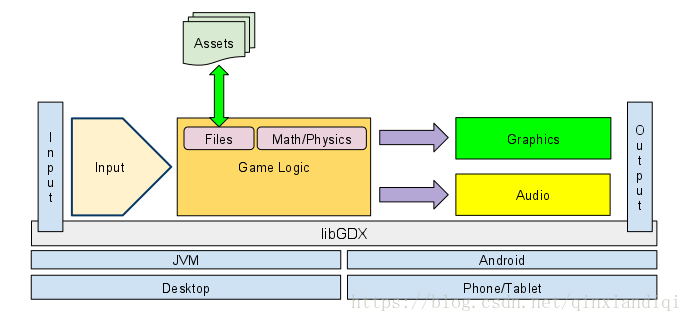

> 原文作者：libGDX  
原文地址：[https://github.com/libgdx/libgdx/wiki/Modules-overview](https://github.com/libgdx/libgdx/wiki/Modules-overview)   
译文作者：Jianan - qinxiandiqi@foxmail.com  
版本信息：本文基于2018-07-15版本翻译  
译文版权：[CC BY-NC-ND 4.0](http://creativecommons.org/licenses/by-nc-nd/4.0/)，允许复制转载，但必须保留译文作者署名及译文链接。

<br>
## 简介
---

LibGDX，对应典型游戏设计架构的每个步骤，它都提供了一系列模块来提供相应服务。  

 * [Input输入模块](https://github.com/libgdx/libgdx/wiki/Input-handling) - 为所有平台提供了统一的输入和处理模型。它支持键盘、触屏、加速度计和鼠标等可用输入设备。  
 * [Graphics图形模块](https://github.com/libgdx/libgdx/wiki/Graphics) - 它通过OpenGL ES API的方式使用硬件，将图形绘制到屏幕上。  
 * [Files文件模块](https://github.com/libgdx/libgdx/wiki/File-handling) - 它不关心具体操作的媒体文件类型，它为所有平台统一提供了抽象化的，简易的方法来进行媒体文件的读写操作。  
 * [Audio音频模块](https://github.com/libgdx/libgdx/wiki/Audio) - 提供了有助于在所有平台上录制和播放音频的功能。  
 * [Networking网络模块](https://github.com/libgdx/libgdx/wiki/Networking) - 提供执行网络操作的相关方法，例如简单的HTTP GET和POST请求，TCP server/client socket连接等等。  

下图是一个简单游戏架构中libGDX各个模块的结构：



下面章节将简单描述各个模块的一些常用例子。

<br>
## libGDX的模块

<br>

### Input模块
---

*Input*输入模块能够在所有平台上轮询不同输入源的状态，它能够轮询每一个键盘的键、触屏设备和加速度计的状态。在桌面平台上，触屏设备会使用鼠标来替代，但加速度计一般不支持。  

它同时也支持注册输入处理器来消耗基于Input模块产生的特定事件。  

下面的代码片段在触摸事件（或者是桌面平台上的鼠标点击事件）产生时，捕获这个事件并获取它的坐标：
```java
if (Gdx.input.isTouched()) {
  System.out.println("Input occurred at x=" + Gdx.input.getX() + ", y=" + Gdx.input.getY()); 
}
```
只要使用以上类似的方法就可以轮询和处理所有支持的事件类型。

<br>
### Graphics图形模块
---

*Graphics*图形模块将和GPU的通讯交互进行抽象化，并提供了简单的方法来获取OpenGL ES的包装实例。它的内部会管理好所有用来获取和持有OpenGL实例的标准化代码，并处理好设备生产商实现的所有细节。

取决于底层的硬件，（OpenGL ES的）包装实例可能可用也可能不可用（译注：如果硬件设备不支持，该模块功能就不能用了）。

另外，Graphics模块同时也提供了一些方法来生成Pixmap和Texture。  

例如，为了获取OpenGL API 2.0版本的实例，可以使用以下代码：  

```java
GL20 gl = Gdx.graphics.getGL20 ();
```
这个方法会返回一个实例，用来绘制图形到屏幕上。在这段代码中，如果硬件不支持OpenGL ES v2.0的话，这个方法会返回null。  

下面的代码会擦除屏幕内容，并填充红色： 
```java
gl.glClearColor(1f, 0.0f, 0.0f, 1);
gl.glClear(GL20.GL_COLOR_BUFFER_BIT);
```

这些方法始终会返回OpenGL API在特定平台（lwjgl，jogl或Android）的具体实现，因此游戏主程序不需要知道具体的实现细节，它可以在所有libGDX支持的平台上运行。  

libGDX支持以下OpenGL API版本：  

|*GL版本* | *访问方法* |
|:---------:|:-----------------:|
|2.0 | `Gdx.graphics.getGL20();`|
|3.0 |`Gdx.graphics.getGL30();`|

更多关于Graphics图形模块的内容请参考这个[文档](https://github.com/libgdx/libgdx/wiki/Graphics-module)。  

<br>
### Files文件模块
---

*Files*文件模块提供了一种通用的方法来访问文件，使得使用文件的时候不需要考虑游戏具体运行在什么平台上，它让文件的读写变得更简单。不过，由于不同平台的安全限制，在文件写入方面会有一点限制。

使用Files文件模块最常见的场景是从应用程序的同一个子目录中为所有平台加载游戏资源（纹理、音频文件等）。它同样也常被用来将游戏玩家的高分记录或游戏状态写入到文件里面。

下面的例子加载并创建了位于$APP_DIR/assets/textures目录下的brick.png纹理：  
```java
Texture myTexture = new Texture(Gdx.files.internal("assets/textures/brick.png"));
```
这是一个非常强大的抽象层，它使得相同的代码能够适用于Android和桌面端。  

<br>
### Audio音频模块
---

*Audio*音频模块使得创建和播放音频文件变得非常简单。它同样也允许直接访问音频硬件。  

它能够处理两种类型的音频文件：*Music(音乐)*和*Sound(声音)*。两种类型都支持WAV、MP3和OGG格式。  

Sound声音是直接被加载到内存中，所以能够随时播放。它非常适用于游戏中可能会被播放多次的音效，例如爆炸声和枪击声等。  

Music音乐采用另一种加载方式，它是将硬盘（或者SD卡）上的文件以数据流的方式进行加载。每次播放一个音频文件，它都会以数据流的方式将文件加载到音频设备上。

下面的代码会从硬盘上加载并循环播放音频文件*myMusicFile.mps*，同时将音量调低到一半：

```java
Music music = Gdx.audio.newMusic(Gdx.files.getFileHandle("data/myMusicFile.mp3", FileType.Internal));
music.setVolume(0.5f);
music.play();
music.setLooping(true);
```

<br>
### Networking网络模块
---

*Networking*网络模块为游戏的网络操作提供了一些有用的功能，它能被用于添加多人游戏，发送玩家数据到你的网站，或者执行其它一些网络操作。这些功能能够跨平台使用，虽然有些平台可能需要添加一些额外的设置或者缺少一些功能。  

Networking模块提供了可配置化的TCP client和server socket，可以通过配置来进行优化以达到低延迟。  

另外，它也提供了一些方法和工具来发起HTTP请求。其中一个工具就是Request Builder，它采用链式调用的方式来简单创建一个HTTP请求。  

Request Builder通过类似以下代码来创建一个HTTP请求： 
```java
HttpRequestBuilder requestBuilder = new HttpRequestBuilder();
HttpRequest httpRequest = requestBuilder.newRequest()
   .method(HttpMethods.GET)
   .url("http://www.google.de")
   .build();
Gdx.net.sendHttpRequest(httpRequest, httpResponseListener);
```

它同样也可以在创建HTTP请求的时候添加参数：  
```java
HttpRequestBuilder requestBuilder = new HttpRequestBuilder();
HttpRequest httpRequest = requestBuilder.newRequest()
   .method(HttpMethods.GET)
   .url("http://www.google.de")
   .content("q=libgdx&example=example")
   .build();
Gdx.net.sendHttpRequest(httpRequest, httpResponseListener);
```

[上一章|libGDX的生命周期](https://blog.csdn.net/qinxiandiqi/article/details/80874868)  
[下一章|libGDX的启动类和配置](https://blog.csdn.net/qinxiandiqi/article/details/81157151)