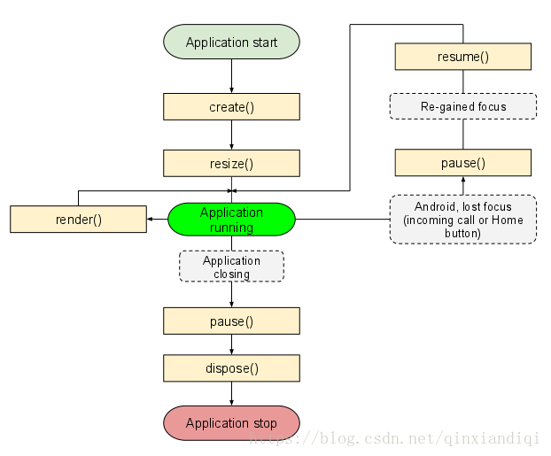

> 原文作者：libGDX  
原文地址：[https://github.com/libgdx/libgdx/wiki/The-life-cycle](https://github.com/libgdx/libgdx/wiki/The-life-cycle)   
译文作者：Jianan - qinxiandiqi@foxmail.com  
版本信息：本文基于2018-07-01版本翻译  
译文版权：[CC BY-NC-ND 4.0](http://creativecommons.org/licenses/by-nc-nd/4.0/)，允许复制转载，但必须保留译文作者署名及译文链接，不得演绎和用于商业用途。

<br>
libGDX应用程序具有明确定义的生命周期，用于处理应用程序的不同的状态，例如应用程序的创建、暂停、恢复、渲染和（销毁）释放等等。  

<br>
# ApplicationListener 
---

应用程序的开发者通过实现[ApplicationListener](http://libgdx.badlogicgames.com/nightlies/docs/api/com/badlogic/gdx/ApplicationListener.html)接口来接管libGDX应用程序的生命周期事件。ApplicationListener的实例需要传递给底层平台的`Application`实例（参考[libGDX的应用框架](https://blog.csdn.net/qinxiandiqi/article/details/80874118)）。之后，每当有应用程序级别的生命周期事件发生时，`Application`都会回调`ApplicationListener`。一个简单的`ApplicationListener`空实现大致如下：

```java
public class MyGame implements ApplicationListener {
   public void create () {
   }

   public void render () {        
   }

   public void resize (int width, int height) { 
   }

   public void pause () { 
   }

   public void resume () {
   }

   public void dispose () { 
   }
}
```

如果不需要关注所有的生命周期事件，也可以选择继承[ApplicationAdapter](http://libgdx.badlogicgames.com/nightlies/docs/api/com/badlogic/gdx/ApplicationAdapter.html)类，然后有选择的重写需要的生命周期方法。

一旦`ApplicationListener`被传递到`Application`，它的方法将会在以下情况被回调：  

| 方法签名 | 描述 |
| ---------------- | ----------- |
| `create ()` | 创建应用程序的时候会被回调，它只会被回调一次。|
| `resize(int width, int height)` | 只要游戏不在Pause停止生命周期状态下，每次游戏的屏幕窗口尺寸发生变化都会回调这个方法。另外，`create()`方法被回调之后，它也会被回调一次。<br/>这个方法的参数是屏幕变化之后新的屏幕宽高，单位是像素。|
| `render ()` | 每次应用程序循环游戏的渲染过程都会执行这个方法。游戏的刷新逻辑通常也会放在这个方法里面执行。|
| `pause ()` | 在Android平台上，当按了Home键或者有电话拨入等情况时，这个方法都会被回调。如果是在桌面平台上，只有在退出应用程序时，它会在`dispose()`被回调之前执行一次。<br/> 如果要保存游戏的状态，这个方法是个很合适的地方。|
| `resume ()` | 这个方法只会在Android平台上被调用，它只会在应用程序从Pause停止状态恢复运行的时候被调用。|
| `dispose ()` | 当应用程序被销毁的时候会调用这个方法。在它被调用之前会先回调`pause()`方法。|

下面的图可以直观的看出整个生命周期：

  

<br>
# 主循环在哪里？
---

Libgdx属于事件驱动模型，因为这也是Android和Javascript的工作模式，它没有明确的主循环。如果非要扯的话，`ApplicationListener.render()`方法也可以考虑看作是主循环方法。  

<br>
# 其它参考
---

[LibGDX和Android的生命周期](http://bitiotic.com/blog/2013/05/23/libgdx-and-android-application-lifecycle/)   
如果你的目标平台是Android的话，这篇文章会跟你解释清楚为什么不要使用静态变量。

<br>
[上一章|libGDX的应用框架](https://blog.csdn.net/qinxiandiqi/article/details/80874118)  
[下一章|模块概览](https://blog.csdn.net/qinxiandiqi/article/details/81054305)