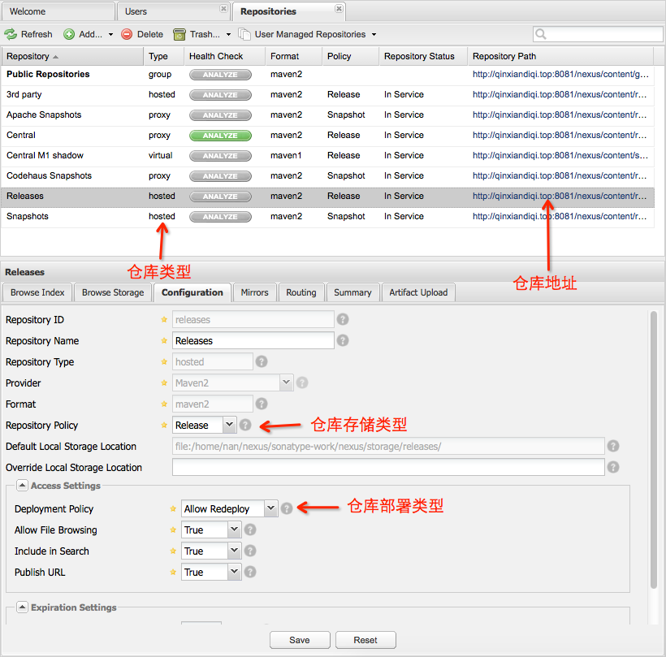
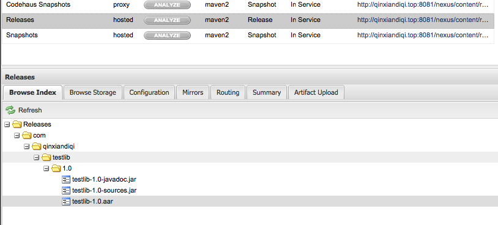

  

由于Android
Studio使用了Gradle构建工具，在library依赖的处理上是将被依赖的library作为一个module引入（拥有一份完整的library拷贝），而Eclipse的ADT则是直接将library作为外部项目依赖链接进来，两者各有各的优缺点。Android
Studio的好处是能时刻保持项目的完整性，每一个项目都包含了整个项目所需要的一切东西，当你把项目共享给别人的时候就不会因为落下某个library而导致别人无法正常打开你的项目。缺点则是多个项目都依赖同一个library，每个项目都有自己一份library代码拷贝，当这个library的代码需要更新的时候，每一个项目中的library代码都需要更新一遍。而Eclipse的library依赖，只是做了一个library链接，多个项目可以链接到同一个library，好处是library需要修改的时候只需要修改一处代码，缺点时与他人共享项目的时候可能会落下library忘记共享。

一般一个公司长期开发累积下来，都会总结出一套自己的SDK或者工具供自己的产品使用。如果使用Android
Studio开发，一旦自己的SDK需要更新难免就会遇到前面说的问题。好在Android Studio除了library
module依赖这种方法之外，还提供了本地仓库或者（服务器）远程仓库依赖，通过Gradle工具自动从仓库中获取并管理项目所需要的library。Gradle支持maven仓库，早期的Android
Studio直接使用的就是maven中央仓库，虽然正式版之后改用jcenter，但是依然可以混用自定义的maven仓库。

整体上的解决思路分三个步骤：

第一，就是在自己公司内部的服务器上搭建一个maven仓库

第二，将自己公司的公共类库发布到公司内部服务器的maven仓库上

第三，在公司其它项目中配置公司内部服务器maven仓库地址，并引用所需的library，Gradle会自动从服务器maven仓库中获取

  

# 1、在自己公司内部服务器上搭建maven仓库

  

服务器上的maven仓库可以使用Sonatype nexus oss来搭建。sonatype nexus oss
是一个maven仓库管理工具，并提供了web控制台，部署和使用都很方便。

  

## 1.1 下载sonatype nexus oss

  

将sonatype nexus oss下载到公司内部服务器上，下载地址：<http://www.sonatype.org/nexus/go>

  

## 1.2 安装并运行sonatype nexus oss

  

首先确认服务器上是否已经安装JDK，nexus oss的运行需要JDK7或者JDK8。如果没有安装JDK，请先安装JDK。  

下载下来的nexus oss是一个zip或者tar.gz压缩包，需要将其解压。你可以将其解压到任何位置，nexus
oss的运行对其所在位置没有什么特殊要求。解压后会看到两个文件夹，一个是nexus-x.xx.x-xx，一个sonatype-
work。其中nexus-x.xx.x-xx是nexus oss的主目录，所有运行程序和配置文件都在里面。sonatype-work是nexus-
oss的数据目录，nexus-
oss运行过程的maven仓库数据都在这里面。进入nexus-x.xx.-x-xx/bin目录，window平台的服务器直接运行nexus.bat脚本就可以了。下面详细讲下linux平台的安装和运行。

nexus
oss官方建议将nexus-x.xx.x-xx安装到/usr/local目录下，并做个/usr/local/nexus链接指向nexus-x.xx.x-xx目录，方便以后nexus
oss版本升级。方法如下

    
    
    $ sudo cp nexus-x.xx.x-xx-bundle.tar.gz /usr/local
    $ cd /usr/local
    $ sudo tar xvzf nexus-x.xx.x-xx-bundle.tar.gz
    $ sudo ln -s nexus-x.xx.x-xx nexus

如果你下载的是zip压缩包，则使用sudo unzip nexus-x.xx.x-xx-bundle.zip命令解压。

为了方便以后使用，可以添加$NEXUS_HOME环境变量指向/usr/local/nexus。另外，默认配置sonatype-
work目录与nexus-x.xx.x-xx在同一个目录下，如果你想讲sonatype-
work迁移到其它指定路径，可以修改nexus-x.xx.x-xx/conf/nexus.properties配置文件中的nexus-work变量值。

完成之后，运行nexus
oss只需要运行nexus-x.xx.x-xx/bin/nexus脚本，参数可以为console或者start。console会在控制台打印出运行日志。如果有配置NEXUS_HOME环境变量，就可以在任何地方执行下面语句：

    
    
    $NEXUS_HOME/bin/nexus start

  

## 1.3 配置sonatype nexus oss

  

运行成功之后，在浏览器打开http://服务器地址:8081/nexus就可以看到nexus oss的控制面板。

点击右上角login登录，默认账号密码为admin/admin123。登录后可以看到以下界面：

左边是功能面板，可以在Repositories里面查看所有的maven仓库，在User里面进行用户管理（修改密码什么的）。点击Repositories，查看maven仓库：

  

可以看到nexus oss默认已经建好了几个仓库，每个仓库都有自己的一些属性。

第一个重要属性是type仓库类型。主要有group、hosted、proxy、virtual四种类型。不同类型的仓库有不用的作用和工作模式，一般只需要关注group、hosted、proxy三种类型。由于nexus
oss上面可以有多个maven仓库，但是maven这个工具要求使用groupId:artifactId:version这三个参数就能唯一确定一个项目，因此nexus
oss使用group类型的仓库来决定nexus
oss上各个maven仓库的优先级，以解决不同maven拥有相同项目的冲突。proxy类型的仓库其实只是个代理，用于代理其他服务器上的maven仓库。hosted类型是nexus
oss自己所在服务器本地的maven仓库，也是我们这次主要使用的仓库类型。

Repository Path是仓库的地址，把自己的项目发布到maven和引用maven仓库中项目的时候需要用到。

选择一个仓库后，可以在下面窗口中看到这个仓库的具体信息，其中Configuration标签页中可以对仓库进行设置。

我们的目的是要将我们自己的项目发布到我们自己的服务器上去，因此我们要选择hosted类型的仓库，以免公司内部的代码外泄出去（当然服务器也得是内网的服务器，公网能访问到的服务器，发布上去的代码也有一定的风险）。对于我们要使用的hosted类型的仓库，重点要看的是里面的Repository
Policy仓库存储协议，有release和snapshot两种，release表示发行版，snapshot表示快照版本。还有一个Deployment
Policy部署协议，有Allow Redeploy（允许部署）、Disable Redeploy（不允许部署）、Read
Only（只读）三种模式。只有在Allow Redeploy模式下，我们才有权限可以将我们的项目发布到这个项目中。nexus
oss默认已经建立了Releases和snapshots两个hosted仓库，我们检查一下配置就可以直接拿来用，当然你也可以自己建立hosted仓库。

  

# 2、发布公共类库到服务器maven仓库

  

编辑需要发布的公共类库的module的build.gradle脚本，在末尾添加下面配置：

    
    
    apply plugin: 'maven'
    def isReleaseBuild() {
        return VERSION_NAME.contains("SNAPSHOT") == false
    }
    def getRepositoryUsername() {
        return hasProperty('NEXUS_USERNAME') ? NEXUS_USERNAME : ""
    }
    def getRepositoryPassword() {
        return hasProperty('NEXUS_PASSWORD') ? NEXUS_PASSWORD : ""
    }
    afterEvaluate { project ->
        uploadArchives {
            repositories {
                mavenDeployer {
                    pom.groupId = GROUP
                    pom.artifactId = POM_ARTIFACT_ID
                    pom.version = VERSION_NAME
                    repository(url: RELEASE_REPOSITORY_URL) {
                        authentication(userName: getRepositoryUsername(), password: getRepositoryPassword())
                    }
                    snapshotRepository(url: SNAPSHOT_REPOSITORY_URL) {
                        authentication(userName: getRepositoryUsername(), password: getRepositoryPassword())
                    }
                }
            }
        }
        task androidJavadocs(type: Javadoc) {
            source = android.sourceSets.main.java.srcDirs
            classpath += project.files(android.getBootClasspath().join(File.pathSeparator))
        }
        task androidJavadocsJar(type: Jar, dependsOn: androidJavadocs) {
            classifier = 'javadoc'
            from androidJavadocs.destinationDir
        }
        task androidSourcesJar(type: Jar) {
            classifier = 'sources'
            from android.sourceSets.main.java.sourceFiles
        }
        artifacts {
            archives androidSourcesJar
            archives androidJavadocsJar
        }
    }

  
同样在这个module下添加gradle.properties文件，文件内容如下：

    
    
    GROUP=对应maven的groupId值，如果名字中包含SNAPSHOT字符，项目将会发布到snapshots仓库，没有则发布到releases仓库
    VERSION_NAME=对应maven的version值
    POM_ARTIFACT_ID=对应maven的artifactId值
    
    SNAPSHOT_REPOSITORY_URL=前面配置的snapshots仓库地址
    RELEASE_REPOSITORY_URL=前面配置的releases仓库地址
    
    NEXUS_USERNAME=登录nexus oss的用户名
    NEXUS_PASSWORD=登录nexus oss的密码

修改完之后，在Android
Studio右面的Gradle面板中找到对应的module，在这个module下面就能看到uploadArchive这个task：

  

双击运行这个task，项目就发布到nexus oss对应的maven仓库中，在日志中可以看到类似这样的信息：

  

看到BUILD SUCCESSFUL表示发布成功，回过头来看nexus oss面板上的仓库，找到你发布上去的仓库，应该就能找到你的项目，比如我发布的项目：

  

  

# 3、在其它项目用引用我们发布的类库

  

方法很简单，在需要添加依赖的module的build.gradle文件中找到dependencies对象，在其中添加我们自己maven服务器的url地址，然后按照前面我们发布项目时配置文件中的gradleId:archiveId:version方式应用就可以了，比如我自己的仓库和项目：

添加后刷新同步下gradle，项目依赖就自动处理了。公共类库有修改，只需要修改公共类库并修改下version版本号，然后再发布一次代码到maven上去。其它项目只需要修改下gradle脚本中的版本号，代码就都自动更新上了。  

