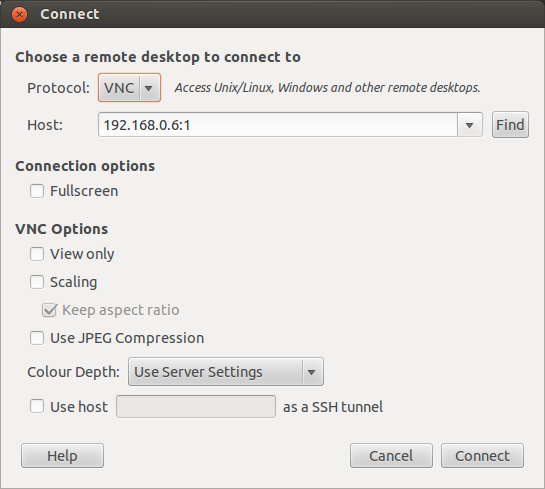
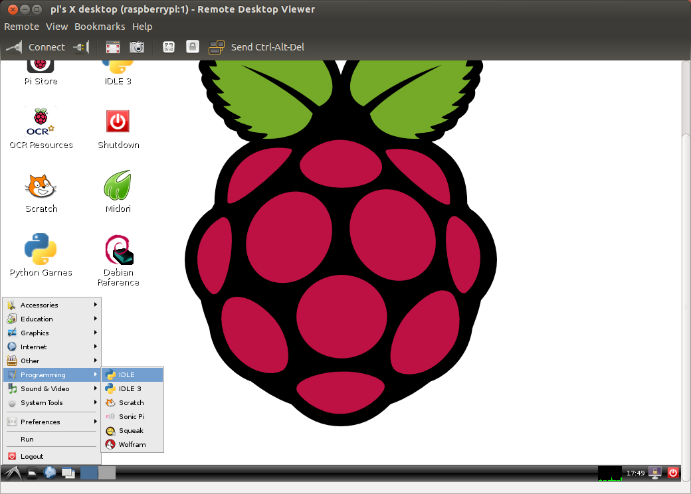

你的Linux发行版本可能已经包含了Remote Desktop
Viewer（远程桌面）程序，你可以通过这个程序使用VNC连接你的树莓派。通常可以在Applications/Internet菜单下面找到这个程序（下面是Ubuntu的例子）；

  
  

  
一旦你选择Remote Desktop
Viewer程序并点击Connect（连接）按钮，你将会看到以下对话框。在Protocol（协议）选项中选择VNC，然后输入树莓派的IP地址以及屏幕编号（例如:0或者:1），完整例子：192.168.0.6:1。

  
  

  
点击Connect（连接）按钮，你将会看到一个提示框要求输入密码。这个密码就是之前在树莓派上配置VNC服务所指定的密码。正确输入之后你将会看到树莓派的远程桌面。

  
  

  
如果你在树莓派桌面上想要退出，不要使用logout（登出）菜单。你只要关闭Remote Desktop
Viewer窗口，然后在树莓派上使用先前文章提到的命令关闭VNC服务。

  
另一个替代的程序是Remmia Remote Desktop
Client，可以从这里下载[remmina.sourceforge.net](http://remmina.sourceforge.net/)。

  

  

原文地址：<http://www.raspberrypi.org/documentation/remote-access/vnc/linux.md>

