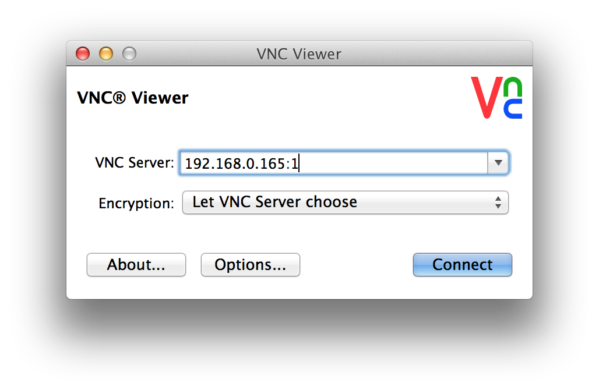
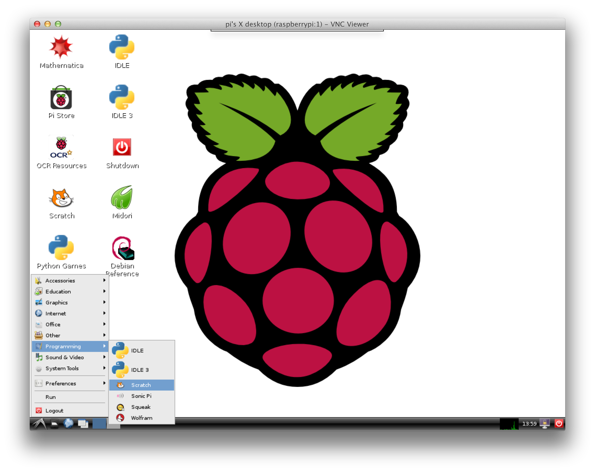

在Mac
OS平台上你需要安装一个VNC客户端程序。你也可以直接使用屏幕分享（系统自带的程序），但是这个程序需要配置比较多的东西。我们使用另一个能够与树莓派VNC服务友好工作的程序叫RealVNC，你可以从[realvnc.com](http://www.realvnc.com/download/vnc/latest)下载。

  
下载安装包文件并打开它。在安装过程中你可以选择安装类型。你只需要在你的Mac上安装VNC客户端，不需要vnc服务。因此选择自定义，并不要勾选VNC
Server选项（如下图）。

  
  

  
点击Continue按钮，完成剩下的安装步骤。完成安装之后打开finder，在左边选择Applications并在搜索框中输入vnc。VNC客户款应该就会出现在搜索结果中。可以为它在你的桌面上创建快捷方式以方便以后使用。

  
  

  
当你运行这个程序，你将会看到上面的对话框。你需要输入树莓派的IP地址以及屏幕编号（:0或者:1），例如：192.168.0.165:1。

  
点击Connect按钮，你将会看到一个未加密连接的警告：

  
  

  
一般情况下，只有当你的Mac和树莓派是通过互联网连接才需要考虑这个警告。如果你使用的是一个本地网络或者学校内部网络，那么你不需要太担心这个问题。点击Continue按钮，之后会提示你输入之前在树莓派上配置VNC服务所指定的密码。完成后你将会看到树莓派的桌面：

  
  

  
如果你在树莓派桌面上想要退出，不要使用logout（登出）菜单。你只要关闭Remote Desktop
Viewer窗口，然后在树莓派上使用先前文章提到的命令关闭VNC服务。

  
更多关于RealVNC的文档请参考以下页面：

<http://www.realvnc.com/products/vnc/documentation/latest/>

  

  
原文地址：<http://www.raspberrypi.org/documentation/remote-access/vnc/mac.md>

