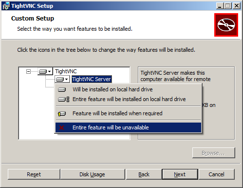
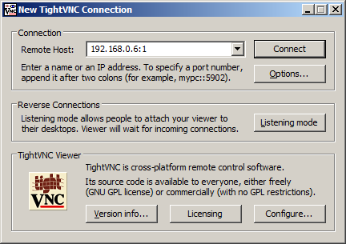

在Windows平台上你需要下载并安装一个VNC客户端程序。常用的有TightVNC，你可以从[tightvnc.com](http://www.tightvnc.com/download.php)上下载。

  
根据你的Window系统版本选择对应的32位或者64位版本下载。如果你不知道你的Window系统版本，可以在控制面板中查看。下载安装文件并运行。

  
在安装过程中，你将有机会选择典型安装、自定义安装或者完全安装。你只需要VNC客户端，不需要服务端，所以选择自定义安装。然后，选择TightVNC
Server并设置为Entire feature will be
unavailable。单击Next。忽略Window防火墙的选项，然后再点击Next，再点击Install安装。

  
  

  
一旦完成安装，你将会在开始菜单中看到TightVNC
Viewer程序。当你运行这个程序的时候将会看到下面的对话框。你需要输入树莓派的IP地址和对应的屏幕编号（:0或:1）。例如，192.168.0.6:1。

  
  

  
点击Connect按钮，你将会开看到提示输入密码的对话框。这个密码是之前你在树莓派上配置VNC服务指定的密码。正确输入密码之后，你将会看到树莓派的桌面。

  
  

  
如果你在树莓派桌面上想要退出，不要使用logout（登出）菜单。你只要关闭Remote Desktop
Viewer窗口，然后在树莓派上使用先前文章提到的命令关闭VNC服务。

  

  

原文地址：<http://www.raspberrypi.org/documentation/remote-access/vnc/windows.md>

