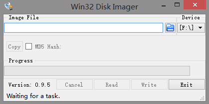
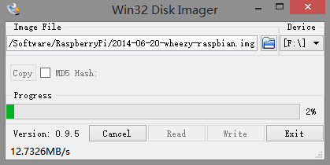
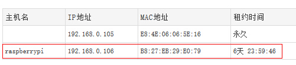
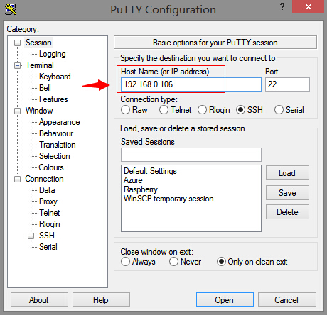
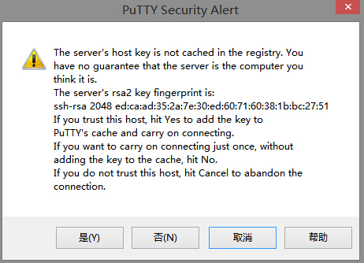
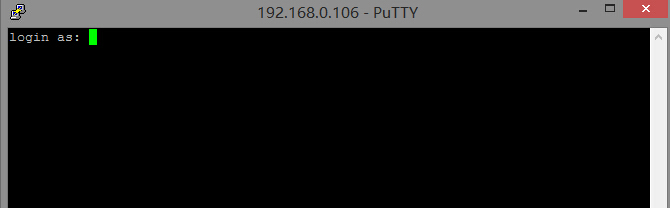
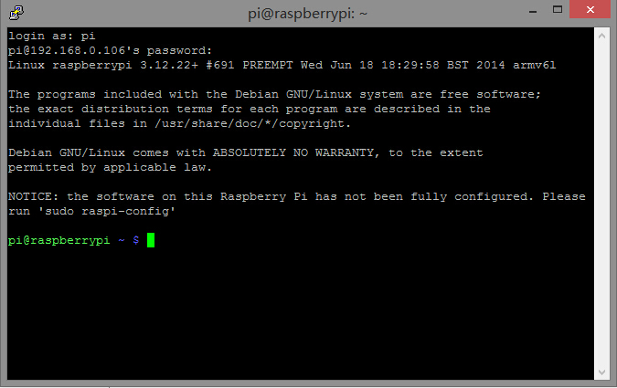

  

树莓派是一种微型计算机，只有卡片般大小，而且便宜。非常适合用于学习Linux操作系统，或者搭建家庭微型服务器媒体中心等。

关于树莓派的详细介绍我就不再多说了，想要了解更多树莓派的内容可以自行google或者直接访问树莓派的官方网站<http://www.raspberrypi.org/>。

  

这里主要讨论下如何在没有显示器的情况下安装树莓派操作系统并登录上去。

实际上由于成本关系，我们购买的树莓派产品通常只有一块主板。当然，主板上有cpu，内存等主要部件。虽然树莓派提供了HDMI接口用于外接显示器，但不是每个人手头都刚好有一块支持HDMI的显示器，而且由于电压关系也不是一定能够带动HDMI显示器。我的树莓派很悲剧的就带不动显示器，怀疑是电压不够带不动我的显示器。所以，只能想办法在没有显示器的情况下安装系统和登录系统了。

  

整体的方案就是树莓派安装系统之后，用网线将树莓派连接到路由器上，再通过局域网SSH远程登录树莓派。

  

硬件准备工作：

1、树莓派一块（这里用的是B型树莓派，相对于A型，B型树莓派性能更加强大，提供的接口更多）。

2、电源和数据线格一个（现在手机使用的电源和数据线就可以，用于给树莓派供电，电源额定电流能够有2A更好一点）

3、网线一条，路由器一台。

4、计算机一台（这里用的是Window平台计算机）。

5、SD卡一张，或者一张TF卡+TF卡转换器。

  

首先要为树莓派安装系统。

树莓派没有硬盘，但是留下了SD卡接口。对于树莓派来说，SD卡就是硬盘。当然你也可以使用TF卡+TF转换器，本人使用的就是TF卡，相对SD卡更便宜一点。

安装系统实际上就是将系统映像烧录到SD卡中。[树莓派官网](http://www.raspberrypi.org/downloads/)提供了多种类型的系统，本人使用的是RaspBian系统，这是树莓派官方根据DeBian系统修改的。你可以根据自己的需要直接从官方下载对应的系统映像，你也可以直接在[百度网盘](http://pan.baidu.com/s/1eQ3o0CU)下载我使用的版本。

下载后你会得到一个zip压缩包，解压后就是我们需要的img系统映像文件。接下来我们还需要一个映像烧录工具，官方推荐Win32DiskImage这个烧录工具，你可以在[这里](http://download.csdn.net/detail/qinxiandiqi/7876059)下载到。

系统映像和烧录工具都下载完成后就可以开始进行烧录。先将你的SD卡或者TF卡连接电脑，然后打开Win32DiskImage烧录工具，注意最好以管理员身份运行这个工具。运行后你将会看到这个软件界面：

左边选择我们下载的树莓派系统映像文件，右边Device选择你的SD卡盘符，这里我的SD卡盘符是F（千万注意！一定要确认是SD卡，否则烧录到其他分区覆盖了你宝贵的数据，后果不堪设想）。确认无误之后，就可以点击Write按钮进行烧录。

  

烧录完成之后取下SD卡，安装到树莓派上。将树莓派用网线连接上你的路由器，然后接通电源。RaspBian系统默认在启动的同时会启动SSH服务，我们就是要利用SSH远程登录上树莓派。

这个时候，你可以先登录你的路由器，查看路由器当前的客户端列表，目的就是要查看路由器当前分配给树莓派的ip地址，例如在我的路由器中分配了192.168.0.106这个ip给了树莓派：

  

记下你的路由器分配给树莓派的ip地址，接下来我们还要在同个局域网内的一台Window机上安装putty这个SSH协议远程客户端软件，你可以在[这里](http://download.csdn.net/detail/qinxiandiqi/7876579)下载到这个软件。安装putty之后，打开putty这个软件，在Host
Name中填写你的路由器分配给树莓派的ip，以下是我的分配到ip：

完成后点击open就会远程连接树莓派。首次连接的时候会提醒是否信任树莓派SSH的指纹：  

  

点击确认，出现终端：

树莓派默认的用户名为pi，密码raspberry，输入进行登录：

  

如果看到这个界面，说明你已经成功登录树莓派，系统已经安装成功。

接下来，你可以根据你的需要为树莓派安装你需要的软件，例如vnc远程桌面等等。  

