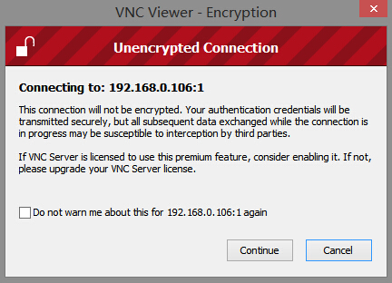

  

在没有显示器的情况下，可以使用putty远程终端登录树莓派。然而，所有的操作都要通过输入命令来执行，这对于习惯了桌面可视化操作的我们来说一时可能难以适应。

一种解决的方法是使用vnc远程桌面。

  

首先要在树莓派上安装VNC服务。

打开putty登录上树莓派，输入以下命令：

    
    
    sudo apt-get install tightvncserver

确保你的树莓派能够连接上互联网，树莓派会自动联网下载相应的包，中途会询问你是否确认安装，输入y后回车，根据你的网络情况会花费一定的时间安装vnc服务：

  

安装完vnc Server之后，输入以下命令配置vcn服务：

    
    
    tightvncserver

  
中间会让你输入vnc服务的访问密码（输入一次，确认一次，共两次），这个密码用于远程vnc终端连接时输入。另外还可以输入一个可选的只读密码，我这里选择不设置。

  

vnc服务配置好之后，输入以下命令启动一个vnc服务：  

    
    
    vncserver :1 -geometry 1920x1080 -depth 24

上面命令启动了一个端口号为1，分辨率为1920x1080，色彩位深为24位的vnc服务。实际上后面的-geometry和-
depth选项是可选的。我直接输入了vncservier:1命令启动一个端口号为1的vnc服务：

  

到这里，vnc服务已经安装完毕并启动成功。下一步是远程vnc客户端连接。这里需要一个vnc-
viewer软件，我使用的是Window平台，这个软件可以在[这里](http://download.csdn.net/detail/qinxiandiqi/7877227http://download.csdn.net/detail/qinxiandiqi/7877227)下载。

下载后打开vnc-viewer，输入树莓派的ip地址和刚才设置的端口号1,。比如我的树莓派分配到的地址是192.168.0.106：

输入后点击connect按钮连接树莓派vnc服务，由于没有配置通道加密，所以会有未加密通道连接警告：

可以勾选不要再提示然后点击Continue继续，输入我们配置树莓派vnc的访问密码：

点击OK，如果密码没错的话，将出现树莓派的桌面：

至此，vnc远程登录树莓派目标完成。

  

  

  

