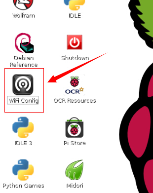
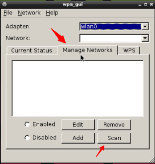
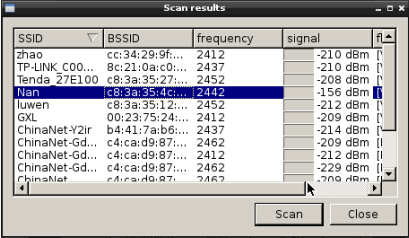
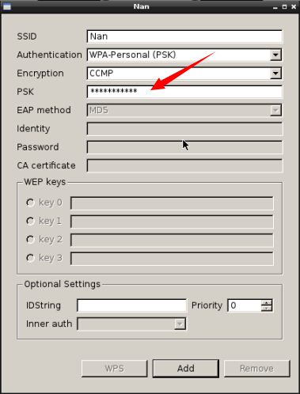
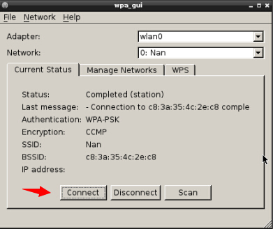
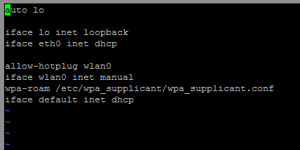
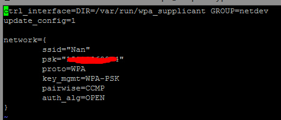

  

上两篇介绍了树莓派系统的安装，用网线接入路由器，以及树莓派的vnc配置。

使用网线将树莓派接入路由器的方法虽然简单，但是会让树莓派的移动性大大降低。我的路由器是wifi路由器，我希望在我的路由器信号范围内可以把树莓派放到任意到一个地方，插上电源就可以远程访问，不被网线限制。因此，需要给树莓派添加wifi模块。

  

给树莓派添加wifi模块，实际上就是一个usb无线网卡。我使用的是EOUP的usb无线网卡，经测试树莓派可以直接识别，不需要额外配置驱动。

树莓派添加usb网卡之后，使用vnc登录树莓派。可以看到RaspBian系统已经提供wifi管理软件：

打开这个软件，切换到中间Manager Network标签后，点击Scan按钮搜索网络：

这时会弹出新的窗口，点击Scan开始搜索网络：

这时可以看到无线网卡扫描到的wifi，双击选择你需要连接的wifi，弹出新的窗口：

在上面PSK中输入wifi的密码，然后点击Add按钮添加。回到主窗口可以看到列表中已经多了我们刚刚添加的wifi连接点，切换到Current
Statu当前状态标签页，点击connect按钮连接wifi：

这时可以在File菜单中选择Save Configuration保存配置。

至此，已经可以摆脱网线的限制，以后只要树莓派一启动就会自动搜索到这个wifi然后连接上去（注意：你需要重新查看你的路由器分配给树莓派无线网卡的ip是多少，你也可以让你的路由器分配一个固定的ip给树莓派，以后就不用经常查看树莓派的ip是多少）。

  

那么回到putty的SSH终端，来看一下上面的操作改变了什么。

树莓派系统自带的编辑器是nano，个人比较习惯使用vim，所以先用以下命令安装vim编辑器：

    
    
    sudo apt-get intall vim

安装完成之后，输入以下命令查看树莓派的网络设置文件：

    
    
    sudo vim /etc/network/interfaces

在我的树莓派上文件内容如下：  

可以看到中间两行代码是有线网卡的设置，最后一段是wifi的设置。而其中wifi的连接信息又保存在/etc/wpa_supplicant/wpa_supplicant.conf文件中。

输“:p”让vim退出当前文件，回到终端，输入以下命令查看wpa_supplicant.conf文件：  

    
    
    sudo vim /etc/wpa_supplicant/wpa_supplicant.conf

我文件内容如下：

  

可以看到其实就是刚才在vnc中使用wifi管理软件添加的wifi信息。

也就是说，实际上我们是可以不通过可视化桌面wifi管理软件添加wifi节点，我们完全可以直接编辑这两个文件来配置wifi连接。

  

