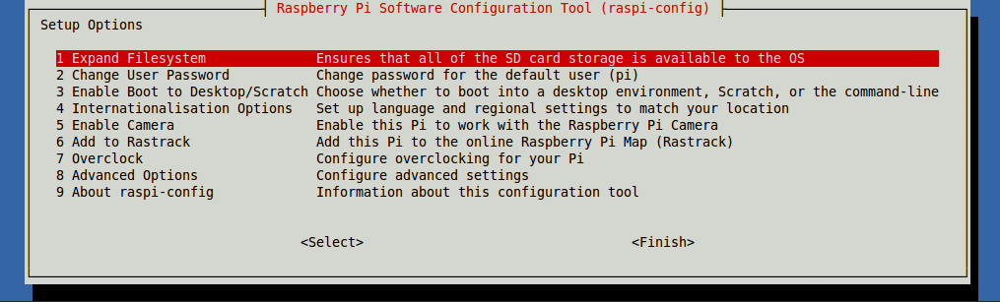

\------------------------------------------------------------------------------------------------------------------------------------------

原文作者：Raspberry Pi Foundation

原文地址：<http://www.raspberrypi.org/documentation/configuration/audio-
config.md>  

原文版权：[CC BY-SA](http://creativecommons.org/licenses/by-sa/4.0/)

译文作者：Jianan - qinxiandiqi@foxmail.com

版本信息：基于原文2014-09-08版本进行翻译

译文版权：[CC BY-SA](http://creativecommons.org/licenses/by-
sa/4.0/)，允许复制转载和演绎，但必须保留译者署名和译文链接，并遵守相同共享协议

\------------------------------------------------------------------------------------------------------------------------------------------

  

树莓派有两种音频输出模式：HDMI和耳机接口。你可以在任何时候切换这两种模式。

  
如果你的HDMI显示器有内置的音箱，音频是可以通过HDMI接口播放的。你也可以切换到耳机接口，使用耳机或者其它耳机接口的音箱播放。如果你的显示器请求音箱支持，声音默认通过HDMI输出；如果没有，那将通过耳机接口输出。这可能不是你所期望的设置，也有可能自动检测的结果不准确，这种情况你可以手动选择输出。

  

# 1、CHANGE THE AUDIO OUTPUT（修改音频输出）

  
这里有两种方法设置音频输出：

  

## 1.1 COMMAND LINE（命令行）

  
在命令行终端上输入下面命令将会切换到HDMI输出模式：

    
    
    amixer cset numid=3 2

  
这里将输出设置为2，也就是HDMI。

将输出设置为1将切换到模拟信号（也就是耳机接口）。

默认的设置为0，代表自动选择。

  

## 1.2 RASPI-CONFIG（raspi-config设置工具）

  
在命令行中输入以下命令打开raspi-config工具：

    
    
    sudo raspi-config

  
输入命令后会打开以下界面：

  

  
选择第八项Advanced Options并回车，然后选择第六项Audio再回车：

  

  
现在你可以看到默认选择Auto选项以及另外两种模式的列表。选择其中一种模式然后回车，再按向右光标控制键跳出选项菜单，选择Finish退出配置工具。

  

# 2、 IF YOU'RE STILL NOT GETTING SOUND VIA HDMI（如果你还是没有从HDMI接口听到声音）

  

在一些少见的情况下，你需要编辑config.txt文件来强制进入HDMI模式（为了排除没有附带声音的DVI模式）。实现这个目的，你可以编辑/boot/config.txt文件设置hdmi_drive=2，然后重启系统让修改生效。

  

  

