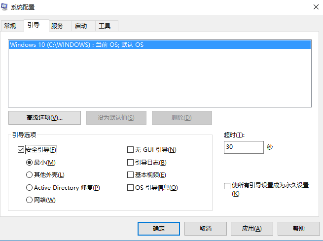
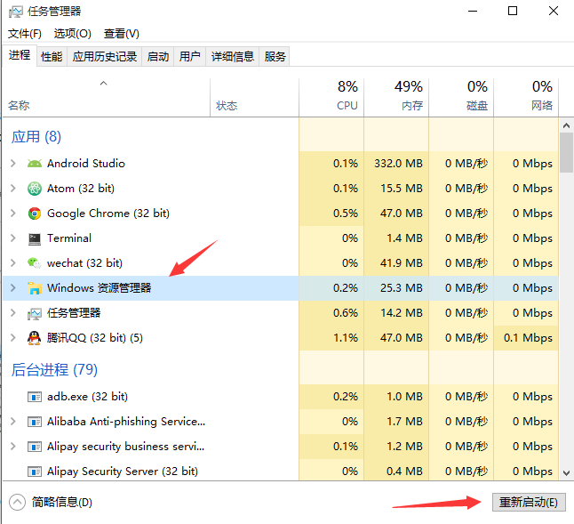
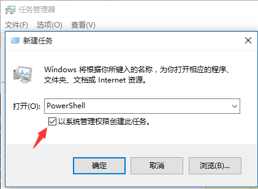

升级win10之后，有时会莫名其妙发现任务栏上面包括开始菜单、小娜、日历、系统通知等系统图标都无法点击，并且重启系统之后并没有自动修复。发生这种情况可以尝试以下解决方法：

# **方法一：卸载冲突软件**

这种情况有可能是存在冲突软件引起的。如果你确定这种情况是在安装某个软件之后出现了，那么可以尝试进入安全模式中把这个软件卸载：

* 按window+R键，弹出运行窗口，输入**msconfig**调出系统配置窗口：    
  
* 选择**引导**标签页，勾选**安全引导**选项
* 点击**确定**后重启系统
* 系统进入安全模式，在安全模式中卸载最近安装后导致任务栏系统图标无法点击的软件
* 卸载软件之后，同样按照上面的方法调出系统配置窗口，并把**安全引导**选项勾除。
* 再次重启系统，看看是否问题解决。

# **方法二：重启window资源管理器**

如果你排除是因为软件冲突引起的问题，那么你可以简单尝试下重启window资源管理器。

* 按Ctrl+Alt+Delete键或者右键任务栏菜单调出任务管理器
* 在任务管理器中找到Widnwo资源管理器，右键菜单选择重启，或者点击右下角重新启动按钮  
  
* 查看情况是否解决。

# **方法三：PowerShell中执行修复脚本**

 * 任务管理器中点击**文件**菜单，选择**运行新任务**，弹出新建任务小窗口
 * 在新建任务小窗口中输入PowerShell，并勾选**以系统管理权限创建此任务**，点击确定弹出PowerShell终端。  
  
 * 在PowerShell终端中，输入一下命令并执行：
```
Get-AppXPackage -AllUsers | Foreach {Add-AppxPackage -DisableDevelopmentMode -Register "$($_.InstallLocation)\AppXManifest.xml"}
```
* 等待命令执行完成，过程种可能会弹出一些错误信息，直接忽略它们。命令执行完成之后，查看问题是否已经修复。

# **方法四：cmd中执行修复命令**

* 运行管理员权限的cmd终端。在开始菜单图标右键菜单选择**命令提示符（管理员）**，或者跟上面PowerShell一样的方式，只不过将新建任务小窗口中输入的“PowerShell”改为“cmd”。
* 在cmd终端中执行下面命令：
```
ren %windir%\System32\AppLocker\Plugin*.* *.bak
```
* 重启系统，查看问题是否解决。

# **方法五：修复系统服务**

* 按照上面打开PowerShell一样的方法，新建任务小窗口中输入**services.msc**,打开服务窗口。
* 查找其中的**Application Identity**服务，右键菜单选择**启动**。
* 查看问题是否已经解决。

# **方法六：还原系统**

如果你有做系统备份，尝试将系统还原到最近正常的时间点。

参考：[https://www.xtremerain.com/fix-windows-10-start-menu-cortana-not-working/](https://www.xtremerain.com/fix-windows-10-start-menu-cortana-not-working/)
