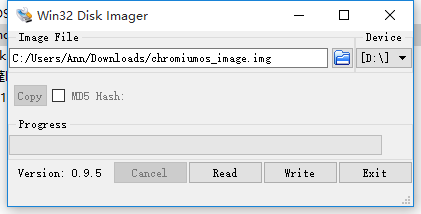

> 原文作者：Jianan - qinxiandiqi@foxmail.com  
原文地址：[http://blog.csdn.net/qinxiandiqi/article/details/50194811](http://blog.csdn.net/qinxiandiqi/article/details/50194811)  
版本信息：2015-12-06  
版权声明：本文采用[CC BY-NC-ND 4.0](http://creativecommons.org/licenses/by-nc-nd/4.0/)共享协议。允许复制和转载，但必须在文首显眼位置保留原文作者、原文链接、版本信息、版权声明等信息。不允许演绎和用于商业用途。

Google旗下两个重量级操作系统：Android和ChromiumOS。Android就不用说了，ChromiumOS目前主要用于ChromeBook设备上。整个系统基本上就是个Chrome浏览器，可以安装各种Chrome扩展和Chrome App Store上面的各种app。虽然ChromeBook设备很便宜，然而并没什么卵用，因为国内根本没有销售啊！我个人的看法是因为国内大环境所致，ChromeBook如果使用不了google的服务，基本上就半身瘫痪了。这种情况下就算ChromeBook很便宜，买来了也没多少使用价值，商家自然也不会投入大陆市场。  

虽然国内没有销售，但是还可以海淘什么的。不过，像我这种精打细算过日子的人，当然不能这么冲动啦。于是决定将ChromiumOS烧录到U盘上先体验下这个系统，再决定入不入手一台ChromeBook。  

然而，Google官方并没有提供将ChromiumOS烧录到U盘的方法，好在ChromiumOS是开源的，网络上的大牛也很多。于是就有人将ChromiumOS进行移植，做了个img系统映像，可以直接烧录到U盘上来体验这个系统。

在制作ChromiumOS的U盘启动盘之前，需要做下面准备工作：  
1. ChromiumOS系统映像，可以到[这里](http://pan.baidu.com/s/1nubpQXz)下载。下载到的是个7z压缩包，解压后就是ChromiumOS的img系统映像。
2. Win32diskManger，用于在window平台上将ChromiumOS系统映像烧录到U盘的软件，可以在[这里](http://download.csdn.net/detail/qinxiandiqi/7876059)下载。
3. U盘一个，容量至少要8G，因为ChromiumOS的系统映像已经7个G了。。。

制作U盘启动盘的方法很简单，打开Win32diskManager，**Image File** 选项选择ChromiumOS的img系统映像文件路径，**Device** 选项选择自己电脑上U盘的盘符。之后点击Write按钮，会有确认是否烧录到U盘的信息弹框，重点检查下盘符是不是你的U盘。确认无误后继续往下执行，等烧录完成后就完成了。如下图：  
 

重启电脑系统，不同的主板需要在开机的时候按不同的键进入启动菜单，根据实际情况进入启动菜单后选择从U盘启动，然后进入ChromiumOS系统。进入系统后会有一些设置网络代理之类的系统初始化的步骤，此处应该有系统截图……但是没有……是事为什么呢？因为手太快点下一步下一步不小心就点过去了啊！另外ChromiumOS下截图不方便。最后要求使用google账号登录或者匿名账号登录系统。有门路就自己设置网络代理翻墙登录google账号，没有的就只能匿名账号登录。然后你会发现除了使用浏览器看看网页，啥都干不了，因为连接不上google的服务，连上google Chrome store在线安装个app都没办法，只能通过离线包安装，略麻烦。。。现已放弃购买ChromeBook的想法。

有兴趣的小伙伴就玩玩吧。哦~对了，ChromiumOS是基于Linux开发的，烧录到U盘之后，U盘会被切割成五六七八块linux的ext类型分区，所以你的U盘就别想在window上使用了。要想恢复U盘需要使用磁盘工具擦除U盘上所有分区重新格式化，so。。。生命在于折腾，祝玩的开心:)
