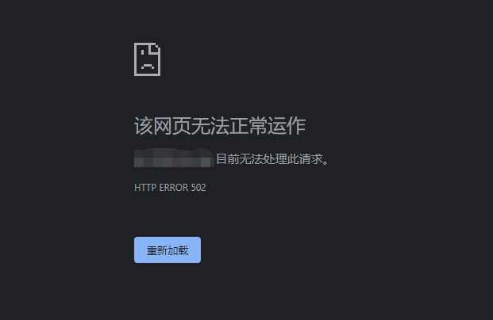

在腾讯云买了台轻量服务器，用docker部署了gogs后，用http://ip:port访问，发现访问一直502。  

  

嗯……肯定是我哪里有问题吧？  

按照腾讯云的排查文档排查：  
[https://cloud.tencent.com/document/product/213/14633](https://cloud.tencent.com/document/product/213/14633)  

1、排查服务器实例相关问题：服务器实例正常运行，资源状态正常，web服务相应端口都正常监听，服务器防火墙和腾讯云防火墙也正常，排除服务器问题  
2、排查网络问题：ping一下服务器ip，一切正常。  

无法理解的现象，难道是gogs应用的问题？那就换一个gitea部署试试，还是502。再换一个OneDev试试，还是502。是docker的问题？重装下docker，还是502。万能大法，重启服务器试试，还是502。本地开发机安装docker，部署gogs、gitea、OneDev，全部正常！心态炸了！！  

**腾讯云什么玩意？！！！**  

折腾了好多天，换了台电脑，居然发现能正常访问了！两台机有啥区别？第一台机有安装Clash，开了代理，难道是代理问题？把第一台机的代理关掉，能访问了……  

**心里一大堆问号？？？**  

腾讯云服务器部署的网站开了代理就不能访问了？这是什么道理，我的代理访问其他网站都是正常的。  

继续折腾一下，换不同代理服务器试试。这一试，问号更多了。使用美国、日本、新加坡、俄罗斯等境外区域的代理访问肯定502，使用香港或台湾等国内地区的代理就能正常访问。这又是什么操作，腾讯云反向围墙吗？ 

找客服沟通排查了一晚上也没什么结果，只是一直强调不是服务器的问题，最后说是我代理软件层面的问题。实在折腾不动了，只好临时在本地代理规则里面增加个排除腾讯云服务器规则了事，我也搞的也糊涂，有明白的同学请指教一下。 

PS：虽然这腾讯云服务器搞得让人心态崩了，但人家技术人员大晚上陪着排查几个小时，996程序员也不容易。唉，互相理解同病相怜心心相惜一下。另外也学到了一点好用的工具：  
1、华佗诊断分析：[https://ping.huatuo.qq.com](https://ping.huatuo.qq.com/)，可以获取本地的公网出口ip，测试页面访问延迟。  
2、网络测试教程：[https://cloud.tencent.com/developer/article/1468122](https://cloud.tencent.com/developer/article/1468122)，里面介绍了一些好用网络测试方法和工具。

